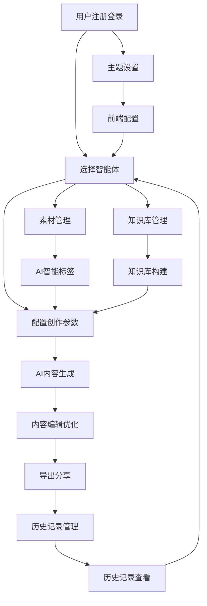
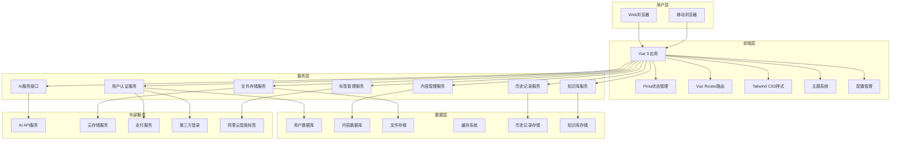
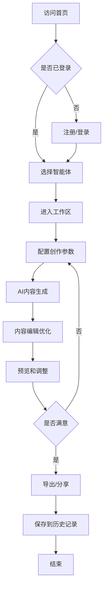

# 社会化营销智能体平台 - 产品需求规格说明书

## 基于AI驱动的社会化营销内容创作与管理平台

***

本文档是社会化营销智能体平台的完整产品需求规格说明书，详细描述了平台的功能需求、技术架构、用户体验设计等各个方面。该平台旨在为营销人员、内容创作者和企业提供一站式的AI驱动营销内容创作解决方案。

**项目信息**

* 项目名称：社会化营销智能体平台

* 项目代号：ai-video-mixer

* 版本：v1.0

* 编写日期：2025年11月1日

* 技术栈：Vue 3 + TypeScript + Pinia + Tailwind CSS

***

## 目录

1. [产品的目标](#一产品的目标)
2. [产品影响者](#二产品影响者)
3. [需求限制条件](#三需求限制条件)
4. [命名标准和定义](#四命名标准和定义)
5. [假定因素](#五假定因素)
6. [产品的范围](#六产品的范围)
7. [功能性需求](#七功能性需求)
8. [非功能需求](#八非功能需求)
9. [项目问题](#九项目问题)
10. [后续版本需求](#十后续版本需求)

***

## 一、产品的目标@澜

### 1.1 背景

随着数字营销的快速发展，企业和个人创作者对高质量营销内容的需求日益增长。传统的内容创作方式存在以下痛点：

1. **创作效率低下**：视频剪辑、文案撰写需要大量时间和专业技能
2. **成本高昂**：聘请专业团队或购买昂贵的创作工具成本过高
3. **质量不稳定**：缺乏统一的创作标准和风格指导
4. **技术门槛高**：普通用户难以掌握复杂的创作工具

市场上虽然存在一些AI创作工具，但大多功能单一，缺乏整合性的解决方案。企业需要一个集成化的平台，能够提供从内容策划到成品输出的全链路AI创作服务。

**目标用户群体**：

* 中小企业营销团队

* 个人内容创作者

* 社交媒体运营人员

* 数字营销机构

### 1.2 产品的目标

**核心目标**：构建一个AI驱动的社会化营销智能体平台，通过多个专业化智能体，为用户提供高效、专业、易用的营销内容创作解决方案。

**具体目标**：

1. **提升创作效率**：将传统视频制作时间从数小时缩短至数分钟
2. **降低使用门槛**：通过对话式交互，让零基础用户也能创作专业内容
3. **保证内容质量**：基于AI算法确保输出内容的专业性和一致性
4. **降低创作成本**：相比传统创作方式，成本降低70%以上

**业务价值**：

* 为用户节省内容创作时间和成本

* 提高营销内容的产出效率和质量

* 构建AI创作工具的生态平台

* 建立可持续的SaaS商业模式

***

## 二、产品影响者@澜

### 2.1 客户（客户代表）

**主要客户**：

* 中小企业营销负责人

* 内容创作机构负责人

* 个人创作者/KOL

**客户特征**：

* 对内容创作效率有强烈需求

* 预算有限，追求性价比

* 希望快速上手，降低学习成本

### 2.2 顾客

**目标顾客画像**：

| 用户类型   | 特征描述           | 核心需求         | 付费意愿 |
| ------ | -------------- | ------------ | ---- |
| 企业营销团队 | 2-10人团队，负责品牌推广 | 批量内容生产、品牌一致性 | 高    |
| 个人创作者  | 自媒体运营者、KOL     | 高质量内容、个人风格   | 中    |
| 营销机构   | 服务多个客户的代理机构    | 多样化内容、快速交付   | 高    |
| 小微企业主  | 个人或小团队运营       | 简单易用、成本控制    | 低-中  |

### 2.3 产品的用户

#### 2.3.1 产品的用户

**主要用户角色**：

| 用户角色  | 用户分类  | 工作目标           | 业务经验 | 技术经验   | 其他特征              |
| ----- | ----- | -------------- | ---- | ------ | ----------------- |
| 营销专员  | 企业员工  | 创作营销内容、提升转化率   | 熟练工  | 新手-熟练工 | 25-35岁，本科学历，追求效率  |
| 内容创作者 | 自由职业者 | 产出高质量内容、建立个人品牌 | 专家   | 熟练工    | 20-40岁，创意思维强，技术敏感 |
| 运营人员  | 企业员工  | 管理社交媒体、维护用户关系  | 熟练工  | 新手-熟练工 | 22-32岁，沟通能力强      |
| 企业主   | 决策者   | 控制成本、提升业务效果    | 专家   | 新手     | 30-50岁，注重ROI      |

#### 2.3.2 对用户设的优先级

| 用户类型   | 优先级   | 占比  | 重要性说明              |
| ------ | ----- | --- | ------------------ |
| 企业营销团队 | 关键用户  | 40% | 付费能力强，使用频率高，影响产品成功 |
| 个人创作者  | 关键用户  | 35% | 活跃度高，口碑传播力强        |
| 营销机构   | 次要用户  | 20% | 专业需求复杂，但市场规模有限     |
| 小微企业主  | 不重要用户 | 5%  | 付费意愿低，使用频率不稳定      |

### 2.4 其他影响者

**技术影响者**：

* AI算法工程师

* 前端开发工程师

* 产品设计师

* 测试工程师

**业务影响者**：

* 市场营销专家

* 内容创作行业专家

* 法务顾问（版权、隐私保护）

* 财务顾问（定价策略）

***

## 三、需求限制条件

### 3.1 解决方案限制条件

**技术限制条件**：

1. **前端技术栈**：必须使用Vue 3 + TypeScript + Pinia + Tailwind CSS
2. **响应式设计**：必须支持桌面端和移动端访问
3. **浏览器兼容性**：支持Chrome 90+、Firefox 88+、Safari 14+、Edge 90+
4. **性能要求**：首屏加载时间不超过3秒

**业务限制条件**：

1. **内容合规**：所有生成内容必须符合相关法律法规
2. **版权保护**：确保使用的素材和模板无版权争议
3. **数据安全**：用户数据必须加密存储和传输

###

### 3.3 关联产品

**外部服务集成**：

1. **AI服务**：OpenAI GPT、Claude等大语言模型API、智能体API
2. **云存储**：阿里云OSS、腾讯云COS等
3. **智能标签**：阿里云智能标签服务
4. AI视频混剪：@斌插入图片
5. 高光时刻提取：优化原型@all
6. 人声克隆定制：
7. BGM：
8. 知识库：
9. 转场花字模板；
10. 合规性审核：@澜@

**内部系统**：

1. **用户管理系统**：注册、登录、权限管理
2. **内容管理系统**：素材库、模板库管理
3. **历史记录系统**：创作历史、版本管理
4. **知识库系统**：文档管理、知识构建
5. **配置管理系统**：前端配置、用户偏好
6. **标签管理系统**：智能标签、分类管理
7. **数据分析系统**：用户行为分析、内容效果统计

### 3.4 预期的工作场地环境

**办公环境**：

* 安静的办公室或家庭工作环境

* 稳定的网络连接（带宽≥10Mbps）

* 标准的办公设备（电脑、显示器、音响）

**移动环境**：

* 支持在移动设备上进行轻量级操作

* 适应不同的光线条件和网络状况

* 支持触摸操作和手势控制

### 3.5 产品开发周期@澜

**关键时间节点**：

| 阶段     | 时间       | 交付内容    | 验收标准           |
| ------ | -------- | ------- | -------------- |
| MVP版本  | 2024年12月 | 基础功能原型  | 用户注册登录、两个核心智能体 |
| Beta版本 | 2025年2月  | 完整功能测试版 | 所有核心功能、性能优化    |
| 正式版本   | 2025年4月  | 商业化产品   | 稳定性、安全性、用户体验   |

**里程碑要求**：

* MVP版本必须在2024年12月底前完成，以验证产品市场契合度

* Beta版本需要通过100名种子用户的测试验证

* 正式版本上线前必须通过安全审计和性能测试

### 3.6 费用预算

**开发预算**：

* 人力成本：150万元（6个月，5人团队）

* 技术服务费：30万元（AI API、云服务等）

* 设计和测试：20万元

* 总预算：200万元

**运营预算**：

* 服务器和CDN：每月5万元

* AI API调用费用：每月10万元

* 营销推广：每月20万元

***

## 四、命名标准和定义@郑峰

### 核心术语定义

| 术语                      | 定义          | 说明             |
| ----------------------- | ----------- | -------------- |
| 智能体(Agent)              | 具有特定功能的AI助手 | 如视频混剪智能体、写作智能体 |
| 工作区(Workspace)          | 用户进行创作的主要界面 | 包含对话区域和功能面板    |
| 素材库(Asset Library)      | 存储用户上传文件的空间 | 支持图片、视频、音频等格式  |
| 人格(Persona)             | AI智能体的角色设定  | 包含性格、专业领域、语言风格 |
| 知识库(Knowledge Base)     | 用于训练AI的专业内容 | 用户可上传相关资料进行定制  |
| 时间线(Timeline)           | 视频编辑的时序界面   | 显示视频片段的时间顺序    |
| 混剪(Video Mixing)        | 将多个视频片段组合编辑 | 包含剪切、拼接、特效等操作  |
| 云盘(Cloud Drive)         | 云端文件存储服务    | 用户文件的在线存储和管理   |
| 历史记录(History)           | 用户创作活动的记录   | 按智能体类型和时间分类存储  |
| 智能标签(Smart Tags)        | AI自动生成的内容标签 | 用于视频内容识别和分类    |
| 快捷提示(Quick Prompts)     | 预设的创作提示模板   | 提高用户输入效率       |
| 写作模板(Writing Templates) | 标准化的文档格式    | 支持变量替换和自定义     |
| 主题系统(Theme System)      | 界面外观配置系统    | 支持深色/浅色主题切换    |
| 批量处理(Batch Processing)  | 同时处理多个文件    | 提高大量文件的处理效率    |
| 轮询查询(Polling Query)     | 定期查询任务状态    | 用于跟踪长时间运行的任务   |

### 技术术语

| 术语  | 定义             | 技术说明            |
| --- | -------------- | --------------- |
| SPA | 单页应用程序         | 使用Vue.js构建的前端应用 |
| PWA | 渐进式Web应用       | 支持离线使用和推送通知     |
| SSR | 服务端渲染          | 提升首屏加载速度和SEO    |
| CDN | 内容分发网络         | 加速静态资源加载        |
| API | 应用程序接口         | 前后端数据交互接口       |
| JWT | JSON Web Token | 用户身份验证令牌        |

***

## 五、假定因素@斌

### 技术假定

1. **AI服务稳定性**：假定第三方AI服务（如OpenAI、Claude）能够提供稳定的API服务，响应时间在5秒以内
2. **浏览器兼容性**：假定目标用户使用的浏览器版本支持现代Web标准（ES6+、WebRTC等）
3. **网络环境**：假定用户具备稳定的网络连接，带宽不低于5Mbps
4. **设备性能**：假定用户设备具备基本的计算能力，内存不低于4GB

### 业务假定

1. **用户接受度**：假定目标用户对AI辅助创作工具有较高的接受度和学习意愿
2. **市场需求**：假定营销内容创作市场持续增长，用户对效率工具有强烈需求
3. **竞争环境**：假定在产品上线期间，不会出现颠覆性的竞争产品
4. **法规环境**：假定相关法律法规在产品开发期间保持相对稳定

### 资源假定

1. **开发团队**：假定能够组建并维持稳定的5人开发团队
2. **AI资源**：假定能够获得足够的AI API调用额度和计算资源
3. **云服务**：假定云服务提供商能够提供稳定的存储和计算服务
4. **资金支持**：假定项目资金能够按计划到位，支持产品开发和运营

***

## 六、产品的范围

### 6.1 工作的上下文范围

**核心工作流程**：@澜



**系统边界**：

* **内部系统**：用户管理、智能体服务、内容生成、文件存储

* **外部系统**：AI API服务、支付系统、第三方登录、CDN服务

###

### 6.3 产品边界

**包含的功能**：

* ✅ 用户注册登录系统

* ✅ 视频混剪智能体

* ✅ 风格模仿写作大师

* ✅ AI云盘文件管理

* ✅ 历史记录管理系统

* ✅ 知识库管理系统

* ✅ AI智能标签系统

* ✅ 前端配置管理

* ✅ 主题系统

* ✅ 素材管理增强功能

* ✅ 基础的内容编辑功能

* ✅ 后台管理系统

***

## 七、功能性需求

### 7.1 用户认证系统

**需求描述**：提供完整的用户身份认证、授权和账户管理功能，确保系统安全性和用户数据保护。

#### 7.1.1 用户注册功能

**输入要求**：

* **手机号注册**：

  * 手机号格式：中国大陆11位手机号（1\[3-9]\d{9}）

  * 短信验证码：6位数字，有效期5分钟

  * 密码：8-32位，必须包含大小写字母、数字，可选特殊字符

* **邮箱注册**：

  * 邮箱格式：符合RFC 5322标准的邮箱地址

  * 邮件验证码：6位数字或32位UUID，有效期30分钟

  * 密码：同手机号注册要求

* **通用输入**：

  * 用户昵称：2-20个字符，支持中英文、数字、下划线

  * 用户协议确认：必选布尔值

  * 隐私政策确认：必选布尔值

**处理流程**：

1. **输入验证阶段**：

   * 前端实时验证输入格式

   * 后端二次验证所有输入参数

   * 检查手机号/邮箱是否已注册

   * 验证昵称唯一性（忽略大小写）

2. **验证码发送阶段**：

   * 生成6位随机数字验证码

   * 调用第三方短信/邮件服务发送

   * 记录发送日志和限流计数

   * 设置验证码过期时间

3. **账户创建阶段**：

   * 验证码校验（最多3次尝试机会）

   * 密码加密存储（使用bcrypt，cost=12）

   * 生成唯一用户ID（UUID v4）

   * 创建用户基础信息记录

   * 生成JWT访问令牌和刷新令牌

**输出结果**：

* **成功响应**

  ```json
  {
    "code": 200,
    "message": "注册成功",
    "data": {
      "userId": "uuid",
      "accessToken": "jwt_token",
      "refreshToken": "refresh_token",
      "expiresIn": 3600,
      "userInfo": {
        "id": "uuid",
        "nickname": "用户昵称",
        "avatar": "默认头像URL",
        "email": "user@example.com",
        "phone": "138****8888",
        "plan": "free",
        "createdAt": "2024-01-01T00:00:00Z"
      }
    }
  }
  ```

* **失败响应**：包含具体错误码和错误信息

**业务逻辑**：

* 同一手机号/邮箱只能注册一个账户

* 验证码发送频率限制：同一号码1分钟内最多1次，1小时内最多5次

* 注册失败3次后，该IP地址15分钟内禁止注册

* 新用户默认为免费计划，赠送5GB存储空间

* 自动创建用户默认文件夹结构

**异常处理**：

* **验证码发送失败**：重试机制，最多3次，失败后提示用户稍后重试

* **数据库写入失败**：事务回滚，返回系统繁忙提示

* **第三方服务异常**：降级处理，记录错误日志，提示用户使用备用方式

* **网络超时**：客户端重试机制，最多3次，每次间隔递增

**权限控制**：

* 注册接口无需认证

* 实施IP频率限制和设备指纹识别

* 验证码接口需要图形验证码防止机器人攻击

* 敏感操作记录审计日志

**性能要求**：

* 注册接口响应时间≤2秒（95%请求）

* 验证码发送成功率≥98%

* 支持并发注册用户数≥100/秒

* 数据库连接池大小：20-50连接

**验收标准**：

* 功能测试：所有注册流程正常完成

* 性能测试：满足响应时间和并发要求

* 安全测试：通过SQL注入、XSS等安全扫描

* 兼容性测试：支持主流浏览器和移动设备

* 压力测试：1000并发用户注册系统稳定运行

#### 7.1.2 用户登录功能

**输入要求**：

* **账号密码登录**：

  * 账号：手机号或邮箱地址

  * 密码：用户设置的登录密码

  * 记住登录：可选布尔值，默认false

* **手机号验证码登录**：

  * 手机号：11位中国大陆手机号

  * 验证码：6位数字，有效期5分钟

* **第三方登录**（可选）：

  * 微信授权码

  * QQ授权码

  * 支付宝授权码

**处理流程**：

1. **身份验证阶段**：

   * 识别登录方式（密码/验证码/第三方）

   * 账号存在性验证

   * 密码/验证码校验

   * 账户状态检查（是否被禁用/冻结）

2. **安全检查阶段**：

   * 检查登录失败次数（5次失败锁定30分钟）

   * 设备指纹识别和风险评估

   * 异地登录检测和通知

   * 可疑行为检测（如短时间多次登录）

3. **会话创建阶段**：

   * 生成JWT访问令牌（有效期1小时）

   * 生成刷新令牌（有效期7天或30天）

   * 更新用户最后登录时间和IP

   * 记录登录日志

**输出结果**：

* **成功响应**：

  ```json
  {
    "code": 200,
    "message": "登录成功",
    "data": {
      "accessToken": "jwt_token",
      "refreshToken": "refresh_token",
      "expiresIn": 3600,
      "userInfo": {
        "id": "uuid",
        "nickname": "用户昵称",
        "avatar": "头像URL",
        "email": "user@example.com",
        "phone": "138****8888",
        "plan": "premium",
        "lastLoginAt": "2024-01-01T00:00:00Z"
      }
    }
  }
  ```

**业务逻辑**：

* 密码错误5次后账户临时锁定30分钟

* 异地登录需要短信/邮件验证确认

* 记住登录状态最长30天，期间无需重新输入密码

* 同一账户最多允许5个设备同时登录

* 长时间未活动（7天）自动退出登录

**异常处理**：

* **账户不存在**：返回"账户或密码错误"（不暴露具体信息）

* **密码错误**：记录失败次数，达到阈值后锁定账户

* **账户被禁用**：返回具体禁用原因和申诉方式

* **验证码错误**：最多3次机会，超过后需重新获取

* **系统异常**：返回通用错误信息，记录详细日志

**权限控制**：

* 登录接口无需认证

* 实施IP和设备级别的频率限制

* 异地登录需要额外验证

* 管理员可以强制用户下线

**性能要求**：

* 登录接口响应时间≤1.5秒（95%请求）

* 支持并发登录用户数≥500/秒

* JWT令牌验证时间≤50ms

* 会话存储使用Redis，响应时间≤10ms

**验收标准**：

* 所有登录方式功能正常

* 安全机制有效防护暴力破解

* 性能指标满足要求

* 异常情况处理得当

* 用户体验流畅

#### 7.1.3 个人信息管理功能

**输入要求**：

* **基本信息编辑**：

  * 昵称：2-20字符，支持中英文数字下划线

  * 头像：图片文件，支持JPG/PNG/GIF，大小≤5MB，尺寸≥100x100px

  * 个人简介：0-200字符

  * 性别：可选枚举值（男/女/保密）

  * 生日：日期格式YYYY-MM-DD

* **安全信息修改**：

  * 当前密码：用于身份验证

  * 新密码：8-32位，复杂度要求同注册

  * 手机号：11位中国大陆手机号

  * 邮箱：符合标准的邮箱地址

* **隐私设置**：

  * 个人资料可见性：公开/仅好友/私密

  * 活动状态显示：布尔值

  * 接收通知设置：对象包含各类通知开关

**处理流程**：

1. **权限验证阶段**：

   * 验证JWT令牌有效性

   * 确认操作用户身份

   * 检查修改权限（如管理员可修改其他用户信息）

2. **数据验证阶段**：

   * 验证输入数据格式和范围

   * 检查昵称唯一性（排除当前用户）

   * 验证手机号/邮箱未被其他用户使用

   * 头像文件安全扫描

3. **敏感操作验证**：

   * 修改密码需要输入当前密码

   * 修改手机号/邮箱需要验证码确认

   * 重要操作发送通知到原手机号/邮箱

4. **数据更新阶段**：

   * 使用数据库事务确保一致性

   * 头像上传到云存储并生成缩略图

   * 更新用户信息表

   * 清除相关缓存

**输出结果**：

* **成功响应**：

  ```json
  {
    "code": 200,
    "message": "信息更新成功",
    "data": {
      "userInfo": {
        "id": "uuid",
        "nickname": "新昵称",
        "avatar": "新头像URL",
        "email": "new@example.com",
        "phone": "139****9999",
        "bio": "个人简介",
        "gender": "男",
        "birthday": "1990-01-01",
        "updatedAt": "2024-01-01T00:00:00Z"
      }
    }
  }
  ```

**业务逻辑**：

* 昵称修改30天内只能修改1次

* 头像自动生成多种尺寸（50x50, 100x100, 200x200）

* 敏感信息修改需要邮件/短信通知

* 修改记录保留审计日志

* VIP用户可以设置个性化域名

**异常处理**：

* **昵称重复**：提示用户选择其他昵称，提供建议

* **头像上传失败**：重试机制，失败后保留原头像

* **验证码错误**：提供重新发送选项

* **数据库更新失败**：事务回滚，提示用户重试

* **文件存储异常**：使用备用存储服务

**权限控制**：

* 用户只能修改自己的信息

* 管理员可以修改任意用户信息

* 某些字段（如用户ID、注册时间）不允许修改

* 敏感操作需要二次验证

**性能要求**：

* 信息更新响应时间≤2秒

* 头像上传速度≥1MB/s

* 支持并发修改用户数≥200/秒

* 缓存更新延迟≤1秒

**验收标准**：

* 所有字段修改功能正常

* 数据验证规则有效

* 安全机制防止恶意修改

* 性能满足要求

* 用户体验良好

#### 7.1.4 权限管理和会话控制

**输入要求**：

* **令牌刷新**：

  * 刷新令牌：有效的refresh\_token

  * 设备标识：可选的设备指纹

* **会话管理**：

  * 会话ID：要操作的会话标识

  * 操作类型：查看/删除/删除全部

* **权限检查**：

  * 资源路径：要访问的API端点

  * 操作类型：GET/POST/PUT/DELETE等

**处理流程**：

1. **令牌验证流程**：

   * 解析JWT令牌结构和签名

   * 验证令牌有效期和颁发者

   * 检查用户状态（是否被禁用）

   * 验证令牌黑名单

2. **权限检查流程**：

   * 获取用户角色和权限列表

   * 匹配资源访问权限

   * 检查特殊权限（如管理员权限）

   * 记录权限检查日志

3. **会话管理流程**：

   * 查询用户所有活跃会话

   * 验证会话有效性

   * 执行会话操作（删除/刷新）

   * 更新会话状态

**输出结果**：

* **权限验证成功**：

  ```json
  {
    "code": 200,
    "message": "验证通过",
    "data": {
      "userId": "uuid",
      "permissions": ["read", "write", "delete"],
      "roles": ["user", "premium"],
      "expiresAt": "2024-01-01T01:00:00Z"
    }
  }
  ```

* **会话列表**：

  ```json
  {
    "code": 200,
    "data": {
      "sessions": [
        {
          "sessionId": "session_uuid",
          "deviceInfo": "Chrome 120.0 on Windows 10",
          "ipAddress": "192.168.1.100",
          "location": "北京市",
          "lastActive": "2024-01-01T00:30:00Z",
          "isCurrent": true
        }
      ]
    }
  }
  ```

**业务逻辑**：

* JWT访问令牌有效期1小时，刷新令牌有效期7-30天

* 用户权限基于角色（RBAC）和资源级别控制

* 同一用户最多5个活跃会话，超出自动踢出最旧会话

* 异地登录需要验证，可设置信任设备

* 管理员可以查看和管理所有用户会话

**异常处理**：

* **令牌过期**：返回401状态码，前端自动跳转登录

* **令牌无效**：清除本地存储，要求重新登录

* **权限不足**：返回403状态码和具体权限要求

* **会话冲突**：提示用户选择保留哪个会话

* **系统异常**：记录错误日志，返回通用错误信息

**权限控制**：

* 三级权限体系：系统级、功能级、数据级

* 角色定义：游客、普通用户、VIP用户、管理员、超级管理员

* 资源权限：读取、创建、修改、删除、管理

* 特殊权限：系统配置、用户管理、数据导出等

**性能要求**：

* JWT验证时间≤10ms

* 权限检查时间≤20ms

* 会话查询响应时间≤100ms

* 支持并发权限验证≥1000/秒

**验收标准**：

* 权限控制准确无误

* 会话管理功能完整

* 安全机制有效防护

* 性能满足高并发要求

* 用户体验流畅自然

### 7.2 视频混剪智能体

**需求描述**：提供基于AI的智能视频混剪服务，通过自然语言交互理解用户需求，自动处理素材并生成专业级视频内容。

#### 7.2.1 需求理解和对话交互

**输入要求**：

* **自然语言描述**：

  * 文本长度：10-1000字符

  * 支持语言：中文、英文

  * 内容类型：视频主题、风格要求、时长需求、目标受众等

* **结构化参数**（可选）：

  * 视频时长：15秒-10分钟

  * 视频比例：16:9、9:16、1:1、4:3

  * 视频风格：商业、娱乐、教育、纪录片、Vlog等

  * 目标平台：抖音、快手、B站、YouTube、微信视频号

* **参考素材**（可选）：

  * 参考视频URL或文件

  * 风格图片

  * 音乐偏好

**处理流程**：

1. **语言理解阶段**：

   * 使用NLP模型解析用户意图

   * 提取关键信息：主题、风格、时长、情感色调

   * 识别特殊要求：字幕、音乐、转场效果等

   * 生成结构化需求描述

2. **需求确认阶段**：

   * 向用户展示理解结果

   * 提供可选的风格模板

   * 确认技术参数（分辨率、帧率等）

   * 收集用户反馈和修正

3. **方案生成阶段**：

   * 基于需求生成视频大纲

   * 推荐素材类型和数量

   * 估算制作时间和资源消耗

   * 提供多个方案选择

**输出结果**：

* **需求分析报告**：

  ```json
  {
    "projectId": "uuid",
    "requirements": {
      "theme": "产品宣传",
      "style": "商业风格",
      "duration": 60,
      "aspectRatio": "16:9",
      "targetPlatform": "抖音",
      "mood": "专业、现代",
      "keyElements": ["产品展示", "用户评价", "品牌logo"]
    },
    "suggestions": {
      "videoStructure": [
        {"segment": "开场", "duration": 5, "content": "品牌logo动画"},
        {"segment": "主体", "duration": 45, "content": "产品功能展示"},
        {"segment": "结尾", "duration": 10, "content": "联系方式"}
      ],
      "materialNeeds": {
        "videos": 3,
        "images": 5,
        "audio": 1
      }
    }
  }
  ```

**业务逻辑**：

* 支持多轮对话优化需求

* 自动保存对话历史和需求变更

* 根据用户等级提供不同复杂度的功能

* 智能推荐基于历史偏好和热门趋势

**异常处理**：

* **需求不明确**：引导用户提供更多信息，提供示例

* **技术限制**：提示用户调整需求，提供替代方案

* **AI理解错误**：提供人工客服介入选项

* **系统超载**：排队机制，预估等待时间

**权限控制**：

* 免费用户：基础功能，每日3次使用限制

* VIP用户：高级功能，无使用次数限制

* 企业用户：定制化服务，专属客服支持

**性能要求**：

* 需求理解响应时间≤3秒

* 方案生成时间≤10秒

* 支持并发对话数≥100

* 对话历史保存≥30天

**验收标准**：

* 需求理解准确率≥85%

* 用户满意度≥4.0/5.0

* 对话完成率≥90%

* 系统响应稳定性≥99%

#### 7.2.2 素材处理和管理

**输入要求**：

* **视频文件**：

  * 格式：MP4、AVI、MOV、WMV、FLV、MKV

  * 大小：单文件≤500MB，总量≤2GB

  * 分辨率：最低480P，最高4K

  * 时长：≤60分钟

  * 编码：H.264、H.265、VP9

* **图片文件**：

  * 格式：JPG、PNG、GIF、BMP、WEBP

  * 大小：单文件≤20MB

  * 分辨率：最低720x720，最高8K

  * 色彩模式：RGB、RGBA

* **音频文件**：

  * 格式：MP3、WAV、AAC、FLAC、OGG

  * 大小：单文件≤100MB

  * 采样率：44.1kHz-192kHz

  * 比特率：128kbps-320kbps

  * 时长：≤30分钟

**处理流程**：

1. **文件上传阶段**：

   * 支持拖拽上传和批量选择

   * 实时显示上传进度和速度

   * 文件格式和大小验证

   * 病毒扫描和安全检查

2. **内容分析阶段**：

   * 视频：场景检测、人物识别、动作分析、情感识别

   * 图片：对象识别、色彩分析、构图评估、美学评分

   * 音频：音乐类型识别、情感分析、节拍检测、音质评估

3. **智能标签阶段**：

   * 自动生成描述性标签

   * 提取关键帧和缩略图

   * 分析素材适用场景

   * 计算素材质量评分

4. **素材优化阶段**：

   * 自动色彩校正和曝光调整

   * 噪声降低和画质增强

   * 音频降噪和音量标准化

   * 格式转换和压缩优化

**输出结果**：

* **素材分析报告**：

  ```json
  {
    "materialId": "uuid",
    "type": "video",
    "metadata": {
      "duration": 120.5,
      "resolution": "1920x1080",
      "fps": 30,
      "fileSize": "45.2MB",
      "format": "MP4"
    },
    "analysis": {
      "scenes": [
        {"start": 0, "end": 30, "description": "室内办公场景", "quality": 8.5},
        {"start": 30, "end": 60, "description": "产品特写", "quality": 9.2}
      ],
      "objects": ["人物", "电脑", "咖啡杯", "文档"],
      "emotions": ["专业", "专注", "积极"],
      "colors": ["蓝色", "白色", "灰色"],
      "qualityScore": 8.8
    },
    "tags": ["商务", "办公", "科技", "专业"],
    "usageRecommendations": ["开场", "过渡", "背景"]
  }
  ```

**业务逻辑**：

* 素材自动分类和归档

* 重复素材检测和去重

* 版权风险检测和提醒

* 素材使用统计和推荐

* 智能素材库建设

**异常处理**：

* **文件损坏**：提示重新上传，提供修复建议

* **格式不支持**：自动转换或提示用户转换

* **文件过大**：提供压缩工具或分段上传

* **分析失败**：使用备用算法或人工标注

* **存储空间不足**：提示清理或升级套餐

**权限控制**：

* 用户只能访问自己的素材

* 管理员可以查看所有素材

* 素材分享需要用户授权

* 敏感内容自动标记和隔离

**性能要求**：

* 文件上传速度≥5MB/s

* 视频分析时间≤文件时长的1/10

* 图片分析时间≤2秒/张

* 音频分析时间≤文件时长的1/5

* 支持并发处理≥50个文件

**验收标准**：

* 文件上传成功率≥99%

* 内容分析准确率≥90%

* 标签准确率≥85%

* 处理速度满足要求

* 用户体验流畅

#### 7.2.3 智能视频生成

**输入要求**：

* **项目配置**：

  * 项目ID和需求描述

  * 选定的素材列表

  * 视频参数设置

* **生成参数**：

  * 输出分辨率：720P、1080P、4K

  * 帧率：24fps、30fps、60fps

  * 码率：自动、高质量、标准、压缩

  * 格式：MP4、MOV、AVI

* **风格设置**：

  * 转场效果：淡入淡出、切换、特效转场

  * 滤镜风格：自然、复古、黑白、暖色调等

  * 音乐匹配：自动匹配、用户指定、无音乐

  * 字幕样式：字体、大小、颜色、位置

**处理流程**：

1. **素材预处理阶段**：

   * 素材格式统一和质量优化

   * 时长调整和片段提取

   * 色彩校正和风格统一

   * 音频同步和音量平衡

2. **智能剪辑阶段**：

   * 基于需求自动选择最佳片段

   * 智能识别剪辑点（动作、音乐节拍、情感变化）

   * 自动调整片段时长和顺序

   * 生成流畅的视频结构

3. **效果添加阶段**：

   * 智能添加转场效果

   * 应用滤镜和色彩调整

   * 背景音乐匹配和混音

   * 字幕生成和同步

4. **渲染输出阶段**：

   * 多线程并行渲染

   * 实时进度反馈

   * 质量检查和优化

   * 多格式输出和压缩

**输出结果**：

* **生成的视频文件**：

  * 主视频文件（用户指定格式）

  * 预览版本（低分辨率快速预览）

  * 缩略图和关键帧

  * 项目文件（可编辑版本）

* **生成报告**：

  ```json
  {
    "videoId": "uuid",
    "status": "completed",
    "outputFiles": {
      "mainVideo": "https://cdn.example.com/video.mp4",
      "preview": "https://cdn.example.com/preview.mp4",
      "thumbnail": "https://cdn.example.com/thumb.jpg",
      "projectFile": "https://cdn.example.com/project.json"
    },
    "metadata": {
      "duration": 60,
      "resolution": "1920x1080",
      "fileSize": "25.6MB",
      "quality": "high"
    },
    "statistics": {
      "renderTime": 120,
      "materialsUsed": 8,
      "effectsApplied": 12
    }
  }
  ```

**业务逻辑**：

* 根据用户等级提供不同质量选项

* 自动保存项目文件支持后续编辑

* 生成多个版本供用户选择

* 智能推荐优化建议

* 版权音乐自动匹配和授权

**异常处理**：

* **素材不足**：智能推荐补充素材或调整需求

* **渲染失败**：自动重试，失败后降级处理

* **质量不达标**：自动优化或提供手动调整选项

* **存储空间不足**：压缩输出或提示用户清理空间

* **网络中断**：断点续传和本地缓存

**权限控制**：

* 免费用户：720P输出，有水印

* VIP用户：1080P输出，无水印

* 企业用户：4K输出，批量处理

* 生成的视频用户拥有完整版权

**性能要求**：

* 1分钟视频生成时间≤5分钟

* 支持并发生成任务≥20个

* 渲染队列等待时间≤10分钟

* 输出文件质量损失≤5%

**验收标准**：

* 视频生成成功率≥95%

* 生成质量满足用户需求≥90%

* 渲染时间符合预期

* 输出格式兼容性良好

* 用户满意度≥4.2/5.0

#### 7.2.4 可视化编辑功能

**输入要求**：

* **编辑操作**：

  * 时间线拖拽：片段位置调整

  * 长度调整：片段裁剪和延长

  * 分割合并：片段分割和合并操作

  * 效果调整：滤镜、转场、音效参数

* **精确参数**：

  * 时间点：精确到毫秒级别

  * 坐标位置：像素级精度

  * 音量大小：0-100%范围

  * 透明度：0-100%范围

* **批量操作**：

  * 多选片段：支持Ctrl+点击多选

  * 批量应用：统一应用效果到多个片段

  * 模板应用：使用预设模板快速编辑

**处理流程**：

1. **界面渲染阶段**：

   * 加载项目文件和素材

   * 渲染时间线和预览窗口

   * 初始化编辑工具和面板

   * 设置快捷键和手势支持

2. **实时预览阶段**：

   * 低延迟预览渲染

   * 实时效果预览

   * 音频波形显示

   * 关键帧标记显示

3. **操作响应阶段**：

   * 捕获用户操作事件

   * 实时更新时间线状态

   * 同步预览窗口变化

   * 保存操作历史支持撤销

4. **数据同步阶段**：

   * 自动保存编辑进度

   * 云端同步项目文件

   * 版本控制和历史记录

   * 协作编辑支持

**输出结果**：

* **实时预览**：

  * 预览窗口实时更新

  * 音频同步播放

  * 效果实时渲染

  * 时间线位置同步

* **项目状态**：

  ```json
  {
    "projectId": "uuid",
    "timeline": {
      "tracks": [
        {
          "type": "video",
          "clips": [
            {
              "id": "clip1",
              "start": 0,
              "duration": 30,
              "source": "material1.mp4",
              "effects": ["fade_in", "color_correction"]
            }
          ]
        },
        {
          "type": "audio",
          "clips": [
            {
              "id": "audio1",
              "start": 0,
              "duration": 60,
              "source": "bgm.mp3",
              "volume": 0.7
            }
          ]
        }
      ]
    },
    "lastModified": "2024-01-01T00:00:00Z"
  }
  ```

**业务逻辑**：

* 支持无限撤销和重做操作

* 自动保存防止数据丢失

* 多人协作编辑支持

* 模板和预设管理

* 快捷键自定义

**异常处理**：

* **操作冲突**：智能合并或提示用户选择

* **预览卡顿**：降低预览质量或使用代理文件

* **内存不足**：自动清理缓存或提示关闭其他应用

* **网络中断**：本地缓存编辑，恢复后同步

* **浏览器崩溃**：自动恢复未保存的编辑

**权限控制**：

* 项目创建者拥有完整编辑权限

* 协作者根据权限级别限制功能

* 只读模式支持预览和评论

* 管理员可以访问所有项目

**性能要求**：

* 操作响应时间≤100ms

* 预览播放延迟≤50ms

* 支持4K素材实时编辑

* 内存使用≤4GB（1080P项目）

* 自动保存间隔≤30秒

**验收标准**：

* 所有编辑功能正常工作

* 预览质量和性能满足要求

* 操作体验流畅自然

* 数据安全和同步可靠

* 兼容主流浏览器和设备

### 7.3 风格模仿写作大师

**需求描述**：提供基于AI的智能写作服务，通过学习特定人格和知识库，生成符合目标风格和专业要求的高质量内容。

#### 7.3.1 人格管理系统

**输入要求**：

* **人格基础信息**：

  * 人格名称：2-50字符，支持中英文

  * 人格描述：50-500字符详细描述

  * 专业领域：选择或自定义，如营销、技术、教育等

  * 目标受众：年龄段、职业、兴趣等标签

* **语言风格设定**：

  * 语言类型：中文、英文、双语

  * 语气风格：正式、轻松、专业、幽默、严肃

  * 句式偏好：长句、短句、混合

  * 专业术语使用程度：高、中、低

* **人格特征参数**：

  * 创新性：1-10级别（保守到创新）

  * 情感表达：1-10级别（理性到感性）

  * 互动性：1-10级别（单向到互动）

  * 权威性：1-10级别（亲和到权威）

* **参考样本**：

  * 文本样本：上传参考文档或文本

  * 风格标签：选择预设风格标签

  * 反面案例：不希望模仿的风格样本

**处理流程**：

1. **人格创建阶段**：

   * 收集用户输入的人格信息

   * 解析参考样本的语言特征

   * 使用NLP模型分析文本风格

   * 生成人格特征向量

2. **风格学习阶段**：

   * 分析参考文本的语言模式

   * 提取词汇使用偏好和句式结构

   * 学习逻辑表达和论证方式

   * 建立人格化的语言模型

3. **效果验证阶段**：

   * 生成测试文本样本

   * 与原始风格进行相似度对比

   * 用户反馈收集和调整

   * 人格模型优化和微调

4. **人格部署阶段**：

   * 保存人格配置和模型参数

   * 建立人格调用接口

   * 设置使用权限和共享规则

   * 监控人格使用效果

**输出结果**：

* **人格配置文件**：

  ```json
  {
    "personaId": "uuid",
    "name": "营销专家小王",
    "description": "专业的数字营销专家，擅长创造吸引人的营销文案",
    "domain": "数字营销",
    "language": "中文",
    "style": {
      "tone": "专业且亲和",
      "formality": 7,
      "creativity": 8,
      "emotion": 6,
      "authority": 8
    },
    "vocabulary": {
      "professionalTerms": ["转化率", "用户画像", "品牌价值"],
      "commonPhrases": ["让我们一起", "值得注意的是", "从数据来看"],
      "avoidWords": ["绝对", "完美", "史上最佳"]
    },
    "writingPatterns": {
      "sentenceLength": "中等",
      "paragraphStructure": "总分总",
      "logicalFlow": "问题-分析-解决方案"
    }
  }
  ```

**业务逻辑**：

* 支持多个人格并行管理

* 人格可以继承和派生

* 提供人格模板库和快速创建

* 支持人格效果A/B测试

* 人格使用数据统计和分析

**异常处理**：

* **参考样本不足**：提供补充样本建议或使用通用模板

* **风格冲突**：智能识别并提示用户调整参数

* **学习失败**：降级到基础模型或人工介入

* **效果不佳**：提供优化建议和重新训练选项

**权限控制**：

* 用户只能管理自己创建的人格

* 支持人格共享和权限设置

* 企业用户可以创建团队共享人格

* 管理员可以审核和管理所有人格

**性能要求**：

* 人格创建时间≤5分钟

* 风格学习准确率≥85%

* 人格调用响应时间≤1秒

* 支持并发人格数≥100个

**验收标准**：

* 人格创建成功率≥95%

* 风格相似度≥80%

* 用户满意度≥4.0/5.0

* 人格效果稳定性≥90%

#### 7.3.2 知识库管理系统

**输入要求**：

* **文档上传**：

  * 格式支持：PDF、DOC/DOCX、TXT、MD、HTML、RTF

  * 文件大小：单文件≤50MB，总量≤1GB

  * 文档数量：≤1000个文档

  * 文档语言：中文、英文、混合

* **文档内容**：

  * 文本内容：自动提取和识别

  * 图表信息：OCR识别和描述

  * 链接引用：外部链接验证和内容抓取

  * 元数据：标题、作者、创建时间等

* **知识分类**：

  * 主题分类：自定义或预设分类体系

  * 重要程度：高、中、低三级

  * 时效性：长期有效、短期有效、实时更新

  * 应用场景：特定用途标签

**处理流程**：

1. **文档解析阶段**：

   * 文档格式识别和转换

   * 文本内容提取和清洗

   * 结构化信息识别（标题、段落、列表）

   * 图表和表格内容OCR识别

2. **知识提取阶段**：

   * 关键信息和概念提取

   * 实体识别（人名、地名、机构名）

   * 关系抽取（因果关系、时间关系）

   * 主题建模和分类

3. **知识组织阶段**：

   * 知识点自动标签和分类

   * 知识图谱构建和关联

   * 重复内容检测和去重

   * 知识质量评估和打分

4. **索引建立阶段**：

   * 全文搜索索引构建

   * 语义搜索向量化

   * 知识点快速检索优化

   * 相关性排序算法优化

**输出结果**：

* **知识库结构**：

  ```json
  {
    "knowledgeBaseId": "uuid",
    "name": "数字营销知识库",
    "description": "包含最新的数字营销理论和实践案例",
    "statistics": {
      "totalDocuments": 156,
      "totalKnowledgePoints": 2340,
      "categories": 12,
      "lastUpdated": "2024-01-01T00:00:00Z"
    },
    "categories": [
      {
        "name": "社交媒体营销",
        "documentCount": 45,
        "knowledgePoints": 680,
        "subcategories": ["内容营销", "广告投放", "用户运营"]
      }
    ],
    "knowledgePoints": [
      {
        "id": "kp001",
        "title": "用户画像构建方法",
        "content": "用户画像是基于用户行为数据...",
        "source": "document_123.pdf",
        "category": "用户分析",
        "importance": "high",
        "tags": ["用户画像", "数据分析", "精准营销"],
        "relatedPoints": ["kp002", "kp015"]
      }
    ]
  }
  ```

**业务逻辑**：

* 支持增量更新和版本控制

* 知识点自动关联和推荐

* 知识使用频率统计和优化

* 过期知识自动标记和提醒

* 知识质量评估和改进建议

**异常处理**：

* **文档解析失败**：提供手动上传或格式转换工具

* **内容识别错误**：支持人工校正和标注

* **知识冲突**：智能识别并提供解决方案

* **存储空间不足**：自动压缩或提示清理

* **索引构建失败**：使用备用索引策略

**权限控制**：

* 知识库创建者拥有完整管理权限

* 支持知识库共享和协作编辑

* 敏感信息自动识别和保护

* 访问日志记录和审计

**性能要求**：

* 文档上传速度≥10MB/s

* 知识提取时间≤文档页数×2秒

* 搜索响应时间≤500ms

* 支持并发用户≥200人

**验收标准**：

* 文档解析准确率≥95%

* 知识提取准确率≥90%

* 搜索结果相关性≥85%

* 系统稳定性≥99.5%

#### 7.3.3 智能内容生成

**输入要求**：

* **生成任务配置**：

  * 内容类型：广告文案、产品介绍、社交媒体、邮件营销、新闻稿等

  * 目标长度：50-10000字符

  * 语言要求：中文、英文或双语

  * 输出格式：纯文本、Markdown、HTML

* **内容参数**：

  * 主题关键词：1-10个核心关键词

  * 目标受众：年龄、性别、职业、兴趣等

  * 情感色调：积极、中性、紧迫、温暖等

  * 行动导向：购买、注册、分享、咨询等

* **约束条件**：

  * 禁用词汇：不能出现的词汇列表

  * 必含元素：必须包含的信息点

  * 品牌规范：品牌名称、slogan、价值观等

  * 合规要求：法律法规、行业标准等

**处理流程**：

1. **需求分析阶段**：

   * 解析用户输入的生成要求

   * 匹配合适的人格和知识库

   * 分析目标受众和使用场景

   * 制定内容生成策略

2. **内容规划阶段**：

   * 生成内容大纲和结构

   * 确定关键信息点和论证逻辑

   * 规划段落分布和字数分配

   * 设计开头、主体、结尾结构

3. **文本生成阶段**：

   * 基于人格模型生成初稿

   * 融入知识库相关信息

   * 应用品牌规范和风格要求

   * 优化语言表达和逻辑流畅性

4. **质量优化阶段**：

   * 语法检查和错误修正

   * 内容逻辑性和连贯性检查

   * 关键词密度和SEO优化

   * 情感色调和说服力评估

**输出结果**：

* **生成的内容**：

  * 主要版本：完整的目标内容

  * 备选版本：2-3个不同风格的版本

  * 摘要版本：内容要点提炼

  * 扩展版本：详细版本供选择

* **内容分析报告**：

  ```json
  {
    "contentId": "uuid",
    "type": "产品介绍文案",
    "metadata": {
      "wordCount": 856,
      "readingTime": "3分钟",
      "language": "中文",
      "tone": "专业亲和"
    },
    "qualityMetrics": {
      "readability": 8.5,
      "persuasiveness": 7.8,
      "originality": 92,
      "seoScore": 85
    },
    "keywordAnalysis": {
      "primaryKeywords": ["智能手机", "高性能", "用户体验"],
      "keywordDensity": 2.3,
      "semanticKeywords": ["科技", "创新", "便捷"]
    },
    "suggestions": [
      "可以增加更多用户案例来提高说服力",
      "建议在结尾添加更强的行动号召"
    ]
  }
  ```

**业务逻辑**：

* 支持多轮对话优化内容

* 自动保存生成历史和版本

* 内容模板库建设和复用

* A/B测试支持和效果跟踪

* 批量生成和自动化流程

**异常处理**：

* **生成失败**：提供重新生成或降级方案

* **内容不符合要求**：引导用户调整参数

* **违规内容检测**：自动过滤和替换

* **知识库信息不足**：提示补充相关资料

* **生成时间过长**：提供快速版本选项

**权限控制**：

* 根据用户等级限制生成次数和长度

* 高级功能需要相应权限

* 生成内容版权归用户所有

* 敏感行业内容需要审核

**性能要求**：

* 短文案生成时间≤10秒

* 长文章生成时间≤60秒

* 支持并发生成任务≥50个

* 生成质量稳定性≥90%

**验收标准**：

* 内容生成成功率≥98%

* 内容质量满意度≥4.2/5.0

* 原创性检测≥90%

* 语法正确率≥98%

#### 7.3.4 内容优化和编辑

**输入要求**：

* **原始内容**：

  * 文本内容：支持纯文本、富文本、Markdown

  * 内容长度：10-50000字符

  * 格式要求：保持或转换格式

* **优化目标**：

  * 优化类型：语法、逻辑、SEO、可读性、说服力

  * 目标受众调整：重新定位目标群体

  * 风格调整：正式化、口语化、专业化等

  * 长度调整：扩展、压缩、重组

* **约束条件**：

  * 核心信息保持：必须保留的关键信息

  * 风格一致性：与品牌风格保持一致

  * 合规要求：符合法律法规和平台规则

**处理流程**：

1. **内容分析阶段**：

   * 文本结构和逻辑分析

   * 语法错误和表达问题识别

   * 关键词分布和SEO评估

   * 可读性和用户体验评估

2. **问题诊断阶段**：

   * 识别具体的改进点

   * 分析问题的优先级和影响

   * 生成详细的优化建议

   * 预估优化效果和工作量

3. **智能优化阶段**：

   * 语法错误自动修正

   * 句式结构优化调整

   * 逻辑流程重新组织

   * 关键词密度和分布优化

4. **人工协作阶段**：

   * 提供可视化编辑界面

   * 实时预览优化效果

   * 支持逐句逐段调整

   * 版本对比和回滚功能

**输出结果**：

* **优化后的内容**：

  * 主要优化版本

  * 保守优化版本（小幅调整）

  * 激进优化版本（大幅改写）

  * 分段优化结果（可选择性应用）

* **优化报告**：

  ```json
  {
    "optimizationId": "uuid",
    "originalMetrics": {
      "wordCount": 1200,
      "readabilityScore": 6.5,
      "grammarErrors": 8,
      "seoScore": 65
    },
    "optimizedMetrics": {
      "wordCount": 1180,
      "readabilityScore": 8.2,
      "grammarErrors": 0,
      "seoScore": 88
    },
    "improvements": [
      {
        "type": "语法修正",
        "count": 8,
        "examples": ["修正了主谓不一致", "调整了标点符号使用"]
      },
      {
        "type": "SEO优化",
        "improvements": ["关键词密度从1.2%提升到2.1%", "添加了语义相关词汇"]
      }
    ],
    "suggestions": [
      "建议在第三段添加具体数据支撑",
      "可以考虑将长句拆分为短句提高可读性"
    ]
  }
  ```

**业务逻辑**：

* 支持批量内容优化

* 优化模板和规则自定义

* 优化效果跟踪和学习

* 协作编辑和评论功能

* 版本控制和历史记录

**异常处理**：

* **优化失败**：提供手动编辑工具

* **过度优化**：保留原始风格选项

* **内容丢失**：自动备份和恢复

* **格式错乱**：格式修复和重新排版

* **优化冲突**：提供多种方案选择

**权限控制**：

* 内容所有者拥有完整编辑权限

* 协作者根据权限进行编辑

* 优化历史记录和审计日志

* 敏感内容优化需要审核

**性能要求**：

* 内容分析时间≤文字数×0.1秒

* 优化处理时间≤原时间×1.5

* 实时编辑响应时间≤200ms

* 支持同时编辑用户≥20人

**验收标准**：

* 语法错误修正率≥95%

* 可读性提升≥20%

* SEO评分提升≥15%

* 用户满意度≥4.3/5.0

* 内容完整性保持≥98%

### 7.4 AI云盘管理

**需求描述**：提供企业级云端文件存储和管理服务，支持智能分类、版本控制和协作共享功能。

### 7.5 历史记录管理系统

**需求描述**：提供完整的用户创作历史记录管理功能，支持按智能体类型分类查看、按日期分组显示，以及历史记录的查看和管理操作。

#### 7.5.1 历史记录存储和分类

**输入要求**：

* **记录类型**：

  * 视频混剪记录：包含项目参数、素材信息、生成结果

  * 风格模仿写作记录：包含原文、目标风格、优化结果

  * 文档处理记录：包含文档信息、处理类型、结果文件

  * 对话记录：包含智能体对话历史、用户交互数据

* **记录内容**：

  * 基础信息：标题、创建时间、智能体类型、状态

  * 输入数据：用户提供的原始内容和参数

  * 输出结果：AI生成的内容和相关文件

  * 元数据：处理时长、资源消耗、质量评分

**处理流程**：

1. **自动记录阶段**：

   * 用户每次使用智能体时自动创建记录

   * 实时保存创作过程和中间结果

   * 记录用户操作和交互数据

   * 生成唯一记录ID和时间戳

2. **智能分类阶段**：

   * 按智能体类型自动分类（video-mixer、style-imitation、document、chat）

   * 按创建日期进行分组（今天、昨天、本周、本月、更早）

   * 基于内容主题进行标签分类

   * 根据使用频率标记重要记录

3. **数据存储阶段**：

   * 本地存储支持离线访问

   * 云端同步确保数据安全

   * 压缩存储节省空间

   * 定期清理过期记录

**输出结果**：

* **历史记录列表**：

  ```json
  {
    "records": [
      {
        "id": "uuid",
        "type": "video-mixer",
        "title": "产品宣传视频",
        "description": "为新产品制作的30秒宣传视频",
        "createdAt": "2024-01-01T10:30:00Z",
        "status": "completed",
        "thumbnail": "https://cdn.example.com/thumb.jpg",
        "resultUrl": "https://cdn.example.com/video.mp4",
        "metadata": {
          "duration": 30,
          "resolution": "1920x1080",
          "fileSize": "15MB"
        }
      }
    ],
    "groupedByDate": {
      "今天": 3,
      "昨天": 5,
      "本周": 12,
      "本月": 28,
      "更早": 156
    },
    "totalCount": 204
  }
  ```

**业务逻辑**：

* 免费用户保留最近30天记录，VIP用户永久保存

* 支持记录搜索和高级筛选

* 提供记录导出和备份功能

* 记录分享和协作功能

* 智能推荐相关历史记录

#### 7.5.2 历史记录查看和管理

**输入要求**：

* **查看操作**：

  * 记录详情查看：显示完整的创作过程和结果

  * 结果预览：支持视频、文档、图片等多媒体预览

  * 对比查看：支持多个记录的对比分析

  * 时间线查看：按时间顺序展示创作历程

* **管理操作**：

  * 删除记录：单个删除或批量删除

  * 收藏标记：标记重要记录便于快速访问

  * 重命名：修改记录标题和描述

  * 分类整理：自定义标签和分类

**处理流程**：

1. **记录检索阶段**：

   * 根据筛选条件查询记录

   * 按日期分组和排序

   * 加载记录缩略图和基本信息

   * 计算统计数据和使用情况

2. **详情展示阶段**：

   * 加载完整记录数据

   * 渲染多媒体内容预览

   * 显示创作参数和过程

   * 提供相关操作按钮

3. **管理操作阶段**：

   * 验证用户操作权限

   * 执行相应的管理操作

   * 更新本地和云端数据

   * 刷新界面显示

**输出结果**：

* **记录详情页面**：包含完整的创作信息、参数设置、结果预览

* **操作反馈**：操作成功/失败的即时反馈

* **统计信息**：使用频率、创作效率等数据分析

**异常处理**：

* **记录丢失**：提供数据恢复和云端同步

* **预览失败**：提供原始文件下载链接

* **删除误操作**：提供回收站和恢复功能

* **同步冲突**：智能合并或用户选择解决

### 7.6 知识库管理系统

**需求描述**：提供专业的知识库创建和管理功能，支持多种文档来源，实现知识库的构建、训练和应用，为AI智能体提供专业领域知识支持。

#### 7.6.1 知识库创建和配置

**输入要求**：

* **基础信息**：

  * 知识库名称：2-50字符，支持中英文

  * 知识库描述：0-500字符，描述用途和内容

  * 知识库头像：支持预设图标、AI生成、本地上传

  * 应用领域：选择专业领域标签（技术、商业、教育等）

* **文档来源**：

  * 云盘文档：从用户云盘选择已有文档

  * 本地上传：支持批量上传多种格式文档

  * URL导入：支持网页、在线文档链接导入

  * 手动输入：直接输入文本内容

* **构建参数**：

  * 处理模式：快速模式、标准模式、精细模式

  * 语言设置：中文、英文、多语言混合

  * 知识粒度：段落级、句子级、词汇级

  * 更新策略：手动更新、自动同步、定期刷新

**处理流程**：

1. **知识库初始化**：

   * 创建知识库基础信息记录

   * 生成唯一知识库ID

   * 设置默认配置参数

   * 创建文档存储空间

2. **文档收集阶段**：

   * 验证文档格式和大小

   * 从不同来源收集文档

   * 文档去重和格式统一

   * 建立文档索引和关联

3. **内容预处理**：

   * 文档内容提取和清洗

   * 文本分段和结构化处理

   * 关键词提取和标签生成

   * 内容质量评估和筛选

4. **知识构建阶段**：

   * 使用AI模型进行内容理解

   * 构建知识图谱和关联关系

   * 生成问答对和知识点

   * 建立搜索索引和检索系统

**输出结果**：

* **知识库创建响应**：

  ```json
  {
    "knowledgeBaseId": "uuid",
    "name": "产品技术文档库",
    "description": "包含产品技术规范、API文档、最佳实践等",
    "avatar": "https://cdn.example.com/kb-avatar.png",
    "status": "building",
    "documentCount": 0,
    "totalSize": 0,
    "createdAt": "2024-01-01T00:00:00Z",
    "buildProgress": {
      "stage": "collecting",
      "progress": 0,
      "estimatedTime": "5-10分钟"
    }
  }
  ```

**业务逻辑**：

* 支持多步骤创建流程，可随时保存和继续

* 智能推荐相关文档和内容

* 自动检测文档更新并提示同步

* 支持知识库模板和快速创建

* 提供知识库质量评估和优化建议

#### 7.6.2 知识库构建状态跟踪

**输入要求**：

* **状态查询**：

  * 知识库ID：要查询的知识库标识

  * 详细级别：简要状态、详细进度、完整日志

* **构建控制**：

  * 暂停构建：临时停止构建过程

  * 恢复构建：继续之前暂停的构建

  * 重新构建：清空现有数据重新开始

  * 取消构建：终止构建并清理资源

**处理流程**：

1. **状态监控阶段**：

   * 实时跟踪构建进度和状态

   * 监控资源使用和性能指标

   * 记录构建日志和错误信息

   * 预估剩余时间和完成度

2. **进度反馈阶段**：

   * 定期更新构建进度

   * 推送状态变更通知

   * 提供详细的阶段说明

   * 显示当前处理的文档信息

3. **异常处理阶段**：

   * 检测构建异常和错误

   * 自动重试失败的操作

   * 记录详细的错误日志

   * 提供问题解决建议

4. **完成处理阶段**：

   * 生成构建完成报告

   * 进行知识库质量检测

   * 创建使用示例和说明

   * 发送完成通知

**输出结果**：

* **构建状态响应**：

  ```json
  {
    "knowledgeBaseId": "uuid",
    "status": "building",
    "progress": {
      "overall": 65,
      "stages": {
        "collecting": 100,
        "processing": 80,
        "indexing": 30,
        "optimizing": 0
      }
    },
    "currentStage": "processing",
    "currentDocument": "API接口文档.pdf",
    "processedDocuments": 12,
    "totalDocuments": 18,
    "estimatedTimeRemaining": "3分钟",
    "logs": [
      {
        "timestamp": "2024-01-01T10:30:00Z",
        "level": "info",
        "message": "开始处理文档: 用户手册.docx"
      }
    ]
  }
  ```

**业务逻辑**：

* 支持断点续建，系统重启后可继续构建

* 提供构建优先级设置，VIP用户优先处理

* 智能资源调度，避免系统过载

* 构建完成后自动进行质量检测

* 支持构建历史记录和版本管理

### 7.7 AI智能标签系统

**需求描述**：集成阿里云智能标签服务，为用户上传的视频素材自动生成智能标签，支持批量处理和实时查询，提升素材管理和搜索效率。

#### 7.7.1 智能标签生成

**输入要求**：

* **视频文件**：

  * 支持格式：MP4、AVI、MOV、WMV、FLV、MKV等主流格式

  * 文件大小：≤500MB单个文件

  * 视频时长：≤30分钟

  * 分辨率：≥480p，推荐1080p以上

* **标签参数**：

  * 标签类型：场景、物体、人物、动作、情感、风格

  * 置信度阈值：0.1-1.0，默认0.6

  * 标签数量限制：5-50个，默认20个

  * 语言设置：中文、英文

**处理流程**：

1. **任务提交阶段**：

   * 验证视频文件格式和大小

   * 上传视频到临时存储空间

   * 调用阿里云智能标签API

   * 生成任务ID并返回给用户

2. **智能分析阶段**：

   * AI模型分析视频内容

   * 识别场景、物体、人物等元素

   * 分析视频情感和风格特征

   * 生成置信度评分

3. **结果处理阶段**：

   * 获取AI分析结果

   * 按置信度排序和筛选

   * 标签分类和归组

   * 生成标签颜色和样式

4. **数据存储阶段**：

   * 将标签数据存储到数据库

   * 更新文件元数据信息

   * 建立标签搜索索引

   * 清理临时文件

**输出结果**：

* **标签生成结果**：

  ```json
  {
    "jobId": "uuid",
    "fileId": "uuid",
    "status": "completed",
    "tags": [
      {
        "name": "商务会议",
        "category": "场景",
        "confidence": 0.95,
        "color": "#3B82F6",
        "startTime": 0,
        "endTime": 30
      },
      {
        "name": "演示文稿",
        "category": "物体",
        "confidence": 0.88,
        "color": "#10B981",
        "startTime": 5,
        "endTime": 25
      }
    ],
    "summary": {
      "totalTags": 15,
      "categories": ["场景", "物体", "人物", "动作"],
      "averageConfidence": 0.82
    },
    "processTime": "45秒"
  }
  ```

**业务逻辑**：

* 支持批量视频标签生成

* 智能去重和标签合并

* 用户可以手动编辑和补充标签

* 标签学习和个性化推荐

* 标签统计和热度分析

#### 7.7.2 批量处理和轮询查询

**输入要求**：

* **批量任务**：

  * 文件列表：支持最多50个文件同时处理

  * 处理优先级：高、中、低三个级别

  * 通知设置：邮件、短信、站内消息

* **查询参数**：

  * 任务ID列表：要查询的任务标识

  * 查询间隔：1-60秒，默认5秒

  * 超时设置：最长等待时间，默认10分钟

**处理流程**：

1. **批量任务调度**：

   * 将多个文件分组处理

   * 根据优先级排队

   * 监控系统资源使用

   * 动态调整并发数量

2. **轮询查询机制**：

   * 定期查询任务状态

   * 智能调整查询频率

   * 处理查询超时和重试

   * 缓存查询结果

3. **进度跟踪**：

   * 实时更新处理进度

   * 统计成功和失败数量

   * 记录处理时间和性能

   * 生成批量处理报告

**输出结果**：

* **批量处理状态**：

  ```json
  {
    "batchId": "uuid",
    "totalFiles": 25,
    "completed": 18,
    "processing": 5,
    "failed": 2,
    "progress": 72,
    "estimatedTimeRemaining": "2分钟",
    "results": [
      {
        "fileId": "uuid",
        "fileName": "产品演示.mp4",
        "status": "completed",
        "tagCount": 12,
        "processTime": "38秒"
      }
    ]
  }
  ```

**异常处理**：

* **API调用失败**：自动重试，最多3次

* **视频格式不支持**：提供格式转换建议

* **处理超时**：降低质量要求重新处理

* **配额不足**：提示用户升级套餐或等待

### 7.8 前端配置管理系统

**需求描述**：提供灵活的前端配置管理功能，包括快捷提示管理、写作模板管理和用户界面配置，提升用户体验和工作效率。

#### 7.8.1 快捷提示管理

**输入要求**：

* **提示内容**：

  * 提示文本：1-200字符，支持变量占位符

  * 提示分类：视频制作、文案写作、图片设计等

  * 使用场景：智能体类型、功能模块

  * 快捷键：可选的键盘快捷键设置

* **管理操作**：

  * 添加提示：创建新的快捷提示

  * 编辑提示：修改现有提示内容

  * 删除提示：移除不需要的提示

  * 排序调整：调整提示显示顺序

**处理流程**：

1. **提示创建**：

   * 验证提示内容格式

   * 检查快捷键冲突

   * 分配唯一提示ID

   * 保存到配置存储

2. **智能推荐**：

   * 基于使用频率推荐

   * 根据当前场景匹配

   * 学习用户习惯偏好

   * 提供个性化建议

3. **快速访问**：

   * 支持模糊搜索匹配

   * 键盘快捷键触发

   * 右键菜单集成

   * 智能补全功能

**输出结果**：

* **提示列表**：

  ```json
  {
    "prompts": [
      {
        "id": "uuid",
        "text": "制作一个{duration}秒的{style}风格视频，主题是{theme}",
        "category": "视频制作",
        "scene": "video-mixer",
        "shortcut": "Ctrl+1",
        "useCount": 156,
        "lastUsed": "2024-01-01T10:30:00Z"
      }
    ],
    "categories": ["视频制作", "文案写作", "图片设计"],
    "totalCount": 48
  }
  ```

#### 7.8.2 写作模板管理

**输入要求**：

* **模板信息**：

  * 模板名称：2-50字符

  * 模板内容：支持Markdown格式

  * 模板类型：商业文案、技术文档、创意写作等

  * 变量定义：可替换的内容占位符

* **模板结构**：

  * 标题模板：文章标题格式

  * 段落模板：内容段落结构

  * 结尾模板：文章结尾格式

  * 样式设置：字体、颜色、排版等

**处理流程**：

1. **模板解析**：

   * 解析模板语法和变量

   * 验证模板格式正确性

   * 生成模板预览

   * 建立模板索引

2. **模板应用**：

   * 用户选择模板

   * 填充变量内容

   * 实时预览效果

   * 生成最终文档

3. **模板优化**：

   * 收集使用反馈

   * 分析模板效果

   * 自动优化建议

   * 版本迭代更新

### 7.9 主题系统

**需求描述**：提供完整的主题切换功能，支持深色和浅色主题，实现主题持久化存储，为用户提供个性化的界面体验。

#### 7.9.1 主题切换功能

**输入要求**：

* **主题选择**：

  * 浅色主题：默认的明亮界面风格

  * 深色主题：护眼的暗色界面风格

  * 自动切换：根据系统设置或时间自动切换

  * 自定义主题：用户自定义颜色和样式

* **切换方式**：

  * 手动切换：用户主动选择主题

  * 快捷键切换：键盘快捷键快速切换

  * 定时切换：设定时间自动切换

  * 跟随系统：跟随操作系统主题设置

**处理流程**：

1. **主题检测**：

   * 检测系统主题偏好

   * 读取用户历史设置

   * 分析使用环境和时间

   * 确定默认主题

2. **主题应用**：

   * 动态加载主题样式

   * 更新界面颜色变量

   * 调整图标和图片

   * 平滑过渡动画

3. **设置保存**：

   * 本地存储用户偏好

   * 云端同步设置

   * 跨设备一致性

   * 设置备份恢复

**输出结果**：

* **主题配置**：

  ```json
  {
    "currentTheme": "dark",
    "autoSwitch": true,
    "switchTime": {
      "darkStart": "18:00",
      "lightStart": "06:00"
    },
    "customColors": {
      "primary": "#3B82F6",
      "secondary": "#10B981",
      "background": "#1F2937",
      "text": "#F9FAFB"
    },
    "preferences": {
      "followSystem": false,
      "smoothTransition": true,
      "rememberChoice": true
    }
  }
  ```

**业务逻辑**：

* 主题切换实时生效，无需刷新页面

* 支持主题预览功能

* 提供主题分享和导入

* 智能推荐适合的主题

* 主题使用统计和分析

#### 7.4.1 文件上传和存储

**输入要求**：

* **文件类型支持**：

  * 文档类：PDF、DOC/DOCX、PPT/PPTX、XLS/XLSX、TXT、MD、RTF

  * 图片类：JPG、PNG、GIF、BMP、WEBP、SVG、TIFF、RAW

  * 视频类：MP4、AVI、MOV、WMV、FLV、MKV、WEBM、M4V

  * 音频类：MP3、WAV、AAC、FLAC、OGG、M4A、WMA

  * 压缩包：ZIP、RAR、7Z、TAR、GZ

  * 其他：任意格式文件（通用存储）

* **文件大小限制**：

  * 单文件：≤2GB

  * 批量上传：≤10GB/次

  * 总存储空间：免费5GB，VIP 100GB，企业1TB+

* **上传方式**：

  * 拖拽上传：支持文件夹拖拽

  * 选择上传：支持多文件选择

  * 粘贴上传：支持剪贴板图片

  * API上传：支持第三方集成

**处理流程**：

1. **上传前检查**：

   * 文件格式验证和安全扫描

   * 存储空间检查和配额验证

   * 重复文件检测和处理策略

   * 文件名冲突检测和重命名

2. **分片上传处理**：

   * 大文件自动分片（每片10MB）

   * 并行上传提升速度

   * 断点续传支持

   * 上传进度实时反馈

3. **文件处理阶段**：

   * 文件元数据提取和分析

   * 缩略图和预览图生成

   * 病毒扫描和安全检查

   * 智能分类和标签生成

4. **存储优化阶段**：

   * 文件压缩和格式优化

   * CDN分发和加速配置

   * 备份策略和冗余存储

   * 访问权限和安全设置

**输出结果**：

* **上传成功响应**：

  ```json
  {
    "fileId": "uuid",
    "fileName": "presentation.pptx",
    "fileSize": 15728640,
    "uploadTime": "2024-01-01T00:00:00Z",
    "fileType": "application/vnd.openxmlformats-officedocument.presentationml.presentation",
    "thumbnailUrl": "https://cdn.example.com/thumb.jpg",
    "downloadUrl": "https://cdn.example.com/file.pptx",
    "metadata": {
      "dimensions": "1920x1080",
      "duration": null,
      "pages": 25,
      "author": "John Doe"
    },
    "tags": ["演示文稿", "商业", "PPT"],
    "category": "文档"
  }
  ```

**业务逻辑**：

* 支持版本控制和历史记录

* 智能去重和存储优化

* 自动备份和灾难恢复

* 访问日志和使用统计

* 存储空间智能管理

**异常处理**：

* **上传失败**：自动重试，失败后提供手动重试选项

* **网络中断**：断点续传，保存上传进度

* **存储空间不足**：提示清理或升级套餐

* **文件损坏**：提供文件修复工具或重新上传

* **病毒检测**：隔离文件并通知用户

**权限控制**：

* 用户只能访问自己的文件

* 支持文件夹级别权限设置

* 管理员可以查看和管理所有文件

* 企业用户支持团队共享空间

**性能要求**：

* 上传速度≥5MB/s（标准网络环境）

* 支持并发上传文件数≥10个

* 大文件上传成功率≥98%

* 上传进度更新频率≥每秒1次

**验收标准**：

* 文件上传成功率≥99%

* 支持所有主流文件格式

* 断点续传功能正常工作

* 上传速度满足性能要求

* 存储空间统计准确

#### 7.4.2 素材管理增强功能

**输入要求**：

* **文件操作**：

  * 基础操作：复制、移动、删除、重命名

  * 批量操作：支持多选和批量处理

  * 文件夹操作：创建、删除、重命名、移动

  * 权限操作：设置访问权限和共享规则

* **AI标签支持**：

  * 自动标签生成：视频文件自动生成智能标签

  * 手动标签编辑：用户可以添加、修改、删除标签

  * 标签分类管理：按场景、物体、人物、情感等分类

  * 标签搜索：基于标签的快速搜索和筛选

* **智能搜索和过滤**：

  * 文件名搜索：支持模糊匹配和正则表达式

  * 内容搜索：支持文档内容全文搜索

  * 标签筛选：按AI生成标签和用户标签筛选

  * 高级筛选：按类型、大小、时间、标签组合筛选

  * 语义搜索：基于AI的自然语言搜索

* **文件夹管理**：

  * 智能分类：根据文件类型和标签自动分类

  * 文件夹模板：预设常用文件夹结构

  * 嵌套管理：支持多级文件夹嵌套

  * 快速导航：收藏夹和最近访问

* **排序和视图**：

  * 排序方式：名称、大小、修改时间、类型、标签数量

  * 视图模式：列表视图、网格视图、详细视图、标签视图

  * 自定义列：显示/隐藏特定信息列

  * 预览模式：支持图片、视频、文档预览

**处理流程**：

1. **文件索引阶段**：

   * 建立文件元数据索引

   * 内容提取和全文索引

   * 标签和分类自动生成

   * 关联关系建立和维护

2. **智能分类阶段**：

   * 基于文件类型自动分类

   * 基于内容的智能标签

   * 项目和主题自动关联

   * 使用频率和重要性评估

3. **搜索处理阶段**：

   * 多维度搜索索引查询

   * 搜索结果相关性排序

   * 搜索历史和个性化推荐

   * 搜索结果高亮和预览

4. **操作执行阶段**：

   * 文件操作权限验证

   * 批量操作进度跟踪

   * 操作日志记录和审计

   * 错误处理和回滚机制

**输出结果**：

* **文件列表响应**：

  ```json
  {
    "files": [
      {
        "fileId": "uuid",
        "fileName": "项目方案.docx",
        "fileSize": 2048576,
        "fileType": "document",
        "modifiedTime": "2024-01-01T00:00:00Z",
        "thumbnailUrl": "https://cdn.example.com/thumb.jpg",
        "tags": ["项目", "方案", "文档"],
        "category": "工作文档",
        "isShared": true,
        "permissions": ["read", "write", "share"]
      }
    ],
    "folders": [
      {
        "folderId": "uuid",
        "folderName": "2024项目",
        "fileCount": 25,
        "totalSize": 52428800,
        "modifiedTime": "2024-01-01T00:00:00Z",
        "isShared": false
      }
    ],
    "pagination": {
      "total": 156,
      "page": 1,
      "pageSize": 20,
      "totalPages": 8
    }
  }
  ```

**业务逻辑**：

* 支持文件夹嵌套和路径导航

* 智能推荐相关文件和文件夹

* 最近访问和常用文件快速访问

* 文件使用统计和分析

* 自动整理和清理建议

**异常处理**：

* **操作失败**：提供详细错误信息和解决建议

* **权限不足**：明确提示权限要求

* **文件不存在**：自动刷新或提示文件已被删除

* **批量操作部分失败**：提供详细的成功/失败报告

* **搜索超时**：提供简化搜索或缓存结果

**权限控制**：

* 基于角色的访问控制（RBAC）

* 文件级别的精细权限管理

* 共享链接权限和有效期控制

* 操作日志和权限审计

**性能要求**：

* 文件列表加载时间≤2秒

* 搜索响应时间≤1秒

* 批量操作处理速度≥100个文件/分钟

* 支持并发用户数≥500人

**验收标准**：

* 所有文件操作功能正常工作

* 搜索准确率≥90%

* 文件分类准确率≥85%

* 用户操作体验流畅

* 权限控制安全可靠

#### 7.4.3 文件预览和编辑

**输入要求**：

* **预览请求**：

  * 文件ID和访问权限验证

  * 预览质量设置（高清、标准、快速）

  * 预览范围（全文、部分页面、缩略图）

* **编辑请求**：

  * 支持在线编辑的文件类型

  * 编辑权限验证

  * 协作编辑参与者信息

* **格式转换**：

  * 源格式和目标格式指定

  * 转换质量和参数设置

  * 批量转换任务配置

**处理流程**：

1. **预览生成阶段**：

   * 文件格式识别和解析

   * 预览图片/HTML生成

   * 多页文档分页处理

   * 预览缓存和CDN分发

2. **在线编辑阶段**：

   * 文档内容加载和渲染

   * 实时协作同步机制

   * 编辑操作记录和版本控制

   * 自动保存和冲突解决

3. **格式转换阶段**：

   * 文件格式转换处理

   * 转换质量优化

   * 转换进度跟踪

   * 转换结果验证

4. **版本管理阶段**：

   * 文件版本历史记录

   * 版本对比和差异显示

   * 版本回滚和恢复

   * 版本合并和分支管理

**输出结果**：

* **预览响应**：

  ```json
  {
    "previewId": "uuid",
    "fileId": "uuid",
    "previewType": "html",
    "previewUrl": "https://preview.example.com/doc.html",
    "thumbnails": [
      {
        "page": 1,
        "thumbnailUrl": "https://cdn.example.com/thumb1.jpg"
      }
    ],
    "metadata": {
      "totalPages": 10,
      "canEdit": true,
      "canDownload": true,
      "canPrint": false
    },
    "collaborators": [
      {
        "userId": "uuid",
        "userName": "张三",
        "status": "online",
        "cursor": {"page": 2, "position": 150}
      }
    ]
  }
  ```

**业务逻辑**：

* 支持多种文件格式的在线预览

* 实时协作编辑和冲突解决

* 版本控制和历史记录管理

* 评论和批注功能

* 格式转换和导出功能

**异常处理**：

* **预览生成失败**：提供下载选项或格式转换

* **编辑冲突**：智能合并或提示用户选择

* **网络中断**：本地缓存和自动恢复

* **格式不支持**：提供转换工具或第三方编辑器

* **权限变更**：实时更新用户权限状态

**权限控制**：

* 基于文件权限的预览和编辑控制

* 水印和防截屏保护

* 编辑历史和操作审计

* 敏感文件访问限制

**性能要求**：

* 预览生成时间≤5秒

* 在线编辑响应时间≤200ms

* 协作同步延迟≤1秒

* 支持同时编辑用户≥10人

**验收标准**：

* 主流格式预览成功率≥95%

* 在线编辑功能稳定可用

* 协作编辑同步准确

* 版本控制功能完整

* 用户体验流畅

#### 7.4.4 文件分享和协作

**输入要求**：

* **分享配置**：

  * 分享类型：公开链接、邀请用户、团队共享

  * 权限设置：查看、编辑、下载、评论

  * 有效期设置：永久、自定义时间、访问次数限制

  * 安全设置：密码保护、IP限制、水印设置

* **协作设置**：

  * 协作者列表和权限分配

  * 通知设置：邮件、站内信、实时推送

  * 工作流设置：审批流程、任务分配

* **访问控制**：

  * 访问者身份验证

  * 访问日志记录

  * 异常访问检测和报警

**处理流程**：

1. **分享链接生成**：

   * 生成唯一分享标识

   * 配置访问权限和限制

   * 设置安全参数和验证

   * 生成分享链接和二维码

2. **访问验证阶段**：

   * 分享链接有效性验证

   * 访问权限和限制检查

   * 用户身份验证（如需要）

   * 访问日志记录和统计

3. **协作管理阶段**：

   * 协作者邀请和权限分配

   * 实时协作状态同步

   * 协作冲突检测和解决

   * 协作历史记录和审计

4. **通知和提醒**：

   * 分享通知发送

   * 协作活动实时提醒

   * 权限变更通知

   * 定期活动摘要报告

**输出结果**：

* **分享链接响应**：

  ```json
  {
    "shareId": "uuid",
    "shareUrl": "https://share.example.com/s/abc123",
    "qrCodeUrl": "https://cdn.example.com/qr.png",
    "shareConfig": {
      "permissions": ["view", "download"],
      "expiryTime": "2024-12-31T23:59:59Z",
      "passwordProtected": true,
      "downloadLimit": 100,
      "viewLimit": 1000
    },
    "statistics": {
      "totalViews": 25,
      "totalDownloads": 8,
      "uniqueVisitors": 15,
      "lastAccessed": "2024-01-01T00:00:00Z"
    }
  }
  ```

**业务逻辑**：

* 支持多级权限和细粒度控制

* 分享统计和访问分析

* 协作工作流和审批机制

* 自动通知和提醒系统

* 分享链接管理和批量操作

**异常处理**：

* **链接过期**：提供续期或重新生成选项

* **权限不足**：明确提示所需权限

* **访问异常**：安全检测和访问限制

* **协作冲突**：智能合并和冲突解决

* **通知失败**：重试机制和备用通知方式

**权限控制**：

* 分享者拥有完整管理权限

* 协作者权限基于角色分配

* 访问者权限基于分享设置

* 管理员可以监控和管理所有分享

**性能要求**：

* 分享链接生成时间≤1秒

* 访问验证响应时间≤500ms

* 协作同步延迟≤2秒

* 支持并发访问≥1000人

**验收标准**：

* 分享功能完整可用

* 权限控制准确有效

* 协作功能稳定流畅

* 安全机制可靠

* 统计数据准确

### 7.5 历史记录和收藏管理

**需求描述**：提供完整的用户活动历史记录和个性化收藏管理系统，支持智能分析和快速访问。

#### 7.5.1 历史记录系统

**输入要求**：

* **记录类型**：

  * 创作历史：视频项目、文案生成、人格创建等

  * 操作历史：文件上传、编辑、分享等

  * 访问历史：页面访问、功能使用、搜索记录等

  * 交互历史：对话记录、反馈评价、设置变更等

* **记录详细度**：

  * 基础信息：时间、类型、结果状态

  * 详细参数：输入参数、配置设置、输出结果

  * 上下文信息：使用场景、关联项目、协作者

  * 性能数据：处理时间、资源消耗、质量评分

**处理流程**：

1. **数据收集阶段**：

   * 用户行为自动捕获

   * 系统事件实时记录

   * 业务数据结构化存储

   * 隐私数据脱敏处理

2. **数据处理阶段**：

   * 历史数据清洗和标准化

   * 关联关系建立和维护

   * 数据聚合和统计分析

   * 异常数据检测和处理

3. **索引构建阶段**：

   * 多维度索引建立

   * 全文搜索索引优化

   * 时间序列索引构建

   * 个性化推荐模型训练

4. **数据展示阶段**：

   * 历史记录分类和排序

   * 可视化图表生成

   * 趋势分析和洞察提取

   * 个性化推荐生成

**输出结果**：

* **历史记录列表**：

  ```json
  {
    "records": [
      {
        "recordId": "uuid",
        "type": "video_generation",
        "title": "产品宣传视频制作",
        "timestamp": "2024-01-01T00:00:00Z",
        "status": "completed",
        "duration": 120,
        "details": {
          "inputParams": {
            "theme": "产品宣传",
            "duration": 60,
            "style": "商业风格"
          },
          "outputResults": {
            "videoUrl": "https://cdn.example.com/video.mp4",
            "quality": 8.5,
            "fileSize": "25.6MB"
          }
        },
        "tags": ["视频", "营销", "产品"],
        "projectId": "uuid",
        "isFavorited": false
      }
    ],
    "statistics": {
      "totalRecords": 1250,
      "thisMonth": 85,
      "mostUsedFeature": "视频混剪",
      "averageQuality": 8.2
    },
    "trends": {
      "dailyUsage": [12, 15, 8, 22, 18, 25, 20],
      "featureUsage": {
        "视频混剪": 45,
        "文案生成": 30,
        "文件管理": 25
      }
    }
  }
  ```

**业务逻辑**：

* 自动记录所有用户操作和系统事件

* 智能分类和标签生成

* 历史数据统计分析和趋势预测

* 基于历史的个性化推荐

* 历史数据导出和备份

**异常处理**：

* **记录丢失**：多重备份和恢复机制

* **数据损坏**：数据校验和修复工具

* **查询超时**：分页加载和缓存优化

* **存储空间不足**：自动清理和压缩策略

* **隐私泄露**：数据脱敏和访问控制

**权限控制**：

* 用户只能查看自己的历史记录

* 管理员可以查看聚合统计数据

* 敏感操作记录需要特殊权限

* 历史数据访问日志记录

**性能要求**：

* 历史记录查询响应时间≤2秒

* 支持历史数据量≥100万条

* 数据写入延迟≤100ms

* 搜索响应时间≤1秒

**验收标准**：

* 历史记录完整准确

* 搜索和筛选功能正常

* 统计分析数据准确

* 系统性能满足要求

* 数据安全和隐私保护

#### 7.5.2 收藏管理系统

**输入要求**：

* **收藏对象**：

  * 创作内容：视频项目、文案作品、人格配置

  * 系统资源：模板、素材、知识库文档

  * 外部资源：网页链接、参考资料、灵感来源

  * 用户生成：笔记、标签、个人设置

* **收藏属性**：

  * 基础信息：标题、描述、收藏时间

  * 分类标签：自定义标签和系统分类

  * 优先级：高、中、低三级重要性

  * 访问频率：使用统计和热度评分

* **组织结构**：

  * 收藏夹：主题分类和层级结构

  * 智能分组：基于内容和使用模式

  * 快捷访问：置顶和快速入口

  * 批量操作：多选和批量管理

**处理流程**：

1. **收藏创建阶段**：

   * 收藏对象信息提取

   * 自动标签和分类生成

   * 收藏夹归类和组织

   * 重复收藏检测和处理

2. **智能组织阶段**：

   * 基于内容的自动分类

   * 使用模式分析和分组

   * 相关性分析和推荐

   * 收藏质量评估和优化

3. **访问优化阶段**：

   * 热门收藏识别和置顶

   * 个性化推荐算法

   * 快速搜索和筛选

   * 访问路径优化

4. **数据维护阶段**：

   * 失效链接检测和更新

   * 重复内容合并和清理

   * 收藏统计和分析

   * 备份和同步管理

**输出结果**：

* **收藏列表响应**：

  ```json
  {
    "favorites": [
      {
        "favoriteId": "uuid",
        "type": "video_project",
        "title": "品牌宣传视频模板",
        "description": "适用于产品发布的专业视频模板",
        "thumbnailUrl": "https://cdn.example.com/thumb.jpg",
        "createdTime": "2024-01-01T00:00:00Z",
        "lastAccessTime": "2024-01-15T00:00:00Z",
        "accessCount": 15,
        "tags": ["模板", "品牌", "宣传"],
        "category": "视频模板",
        "priority": "high",
        "folderId": "uuid",
        "originalUrl": "https://app.example.com/project/123"
      }
    ],
    "folders": [
      {
        "folderId": "uuid",
        "folderName": "营销素材",
        "itemCount": 25,
        "createdTime": "2024-01-01T00:00:00Z",
        "color": "#3B82F6",
        "isDefault": false
      }
    ],
    "statistics": {
      "totalFavorites": 156,
      "totalFolders": 8,
      "mostUsedCategory": "视频模板",
      "averageAccessFrequency": 3.2
    }
  }
  ```

**业务逻辑**：

* 支持多层级收藏夹组织

* 智能推荐相关收藏内容

* 收藏内容自动更新和同步

* 基于使用频率的智能排序

* 收藏数据导出和分享

**异常处理**：

* **收藏失效**：自动检测和提醒更新

* **重复收藏**：智能去重和合并建议

* **分类错误**：提供重新分类工具

* **数据丢失**：多重备份和恢复机制

* **同步失败**：离线缓存和增量同步

**权限控制**：

* 用户完全控制自己的收藏内容

* 支持收藏内容的分享和协作

* 私密收藏和公开收藏分离

* 收藏访问日志和统计

**性能要求**：

* 收藏列表加载时间≤1秒

* 搜索响应时间≤500ms

* 支持收藏数量≥10000个

* 批量操作处理速度≥100个/秒

**验收标准**：

* 收藏功能完整可用

* 智能分类准确率≥85%

* 搜索和筛选功能正常

* 数据同步稳定可靠

* 用户体验流畅直观

#### 7.5.3 快速访问和个性化推荐

**输入要求**：

* **用户行为数据**：

  * 访问历史：页面访问、功能使用、停留时间

  * 操作偏好：常用功能、操作习惯、设置偏好

  * 内容偏好：收藏内容、评价反馈、分享行为

  * 时间模式：使用时间、频率分布、季节性变化

* **上下文信息**：

  * 当前任务：正在进行的项目和工作

  * 设备环境：设备类型、网络状况、位置信息

  * 协作关系：团队成员、共享项目、协作历史

  * 外部因素：行业趋势、热门内容、节日活动

**处理流程**：

1. **数据分析阶段**：

   * 用户行为模式识别

   * 偏好特征提取和建模

   * 使用场景分析和分类

   * 个性化标签生成

2. **推荐算法阶段**：

   * 协同过滤推荐算法

   * 内容基础推荐算法

   * 深度学习推荐模型

   * 混合推荐策略优化

3. **快速访问优化**：

   * 热门功能识别和置顶

   * 个性化快捷入口生成

   * 智能搜索建议

   * 上下文相关推荐

4. **效果评估阶段**：

   * 推荐效果跟踪和分析

   * 用户反馈收集和处理

   * 算法模型持续优化

   * A/B测试和效果对比

**输出结果**：

* **个性化推荐响应**：

  ```json
  {
    "quickAccess": {
      "recentItems": [
        {
          "type": "video_project",
          "title": "产品介绍视频",
          "url": "/project/123",
          "lastAccessed": "2024-01-15T10:30:00Z",
          "thumbnail": "https://cdn.example.com/thumb.jpg"
        }
      ],
      "frequentFeatures": [
        {
          "feature": "视频混剪",
          "url": "/video-editor",
          "usageCount": 45,
          "icon": "video"
        }
      ],
      "suggestedActions": [
        {
          "action": "继续编辑项目",
          "description": "您有一个未完成的视频项目",
          "url": "/project/123/edit",
          "priority": "high"
        }
      ]
    },
    "recommendations": [
      {
        "type": "template",
        "title": "春节营销视频模板",
        "reason": "基于您的营销视频制作历史",
        "confidence": 0.85,
        "url": "/template/456",
        "thumbnail": "https://cdn.example.com/template.jpg"
      }
    ],
    "trends": {
      "hotTopics": ["春节营销", "短视频制作", "AI写作"],
      "recommendedKeywords": ["新年", "促销", "品牌故事"]
    }
  }
  ```

**业务逻辑**：

* 基于机器学习的个性化推荐

* 实时更新和动态调整

* 多维度推荐策略组合

* 推荐效果持续优化

* 用户反馈闭环改进

**异常处理**：

* **推荐失效**：降级到通用推荐策略

* **数据不足**：使用冷启动推荐算法

* **算法错误**：提供手动选择选项

* **性能问题**：缓存和预计算优化

* **隐私保护**：数据脱敏和匿名化处理

**权限控制**：

* 推荐内容基于用户权限过滤

* 敏感推荐需要额外验证

* 推荐数据访问日志记录

* 用户可以关闭个性化推荐

**性能要求**：

* 推荐生成时间≤500ms

* 快速访问响应时间≤200ms

* 推荐准确率≥70%

* 用户满意度≥4.0/5.0

**验收标准**：

* 个性化推荐功能正常工作

* 快速访问提升用户效率

* 推荐内容相关性高

* 系统性能满足要求

* 用户体验显著改善

***

## 八、非功能需求

### 8.1 观感需求

#### 8.1.1 设计风格

**整体风格**：现代化、科技感、专业性

**设计原则**：

1. **简洁性**：界面简洁清晰，避免冗余元素
2. **一致性**：保持设计语言和交互模式的一致性
3. **可访问性**：支持无障碍访问，符合WCAG 2.1标准
4. **响应式**：适配不同屏幕尺寸和设备类型

**视觉规范**：

* **主色调**：蓝色系（#3B82F6）和紫色系（#8B5CF6）

* **辅助色**：灰色系（#6B7280、#9CA3AF、#D1D5DB）

* **强调色**：绿色（#10B981）、红色（#EF4444）、橙色（#F59E0B）

* **背景色**：深色主题（#0F172A、#1E293B）、浅色主题（#FFFFFF、#F8FAFC）

**字体规范**：

* **中文字体**：PingFang SC、Microsoft YaHei、sans-serif

* **英文字体**：Inter、Roboto、Arial、sans-serif

* **代码字体**：JetBrains Mono、Consolas、monospace

**图标风格**：

* 使用Lucide图标库

* 线性风格，统一粗细

* 支持多种尺寸（16px、20px、24px、32px）

#### 8.1.2 界面布局

**布局结构**：

1. **顶部导航栏**：Logo、用户菜单、通知中心
2. **侧边栏**：功能导航、智能体列表、快捷操作
3. **主内容区**：工作区、对话界面、编辑面板
4. **底部状态栏**：进度指示、状态信息、帮助链接

**响应式断点**：

* **桌面端**：≥1024px（主要使用场景）

* **平板端**：768px-1023px（辅助使用场景）

* **手机端**：≤767px（查看和轻量操作）

### 8.2 易用性需求

#### 8.2.1 用户体验目标

**可用性指标**：

* **学习时间**：新用户完成首次创作≤10分钟

* **任务完成率**：核心功能任务完成率≥90%

* **错误率**：用户操作错误率≤5%

* **满意度**：用户满意度评分≥4.0/5.0

**易用性原则**：

1. **直观性**：功能入口明显，操作流程清晰
2. **容错性**：提供撤销功能，防止误操作
3. **反馈性**：及时提供操作反馈和状态提示
4. **帮助性**：提供上下文帮助和操作指导

#### 8.2.2 交互设计

**交互模式**：

1. **对话式交互**：自然语言输入，AI智能理解
2. **拖拽操作**：文件上传、时间线编辑、素材管理
3. **快捷键支持**：常用操作的键盘快捷键
4. **手势支持**：移动端的触摸手势操作

**状态反馈**：

* **加载状态**：进度条、骨架屏、加载动画

* **成功状态**：成功提示、完成动画

* **错误状态**：错误信息、解决建议

* **空状态**：空状态插画、引导操作

### 8.3 性能需求

#### 8.3.1 速度需求

**页面加载性能**：

* **首屏加载时间**：≤3秒（3G网络环境）

* **页面切换时间**：≤1秒

* **资源加载时间**：图片≤2秒，视频≤5秒

* **API响应时间**：≤2秒（95%的请求）

**功能响应性能**：

* **搜索响应时间**：≤500ms

* **文件上传速度**：≥1MB/s

* **内容生成时间**：文本≤30秒，视频≤5分钟

* **实时预览延迟**：≤100ms

#### 8.3.2 安全性需求

**数据安全**：

1. **传输安全**：全站HTTPS加密
2. **存储安全**：敏感数据加密存储
3. **访问控制**：基于角色的权限管理
4. **审计日志**：关键操作日志记录

**隐私保护**：

1. **数据最小化**：只收集必要的用户数据
2. **用户控制**：用户可查看、修改、删除个人数据
3. **第三方集成**：明确告知第三方数据使用
4. **合规性**：符合GDPR、CCPA等隐私法规

#### 8.3.3 精度需求

**AI生成精度**：

* **内容相关性**：生成内容与用户需求匹配度≥85%

* **语言准确性**：语法错误率≤2%

* **风格一致性**：风格匹配度≥80%

* **原创性**：内容原创性≥90%

**数据处理精度**：

* **文件识别准确率**：≥95%

* **语音转文字准确率**：≥90%

* **图像识别准确率**：≥85%

#### 8.3.4 可靠性和可用性需求

**系统可用性**：

* **服务可用性**：≥99.5%（月度）

* **故障恢复时间**：≤30分钟

* **数据备份频率**：每日备份

* **灾难恢复时间**：≤4小时

**错误处理**：

* **优雅降级**：部分功能故障不影响核心功能

* **错误重试**：自动重试机制

* **用户通知**：及时通知用户系统状态

* **日志记录**：详细的错误日志和监控

#### 8.3.5 容量需求

**用户容量**：

* **并发用户数**：支持1000个并发用户

* **注册用户数**：支持10万注册用户

* **日活跃用户**：支持5000 DAU

* **峰值处理能力**：支持2倍平均负载的峰值

**数据容量**：

* **文件存储**：支持PB级存储扩展

* **数据库容量**：支持千万级记录

* **CDN带宽**：支持100Mbps带宽

* **API调用量**：支持每日100万次调用

### 8.4 操作需求

#### 8.4.1 预期的物理环境

**办公环境要求**：

* **光线条件**：适应不同光线环境，支持深色/浅色主题切换

* **噪音环境**：支持静音操作，不依赖音频反馈

* **空间要求**：适应不同屏幕尺寸，最小支持13寸笔记本

* **人体工程学**：界面布局符合人体工程学原理

**移动环境要求**：

* **网络环境**：支持4G/5G/WiFi网络，适应网络波动

* **设备性能**：支持中端移动设备（4GB RAM以上）

* **电池续航**：优化功耗，减少电池消耗

* **触摸操作**：支持单手操作，触摸目标≥44px

#### 8.4.2 预期的技术环境

**浏览器支持**：

* **Chrome**：90+版本

* **Firefox**：88+版本

* **Safari**：14+版本

* **Edge**：90+版本

* **移动浏览器**：iOS Safari 14+、Android Chrome 90+

**设备要求**：

* **桌面端**：Windows 10+、macOS 10.15+、Linux Ubuntu 18.04+

* **移动端**：iOS 14+、Android 8.0+

* **内存要求**：最低4GB RAM，推荐8GB+

* **存储要求**：最低1GB可用空间

**网络要求**：

* **最低带宽**：5Mbps

* **推荐带宽**：20Mbps+

* **延迟要求**：≤200ms

* **稳定性**：支持间歇性网络中断

### 8.5 可维护性和可移植性需求

#### 8.5.1 维护需求

**代码维护性**：

1. **代码规范**：遵循ESLint、Prettier规范
2. **文档完整性**：API文档、组件文档、部署文档
3. **测试覆盖率**：单元测试覆盖率≥80%
4. **模块化设计**：组件化、服务化架构

**运维维护性**：

1. **监控系统**：性能监控、错误监控、业务监控
2. **日志系统**：结构化日志、日志聚合分析
3. **部署自动化**：CI/CD流水线、自动化测试
4. **配置管理**：环境配置分离、配置热更新

#### 8.5.2 特殊维护情况

**数据迁移**：

* 支持用户数据导出和导入

* 提供数据格式转换工具

* 保证数据迁移的完整性和一致性

**版本升级**：

* 支持平滑升级，不中断服务

* 提供版本回滚机制

* 兼容旧版本数据格式

**扩展性维护**：

* 支持新智能体的插件式集成

* 支持新功能的模块化添加

* 支持第三方服务的灵活接入

#### 8.5.3 可移植性需求

**平台移植性**：

* **云平台**：支持AWS、阿里云、腾讯云等主流云平台

* **容器化**：支持Docker容器化部署

* **微服务**：支持微服务架构拆分

* **数据库**：支持MySQL、PostgreSQL等主流数据库

**技术栈移植性**：

* **前端框架**：基于标准Web技术，易于迁移

* **后端服务**：基于RESTful API，语言无关

* **存储服务**：支持多种对象存储服务

* **AI服务**：支持多种AI服务提供商

### 8.6 安全性需求

#### 8.6.1 文件完整性需求

**文件上传安全**：

1. **文件类型验证**：严格验证文件类型和扩展名
2. **文件大小限制**：单文件≤500MB，总存储有配额限制
3. **病毒扫描**：上传文件自动病毒扫描
4. **内容审核**：AI自动审核违规内容

**文件存储安全**：

1. **加密存储**：文件在云端加密存储
2. **访问控制**：基于用户权限的文件访问控制
3. **备份机制**：多地域备份，防止数据丢失
4. **完整性校验**：文件MD5校验，确保完整性

**文件传输安全**：

1. **HTTPS传输**：所有文件传输使用HTTPS加密
2. **断点续传**：支持大文件的断点续传
3. **传输验证**：传输过程中的数据完整性验证
4. **访问日志**：详细记录文件访问日志

### 8.7 文化和政策需求

**内容合规性**：

1. **内容审核**：AI+人工审核机制，确保内容合规
2. **敏感词过滤**：实时过滤政治敏感、暴力、色情等内容
3. **版权保护**：尊重知识产权，提供版权声明功能
4. **用户举报**：提供内容举报机制

**多语言支持**：

1. **界面国际化**：支持中文、英文界面
2. **内容本地化**：支持不同地区的内容偏好
3. **时区处理**：正确处理不同时区的时间显示
4. **货币支持**：支持人民币、美元等多种货币

### 8.8 法律需求

#### 8.8.1 法律法规遵循

**数据保护法规**：

1. **GDPR合规**：符合欧盟通用数据保护条例
2. **个人信息保护法**：符合中国个人信息保护法
3. **网络安全法**：符合中国网络安全法要求
4. **数据出境规定**：遵循数据跨境传输规定

**知识产权保护**：

1. **版权保护**：尊重他人版权，提供版权声明
2. **商标保护**：避免侵犯他人商标权
3. **专利保护**：确保技术实现不侵犯他人专利
4. **开源协议**：正确使用开源软件，遵循开源协议

#### 8.8.2 行业标准遵循

**技术标准**：

1. **Web标准**：遵循W3C Web标准
2. **无障碍标准**：符合WCAG 2.1无障碍标准
3. **安全标准**：符合ISO 27001信息安全标准
4. **质量标准**：符合ISO 9001质量管理标准

**行业规范**：

1. **AI伦理**：遵循AI伦理原则，确保AI应用的公平性
2. **内容创作规范**：遵循内容创作行业的职业道德
3. **广告法规**：生成的营销内容符合广告法要求
4. **消费者权益**：保护用户作为消费者的合法权益

***

## 九、项目问题

### 9.1 开放式问题

**技术风险问题**：

1. **AI服务依赖**：如何降低对第三方AI服务的依赖风险？

   * 备选方案：集成多个AI服务提供商，实现服务降级

   * 风险评估：中等风险，需要制定应急预案

2. **性能瓶颈**：大量并发用户时的性能表现如何？

   * 解决方案：负载测试、性能优化、弹性扩容

   * 监控指标：响应时间、吞吐量、资源使用率

3. **数据安全**：如何确保用户数据的绝对安全？

   * 安全措施：加密存储、访问控制、安全审计

   * 合规要求：符合相关法律法规要求

**业务风险问题**：

1. **市场接受度**：目标用户对AI创作工具的接受程度如何？

   * 验证方法：用户调研、MVP测试、市场反馈

   * 应对策略：用户教育、功能优化、价格调整

2. **竞争压力**：如何应对大厂推出类似产品的竞争？

   * 差异化策略：专业化、垂直化、用户体验优化

   * 护城河建设：技术壁垒、用户粘性、生态建设

### 9.2 可重用需求

#### 9.2.1 现有产品

**参考产品分析**：

1. **Canva**：设计工具的易用性和模板丰富度
2. **Figma**：协作功能和实时同步机制
3. **Notion**：灵活的内容组织和管理方式
4. **ChatGPT**：自然语言交互和AI对话体验

**可借鉴特性**：

* 拖拽式操作界面

* 模板库和素材库管理

* 实时协作和分享功能

* 智能推荐和个性化

#### 9.2.2 可复用组件

**UI组件库**：

* 基于Tailwind CSS的设计系统

* 可复用的Vue组件库

* 统一的图标和动画库

* 响应式布局组件

**功能模块**：

* 用户认证和权限管理模块

* 文件上传和管理模块

* 支付和订阅管理模块

* 通知和消息系统

#### 9.2.3 同类产品

**直接竞品**：

1. **剪映**：视频编辑功能强大，但AI能力有限
2. **快影**：操作简单，但专业性不足
3. **Jasper AI**：文案生成能力强，但缺乏视频功能
4. **Copy.ai**：营销文案专业，但功能单一

**间接竞品**：

* Adobe Creative Suite（专业但复杂）

* 各类AI写作工具（功能单一）

* 短视频平台的创作工具（平台局限性）

### 9.3 新问题

#### 9.3.1 新产品对用户业务的影响

**正面影响**：

1. **效率提升**：大幅提升内容创作效率
2. **成本降低**：减少外包和工具采购成本
3. **质量提升**：AI辅助确保内容质量稳定
4. **技能门槛降低**：普通用户也能创作专业内容

**潜在挑战**：

1. **学习成本**：需要时间学习新的创作流程
2. **依赖性**：可能产生对AI工具的过度依赖
3. **创意局限**：AI生成内容可能缺乏独特创意
4. **版权风险**：AI生成内容的版权归属问题

#### 9.3.2 新产品的兼容性

**技术兼容性**：

1. **文件格式**：支持主流的文件格式导入导出
2. **第三方集成**：与常用的营销工具和平台集成
3. **API开放**：提供API接口供第三方系统调用
4. **数据迁移**：支持从其他工具迁移数据

**工作流兼容性**：

1. **现有流程**：尽量适应用户现有的工作流程
2. **团队协作**：支持团队协作和权限管理
3. **审批流程**：支持内容审批和版本控制
4. **发布渠道**：支持多渠道内容发布

#### 9.3.3 新产品对用户使用习惯的影响

**使用习惯改变**：

1. **从手工到AI辅助**：用户需要适应AI辅助创作模式
2. **从单一工具到平台**：从使用多个工具转向统一平台
3. **从离线到在线**：从本地软件转向云端服务
4. **从个人到协作**：从个人创作转向团队协作

**适应策略**：

1. **渐进式引导**：通过教程和引导帮助用户适应
2. **习惯保持**：保留用户熟悉的操作方式
3. **个性化设置**：允许用户自定义界面和功能
4. **反馈机制**：收集用户反馈，持续优化体验

#### 9.3.4 预期的限制因素

**技术限制**：

1. **AI能力边界**：当前AI技术的能力限制
2. **计算资源**：AI计算需要大量计算资源
3. **网络依赖**：需要稳定的网络连接
4. **设备性能**：对用户设备性能有一定要求

**业务限制**：

1. **成本控制**：AI服务调用成本较高
2. **法规限制**：内容审核和合规要求
3. **版权限制**：素材和模板的版权问题
4. **市场教育**：用户对AI工具的认知和接受度

#### 9.3.5 可能带来的其他问题

**社会影响**：

1. **就业影响**：可能影响传统创作行业的就业
2. **内容同质化**：AI生成内容可能导致同质化
3. **技能退化**：过度依赖AI可能导致人类创作技能退化
4. **伦理问题**：AI创作的伦理和责任问题

**应对措施**：

1. **技能培训**：提供相关技能培训和转型支持
2. **创意引导**：鼓励用户发挥创意，AI只是辅助工具
3. **教育宣传**：正确引导AI工具的使用理念
4. **行业自律**：建立行业标准和自律机制

***

## 十、后续版本需求

### 10.1 短期规划（3-6个月）

**功能增强**：

1. **更多智能体**：

   * 图片设计智能体

   * 音频编辑智能体

   * 数据可视化智能体

   * 社交媒体运营智能体

2. **协作功能**：

   * 团队工作空间

   * 实时协作编辑

   * 评论和审批流程

   * 版本控制和历史记录

3. **高级编辑**：

   * 更丰富的视频特效

   * 高级文本编辑器

   * 批量处理功能

   * 自定义模板创建

**性能优化**：

* 加载速度优化

* 内存使用优化

* 离线功能支持

* 移动端体验优化

### 10.2 中期规划（6-12个月）

**平台化发展**：

1. **开放平台**：

   * 第三方智能体接入

   * API开放和SDK提供

   * 插件市场建设

   * 开发者生态建设

2. **企业版功能**：

   * 私有化部署

   * 企业级安全

   * 定制化服务

   * 专业技术支持

3. **数据分析**：

   * 内容效果分析

   * 用户行为分析

   * 营销ROI分析

   * 智能推荐优化

**国际化**：

* 多语言界面支持

* 本地化内容适配

* 海外市场拓展

* 跨境支付支持

### 10.3 长期规划（1-2年）

**技术演进**：

1. **AI能力升级**：

   * 自研AI模型

   * 多模态AI集成

   * 实时AI处理

   * 边缘计算支持

2. **新兴技术**：

   * VR/AR内容创作

   * 3D内容生成

   * 语音交互

   * 脑机接口探索

**生态建设**：

1. **内容生态**：

   * 创作者激励计划

   * 内容交易市场

   * 版权保护机制

   * 创作者社区建设

2. **商业生态**：

   * 广告投放平台

   * 电商直播工具

   * 营销自动化

   * 数据服务平台

**战略目标**：

* 成为AI创作领域的领导者

* 建立完整的创作生态系统

* 实现全球化业务布局

* 推动行业标准制定

***

## 附件

### 附件A：技术架构图



### 附件B：用户流程图



### 附件C：数据库设计

**用户表（users）**：

```sql
CREATE TABLE users (
    id VARCHAR(36) PRIMARY KEY,
    email VARCHAR(255) UNIQUE NOT NULL,
    phone VARCHAR(20),
    password_hash VARCHAR(255) NOT NULL,
    name VARCHAR(100) NOT NULL,
    avatar VARCHAR(500),
    plan ENUM('free', 'premium', 'enterprise') DEFAULT 'free',
    created_at TIMESTAMP DEFAULT CURRENT_TIMESTAMP,
    updated_at TIMESTAMP DEFAULT CURRENT_TIMESTAMP ON UPDATE CURRENT_TIMESTAMP
);
```

**内容表（contents）**：

```sql
CREATE TABLE contents (
    id VARCHAR(36) PRIMARY KEY,
    user_id VARCHAR(36) NOT NULL,
    type ENUM('video', 'text', 'image') NOT NULL,
    title VARCHAR(255) NOT NULL,
    description TEXT,
    data JSON NOT NULL,
    metadata JSON,
    created_at TIMESTAMP DEFAULT CURRENT_TIMESTAMP,
    updated_at TIMESTAMP DEFAULT CURRENT_TIMESTAMP ON UPDATE CURRENT_TIMESTAMP,
    FOREIGN KEY (user_id) REFERENCES users(id)
);
```

**文件表（files）**：

```sql
CREATE TABLE files (
    id VARCHAR(36) PRIMARY KEY,
    user_id VARCHAR(36) NOT NULL,
    name VARCHAR(255) NOT NULL,
    type VARCHAR(100) NOT NULL,
    size BIGINT NOT NULL,
    url VARCHAR(500) NOT NULL,
    thumbnail_url VARCHAR(500),
    folder_id VARCHAR(36),
    ai_tags JSON,
    user_tags JSON,
    created_at TIMESTAMP DEFAULT CURRENT_TIMESTAMP,
    FOREIGN KEY (user_id) REFERENCES users(id)
);
```

**历史记录表（history\_records）**：

```sql
CREATE TABLE history_records (
    id VARCHAR(36) PRIMARY KEY,
    user_id VARCHAR(36) NOT NULL,
    agent_type ENUM('video-mixer', 'style-imitation', 'document', 'chat') NOT NULL,
    title VARCHAR(255) NOT NULL,
    icon VARCHAR(100),
    data JSON NOT NULL,
    created_at TIMESTAMP DEFAULT CURRENT_TIMESTAMP,
    FOREIGN KEY (user_id) REFERENCES users(id)
);
```

**知识库表（knowledge\_bases）**：

```sql
CREATE TABLE knowledge_bases (
    id VARCHAR(36) PRIMARY KEY,
    user_id VARCHAR(36) NOT NULL,
    name VARCHAR(255) NOT NULL,
    description TEXT,
    avatar VARCHAR(500),
    status ENUM('building', 'completed', 'failed') DEFAULT 'building',
    document_count INT DEFAULT 0,
    created_at TIMESTAMP DEFAULT CURRENT_TIMESTAMP,
    updated_at TIMESTAMP DEFAULT CURRENT_TIMESTAMP ON UPDATE CURRENT_TIMESTAMP,
    FOREIGN KEY (user_id) REFERENCES users(id)
);
```

**知识库文档表（knowledge\_documents）**：

```sql
CREATE TABLE knowledge_documents (
    id VARCHAR(36) PRIMARY KEY,
    knowledge_base_id VARCHAR(36) NOT NULL,
    name VARCHAR(255) NOT NULL,
    type ENUM('cloud', 'local', 'url') NOT NULL,
    source VARCHAR(500) NOT NULL,
    content TEXT,
    status ENUM('processing', 'completed', 'failed') DEFAULT 'processing',
    created_at TIMESTAMP DEFAULT CURRENT_TIMESTAMP,
    FOREIGN KEY (knowledge_base_id) REFERENCES knowledge_bases(id)
);
```

**前端配置表（frontend\_configs）**：

```sql
CREATE TABLE frontend_configs (
    id VARCHAR(36) PRIMARY KEY,
    user_id VARCHAR(36) NOT NULL,
    config_type ENUM('quick_prompts', 'writing_templates', 'ui_settings') NOT NULL,
    config_data JSON NOT NULL,
    created_at TIMESTAMP DEFAULT CURRENT_TIMESTAMP,
    updated_at TIMESTAMP DEFAULT CURRENT_TIMESTAMP ON UPDATE CURRENT_TIMESTAMP,
    FOREIGN KEY (user_id) REFERENCES users(id)
);
```

***

**文档结束**

本产品需求规格说明书详细描述了社会化营销智能体平台的完整需求，为产品开发提供了全面的指导。文档将根据项目进展和用户反馈持续更新和完善。
