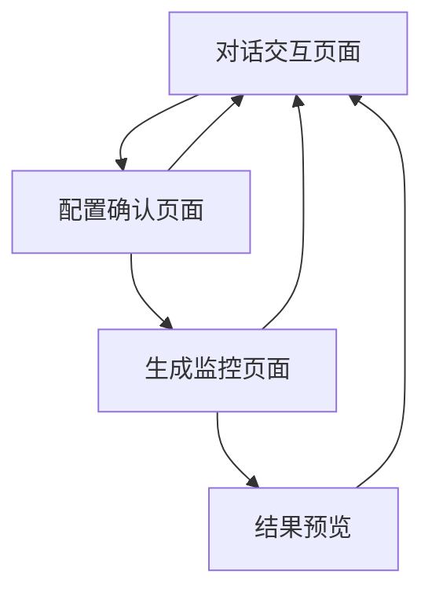
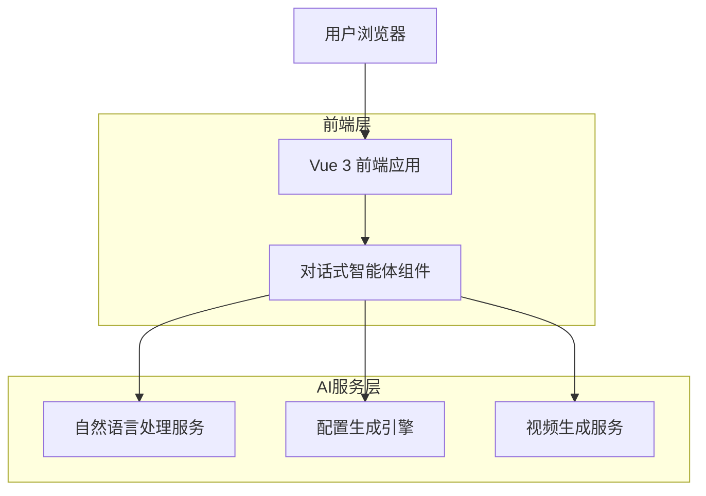
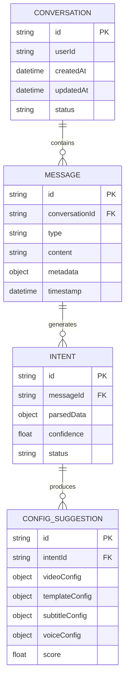

# 对话式视频混剪智能体 - 产品需求规格说明书

## 1. 产品概述

将现有的步骤式视频混剪智能体升级为对话式智能体，用户通过自然语言描述需求，系统自动解析并提供完整的配置方案，用户确认后自动完成所有步骤的配置。

- 解决问题：简化复杂的多步骤配置流程，提升用户体验和操作效率
- 目标用户：需要快速生成视频内容的创作者、营销人员、自媒体从业者
- 产品价值：将专业的视频制作门槛降低到自然语言交流的水平，大幅提升创作效率

## 2. 核心功能

### 2.1 用户角色

| 角色 | 注册方式 | 核心权限 |
|------|----------|----------|
| 普通用户 | 邮箱注册 | 可使用基础对话功能，每日限制生成次数 |
| 高级用户 | 付费升级 | 无限制使用，可保存自定义模板，优先处理 |

### 2.2 功能模块

我们的对话式视频混剪智能体包含以下核心页面：

1. **对话交互页面**：自然语言输入、智能解析、方案推荐
2. **配置确认页面**：方案预览、参数调整、一键应用
3. **生成监控页面**：实时进度、结果预览、下载导出

### 2.3 页面详情

| 页面名称 | 模块名称 | 功能描述 |
|----------|----------|----------|
| 对话交互页面 | 自然语言输入 | 支持文本输入、语音输入、文件上传，智能识别用户意图 |
| 对话交互页面 | 智能解析引擎 | 解析用户需求，提取关键参数（格式、时长、风格、主题等） |
| 对话交互页面 | 方案推荐系统 | 基于解析结果生成多套配置方案，包含模板、参数、字幕、音色等完整配置 |
| 对话交互页面 | 对话历史 | 记录对话过程，支持上下文理解和需求迭代 |
| 配置确认页面 | 方案预览 | 可视化展示推荐的配置方案，包含效果预览 |
| 配置确认页面 | 参数微调 | 允许用户对推荐方案进行细节调整 |
| 配置确认页面 | 一键应用 | 确认方案后自动填充所有配置步骤 |
| 生成监控页面 | 进度跟踪 | 实时显示视频生成进度和状态 |
| 生成监控页面 | 结果预览 | 生成完成后的视频预览和编辑 |
| 生成监控页面 | 导出下载 | 支持多种格式导出和云端存储 |

## 3. 核心流程

### 用户操作流程

1. **需求描述阶段**：用户通过自然语言描述视频制作需求
2. **智能解析阶段**：系统解析用户意图，提取关键参数
3. **方案推荐阶段**：基于解析结果生成多套配置方案
4. **确认调整阶段**：用户预览方案，进行必要的微调
5. **自动配置阶段**：系统自动完成所有步骤的参数配置
6. **生成监控阶段**：实时跟踪视频生成进度
7. **结果交付阶段**：预览、编辑和导出最终视频

### 页面导航流程图



## 4. 用户界面设计

### 4.1 设计风格

- **主色调**：深灰色背景 (#1f2937)，蓝紫渐变强调色 (#3b82f6 到 #8b5cf6)
- **按钮风格**：圆角设计，渐变背景，悬停动效
- **字体**：系统默认字体，标题 18-24px，正文 14-16px
- **布局风格**：卡片式设计，左右分栏布局，响应式适配
- **图标风格**：Lucide图标库，线性风格，统一尺寸

### 4.2 页面设计概览

| 页面名称 | 模块名称 | UI元素 |
|----------|----------|---------|
| 对话交互页面 | 对话区域 | 聊天气泡样式，支持文本、图片、语音消息，渐变背景，圆角设计 |
| 对话交互页面 | 输入区域 | 多行文本框，工具栏按钮，发送按钮，支持拖拽上传 |
| 对话交互页面 | 方案卡片 | 卡片式布局，预览缩略图，参数标签，选择按钮 |
| 配置确认页面 | 预览区域 | 大尺寸预览窗口，参数面板，实时更新 |
| 配置确认页面 | 调整面板 | 滑块控件，下拉选择，开关按钮，颜色选择器 |
| 生成监控页面 | 进度条 | 环形进度条，状态指示器，时间估算 |

### 4.3 响应式设计

- **桌面优先**：主要针对桌面端设计，支持大屏幕操作
- **移动适配**：平板和手机端采用单栏布局，保持核心功能
- **触控优化**：按钮尺寸适配触控操作，手势支持

## 5. 技术架构

### 5.1 整体架构



### 5.2 技术选型

- **前端**：Vue 3 + TypeScript + Pinia + Tailwind CSS + Vite
- **AI服务**：集成现有的AutoConfigModal逻辑，扩展自然语言处理能力

### 5.3 路由定义

| 路由 | 用途 |
|------|------|
| /workspace?agent=video-mixer | 对话式视频混剪智能体主页面 |
| /workspace/video/config | 配置确认页面（可选，可在主页面内切换） |
| /workspace/video/generate | 生成监控页面（可选，可在主页面内切换） |

### 5.4 核心API设计

#### 4.1 自然语言解析API

```
POST /api/video/parse-intent
```

请求参数：
| 参数名 | 参数类型 | 是否必需 | 描述 |
|--------|----------|----------|------|
| message | string | true | 用户输入的自然语言描述 |
| context | object | false | 对话上下文信息 |
| files | array | false | 上传的参考文件 |

响应参数：
| 参数名 | 参数类型 | 描述 |
|--------|----------|------|
| intent | object | 解析出的用户意图 |
| confidence | number | 解析置信度 |
| suggestions | array | 推荐的配置方案 |

示例：
```json
{
  "message": "我想制作一个30秒的抖音短视频，内容是美食制作过程，要有字幕和背景音乐",
  "context": {},
  "files": []
}
```

#### 4.2 配置生成API

```
POST /api/video/generate-config
```

请求参数：
| 参数名 | 参数类型 | 是否必需 | 描述 |
|--------|----------|----------|------|
| intent | object | true | 解析出的用户意图 |
| preferences | object | false | 用户偏好设置 |

响应参数：
| 参数名 | 参数类型 | 描述 |
|--------|----------|------|
| configs | array | 生成的配置方案列表 |
| recommendations | object | 推荐理由和说明 |

## 6. 数据模型

### 6.1 对话数据模型



### 6.2 数据定义语言

```sql
-- 对话表
CREATE TABLE conversations (
    id UUID PRIMARY KEY DEFAULT gen_random_uuid(),
    user_id UUID NOT NULL,
    title VARCHAR(255),
    status VARCHAR(50) DEFAULT 'active',
    created_at TIMESTAMP WITH TIME ZONE DEFAULT NOW(),
    updated_at TIMESTAMP WITH TIME ZONE DEFAULT NOW()
);

-- 消息表
CREATE TABLE messages (
    id UUID PRIMARY KEY DEFAULT gen_random_uuid(),
    conversation_id UUID REFERENCES conversations(id),
    type VARCHAR(50) NOT NULL, -- 'user', 'assistant', 'system'
    content TEXT NOT NULL,
    metadata JSONB,
    timestamp TIMESTAMP WITH TIME ZONE DEFAULT NOW()
);

-- 意图解析表
CREATE TABLE intents (
    id UUID PRIMARY KEY DEFAULT gen_random_uuid(),
    message_id UUID REFERENCES messages(id),
    parsed_data JSONB NOT NULL,
    confidence FLOAT NOT NULL,
    status VARCHAR(50) DEFAULT 'pending',
    created_at TIMESTAMP WITH TIME ZONE DEFAULT NOW()
);

-- 配置建议表
CREATE TABLE config_suggestions (
    id UUID PRIMARY KEY DEFAULT gen_random_uuid(),
    intent_id UUID REFERENCES intents(id),
    video_config JSONB NOT NULL,
    template_config JSONB,
    subtitle_config JSONB,
    voice_config JSONB,
    score FLOAT DEFAULT 0,
    created_at TIMESTAMP WITH TIME ZONE DEFAULT NOW()
);

-- 创建索引
CREATE INDEX idx_conversations_user_id ON conversations(user_id);
CREATE INDEX idx_messages_conversation_id ON messages(conversation_id);
CREATE INDEX idx_intents_message_id ON intents(message_id);
CREATE INDEX idx_config_suggestions_intent_id ON config_suggestions(intent_id);

-- 初始化数据
INSERT INTO conversations (user_id, title, status) VALUES 
('user-1', '美食短视频制作', 'active'),
('user-1', '产品宣传视频', 'completed');
```

## 7. 实现计划

### 7.1 第一阶段：基础对话功能
- 实现对话界面组件
- 集成现有AutoConfigModal逻辑
- 基础的自然语言解析（关键词匹配）

### 7.2 第二阶段：智能推荐
- 增强自然语言处理能力
- 实现多方案推荐算法
- 添加配置预览功能

### 7.3 第三阶段：优化体验
- 上下文理解和对话记忆
- 个性化推荐
- 语音输入支持

### 7.4 第四阶段：高级功能
- 文件上传和内容分析
- 批量处理能力
- 模板学习和优化