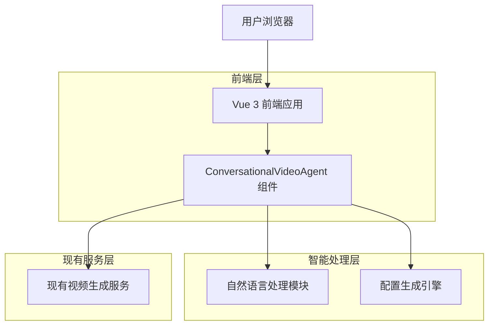
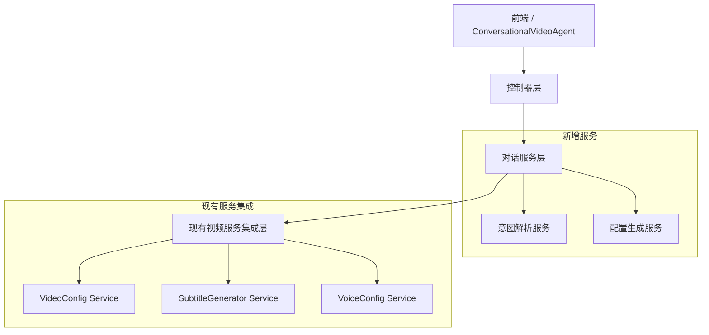
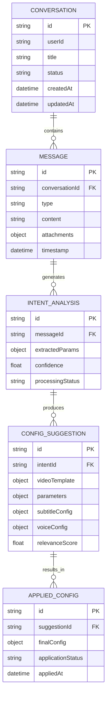

# 对话式视频混剪智能体 - 技术架构文档

## 1. 架构设计



## 2. 技术描述

- **前端**：Vue 3 + TypeScript + Pinia + Tailwind CSS + Vite
- **AI处理**：集成现有AutoConfigModal，扩展自然语言处理能力
- **状态管理**：Pinia Store管理对话状态和配置数据
- **现有集成**：复用VideoConfig、SubtitleGenerator、VideoEditingCanvas等组件

## 3. 路由定义

| 路由 | 用途 |
|------|------|
| /workspace?agent=conversational-video | 对话式视频混剪智能体主页面 |
| /workspace/video/chat | 对话交互界面 |
| /workspace/video/preview | 配置预览和确认页面 |

## 4. API定义

### 4.1 核心API

#### 自然语言意图解析

```
POST /api/video/parse-intent
```

请求参数：
| 参数名 | 参数类型 | 是否必需 | 描述 |
|--------|----------|----------|------|
| message | string | true | 用户输入的自然语言描述 |
| context | object | false | 对话上下文 |
| sessionId | string | true | 会话ID |

响应参数：
| 参数名 | 参数类型 | 描述 |
|--------|----------|------|
| intent | object | 解析出的意图对象 |
| confidence | number | 置信度分数 |
| extractedParams | object | 提取的参数 |

示例：
```json
{
  "message": "制作一个30秒的美食短视频，要有字幕",
  "context": {},
  "sessionId": "session-123"
}
```

#### 配置方案生成

```
POST /api/video/generate-suggestions
```

请求参数：
| 参数名 | 参数类型 | 是否必需 | 描述 |
|--------|----------|----------|------|
| intent | object | true | 解析出的用户意图 |
| userPreferences | object | false | 用户历史偏好 |

响应参数：
| 参数名 | 参数类型 | 描述 |
|--------|----------|------|
| suggestions | array | 配置方案列表 |
| reasoning | string | 推荐理由 |

#### 自动配置应用

```
POST /api/video/apply-config
```

请求参数：
| 参数名 | 参数类型 | 是否必需 | 描述 |
|--------|----------|----------|------|
| selectedConfig | object | true | 用户选择的配置方案 |
| customizations | object | false | 用户自定义调整 |

响应参数：
| 参数名 | 参数类型 | 描述 |
|--------|----------|------|
| success | boolean | 应用是否成功 |
| appliedConfig | object | 最终应用的配置 |

## 5. 服务器架构图



## 6. 数据模型

### 6.1 数据模型定义



### 6.2 数据定义语言

```sql
-- 对话会话表
CREATE TABLE conversations (
    id UUID PRIMARY KEY DEFAULT gen_random_uuid(),
    user_id UUID NOT NULL,
    title VARCHAR(255) DEFAULT '新的视频项目',
    status VARCHAR(50) DEFAULT 'active' CHECK (status IN ('active', 'completed', 'archived')),
    created_at TIMESTAMP WITH TIME ZONE DEFAULT NOW(),
    updated_at TIMESTAMP WITH TIME ZONE DEFAULT NOW()
);

-- 消息表
CREATE TABLE messages (
    id UUID PRIMARY KEY DEFAULT gen_random_uuid(),
    conversation_id UUID REFERENCES conversations(id) ON DELETE CASCADE,
    type VARCHAR(50) NOT NULL CHECK (type IN ('user', 'assistant', 'system')),
    content TEXT NOT NULL,
    attachments JSONB DEFAULT '[]',
    timestamp TIMESTAMP WITH TIME ZONE DEFAULT NOW()
);

-- 意图分析表
CREATE TABLE intent_analyses (
    id UUID PRIMARY KEY DEFAULT gen_random_uuid(),
    message_id UUID REFERENCES messages(id) ON DELETE CASCADE,
    extracted_params JSONB NOT NULL DEFAULT '{}',
    confidence FLOAT NOT NULL DEFAULT 0.0 CHECK (confidence >= 0 AND confidence <= 1),
    processing_status VARCHAR(50) DEFAULT 'pending' CHECK (processing_status IN ('pending', 'completed', 'failed')),
    created_at TIMESTAMP WITH TIME ZONE DEFAULT NOW()
);

-- 配置建议表
CREATE TABLE config_suggestions (
    id UUID PRIMARY KEY DEFAULT gen_random_uuid(),
    intent_id UUID REFERENCES intent_analyses(id) ON DELETE CASCADE,
    video_template JSONB NOT NULL DEFAULT '{}',
    parameters JSONB NOT NULL DEFAULT '{}',
    subtitle_config JSONB DEFAULT '{}',
    voice_config JSONB DEFAULT '{}',
    relevance_score FLOAT DEFAULT 0.0 CHECK (relevance_score >= 0 AND relevance_score <= 1),
    created_at TIMESTAMP WITH TIME ZONE DEFAULT NOW()
);

-- 应用配置表
CREATE TABLE applied_configs (
    id UUID PRIMARY KEY DEFAULT gen_random_uuid(),
    suggestion_id UUID REFERENCES config_suggestions(id) ON DELETE CASCADE,
    final_config JSONB NOT NULL,
    application_status VARCHAR(50) DEFAULT 'pending' CHECK (application_status IN ('pending', 'applied', 'failed')),
    applied_at TIMESTAMP WITH TIME ZONE DEFAULT NOW()
);

-- 创建索引优化查询性能
CREATE INDEX idx_conversations_user_id ON conversations(user_id);
CREATE INDEX idx_conversations_status ON conversations(status);
CREATE INDEX idx_messages_conversation_id ON messages(conversation_id);
CREATE INDEX idx_messages_timestamp ON messages(timestamp DESC);
CREATE INDEX idx_intent_analyses_message_id ON intent_analyses(message_id);
CREATE INDEX idx_config_suggestions_intent_id ON config_suggestions(intent_id);
CREATE INDEX idx_config_suggestions_score ON config_suggestions(relevance_score DESC);
CREATE INDEX idx_applied_configs_suggestion_id ON applied_configs(suggestion_id);

-- 初始化示例数据
INSERT INTO conversations (user_id, title, status) VALUES 
('user-demo', '美食制作短视频', 'active'),
('user-demo', '产品介绍视频', 'completed');

INSERT INTO messages (conversation_id, type, content) VALUES 
((SELECT id FROM conversations WHERE title = '美食制作短视频'), 'user', '我想制作一个30秒的抖音美食视频，展示蛋糕制作过程，需要有字幕和轻松的背景音乐'),
((SELECT id FROM conversations WHERE title = '美食制作短视频'), 'assistant', '我为您推荐了3个配置方案，都适合30秒的美食制作视频...');
```

## 7. 核心组件设计

### 7.1 ConversationalVideoAgent 主组件

```typescript
// ConversationalVideoAgent.vue
interface ConversationState {
  currentConversation: Conversation | null
  messages: Message[]
  isProcessing: boolean
  suggestions: ConfigSuggestion[]
  selectedSuggestion: ConfigSuggestion | null
}

interface Message {
  id: string
  type: 'user' | 'assistant' | 'system'
  content: string
  timestamp: Date
  attachments?: File[]
}

interface ConfigSuggestion {
  id: string
  title: string
  description: string
  videoTemplate: VideoTemplate
  parameters: VideoParameters
  subtitleConfig: SubtitleConfig
  voiceConfig: VoiceConfig
  relevanceScore: number
}
```

### 7.2 自然语言处理模块

```typescript
// NLPProcessor.ts
interface IntentAnalysis {
  intent: string // 'create_video', 'modify_config', 'ask_question'
  entities: {
    duration?: number
    format?: string
    style?: string
    topic?: string
    features?: string[]
  }
  confidence: number
}

class NLPProcessor {
  async analyzeIntent(message: string, context?: object): Promise<IntentAnalysis>
  async extractVideoParams(analysis: IntentAnalysis): Promise<VideoParameters>
  async generateSuggestions(params: VideoParameters): Promise<ConfigSuggestion[]>
}
```

### 7.3 配置生成引擎

```typescript
// ConfigGenerator.ts
interface VideoParameters {
  duration: number
  aspectRatio: string
  template: string
  style: string
  hasSubtitles: boolean
  voiceType: string
  backgroundMusic: boolean
  topic: string
}

class ConfigGenerator {
  async generateFromIntent(intent: IntentAnalysis): Promise<ConfigSuggestion[]>
  async applyConfiguration(suggestion: ConfigSuggestion): Promise<AppliedConfig>
  async integrateWithExistingComponents(config: AppliedConfig): Promise<void>
}
```

## 8. 集成方案

### 8.1 与现有组件集成

1. **VideoConfig.vue 集成**
   - 通过 Pinia Store 自动填充配置数据
   - 保留手动调整能力
   - 添加"来自对话"标识

2. **AutoConfigModal.vue 扩展**
   - 复用现有的智能配置逻辑
   - 增强自然语言处理能力
   - 集成到对话流程中

3. **VideoEditingCanvas.vue 适配**
   - 支持从对话直接跳转到编辑
   - 预填充所有配置步骤
   - 保持原有编辑功能

### 8.2 状态管理集成

```typescript
// store/conversationalVideo.ts
export const useConversationalVideoStore = defineStore('conversationalVideo', () => {
  const currentConversation = ref<Conversation | null>(null)
  const messages = ref<Message[]>([])
  const suggestions = ref<ConfigSuggestion[]>([])
  
  const sendMessage = async (content: string, attachments?: File[]) => {
    // 发送消息并处理响应
  }
  
  const applySuggestion = async (suggestion: ConfigSuggestion) => {
    // 应用配置到现有的视频配置 Store
    const videoStore = useVideoStore()
    await videoStore.applyAutoConfig(suggestion)
  }
  
  return {
    currentConversation,
    messages,
    suggestions,
    sendMessage,
    applySuggestion
  }
})
```

## 9. 实现优先级

### 第一阶段：基础对话功能
- [ ] 创建 ConversationalVideoAgent 组件
- [ ] 实现基础对话界面
- [ ] 集成简单的关键词匹配解析
- [ ] 连接现有 AutoConfigModal 逻辑

### 第二阶段：智能推荐
- [ ] 增强自然语言处理能力
- [ ] 实现多方案生成算法
- [ ] 添加配置预览功能
- [ ] 完善与现有组件的集成

### 第三阶段：体验优化
- [ ] 添加上下文理解
- [ ] 实现对话记忆功能
- [ ] 支持语音输入
- [ ] 优化推荐算法

### 第四阶段：高级功能
- [ ] 文件上传和分析
- [ ] 个性化推荐
- [ ] 批量处理能力
- [ ] 学习用户偏好