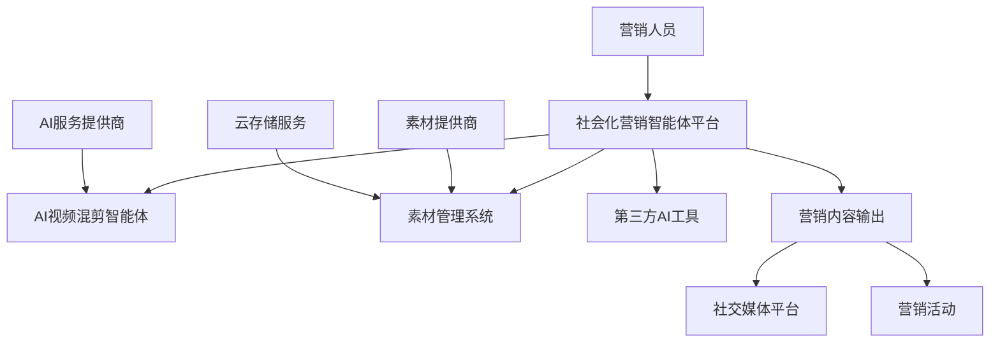

# 社会化营销智能体平台 - 产品需求规格说明书

**项目代号**: SMART-AGENT-PLATFORM  
**文档版本**: v2.0  
**编制日期**: 2024年12月  
**项目性质**: 甲方委托外包开发  

---

**对标产品**: Raycast | Genspark | Manus  
**当前阶段**: 平台基础架构 + AI视频混剪智能体  

---

## 📋 目录

1. [项目概述](#1-项目概述)
2. [产品目标](#2-产品目标)
3. [项目干系人](#3-项目干系人)
4. [项目约束条件](#4-项目约束条件)
5. [命名标准和定义](#5-命名标准和定义)
6. [假定因素](#6-假定因素)
7. [产品范围](#7-产品范围)
8. [功能性需求](#8-功能性需求)
9. [非功能性需求](#9-非功能性需求)
10. [项目问题](#10-项目问题)
11. [后续版本需求](#11-后续版本需求)

---

## 1. 项目概述

### 1.1 产品定位

**社会化营销智能体平台**是一个面向营销领域的AI智能体集成平台，旨在为营销从业者提供一站式的AI工具解决方案。平台采用插件化架构，支持多种营销场景的智能体接入，当前重点打造AI视频混剪智能体。

### 1.2 产品愿景

> 🎯 **成为营销领域最专业的AI智能体平台，让每个营销人员都能轻松使用AI工具提升工作效率**

### 1.3 核心价值主张

| 价值维度 | 具体价值 |
|---------|---------|
| **效率提升** | 通过AI自动化减少90%的重复性工作 |
| **专业能力** | 提供营销领域专业的AI智能体 |
| **易用性** | 对话式交互，零学习成本 |
| **可扩展性** | 插件化架构，支持第三方智能体接入 |

---

## 2. 产品目标

### 2.1 业务目标

- **📈 用户规模**: 第一阶段目标1000+营销从业者用户
- **⚡ 效率提升**: 用户工作效率提升80%以上
- **🔌 生态建设**: 接入10+第三方营销AI工具
- **💰 商业价值**: 为用户节省50%的内容制作成本

### 2.2 技术目标

- **🚀 性能指标**: 支持1000+并发用户
- **⏱️ 响应时间**: 核心功能响应时间<2秒
- **📊 可用性**: 系统可用性达到99.9%
- **🔒 安全性**: 通过企业级安全认证

---

## 3. 项目干系人

### 3.1 甲方团队

| 角色 | 姓名 | 职责 | 联系方式 |
|------|------|------|----------|
| **项目负责人** | 待定 | 项目整体管理与决策 | 待补充 |
| **产品经理-平台架构** | 王成龙 | 平台架构与Agent集成规划 | 待补充 |
| **产品经理-AI功能** | 可晓斌 | AI能力与智能体功能规划 | 待补充 |
| **产品经理-用户体验** | 胡郑峰 | 用户体验与界面交互设计 | 待补充 |

### 3.2 乙方团队

| 角色 | 职责 | 人员配置 |
|------|------|----------|
| **项目经理** | 项目进度管理与质量控制 | 1人 |
| **技术架构师** | 系统架构设计与技术选型 | 1人 |
| **前端开发** | 用户界面开发 | 2-3人 |
| **后端开发** | 服务端开发与API设计 | 3-4人 |
| **AI工程师** | AI功能开发与模型集成 | 2人 |
| **测试工程师** | 功能测试与性能测试 | 2人 |

---

## 4. 项目约束条件

### 4.1 时间约束

| 里程碑 | 时间节点 | 交付内容 |
|--------|----------|----------|
| **第一阶段** | 2025年11月15日 | 核心平台功能 + 基础AI视频混剪 |
| **第二阶段** | 2025年12月中旬 | 完整功能交付 + 性能优化 |
| **项目验收** | 2025年12月底 | 项目整体验收与上线 |

### 4.2 预算约束

- **总预算**: 130人/天
- **第一阶段**: 80人/天
- **第二阶段**: 50人/天

### 4.3 技术约束

- **前端技术栈**: Vue 3 + TypeScript + Pinia + Tailwind CSS
- **后端技术栈**: Node.js/Python + 微服务架构
- **数据库**: PostgreSQL + Redis
- **部署环境**: 云原生架构，支持容器化部署

---

## 5. 命名标准和定义

### 5.1 核心术语

| 术语 | 定义 | 英文对照 |
|------|------|----------|
| **智能体** | 具备特定功能的AI工具，能够理解用户指令并执行相应任务 | Agent |
| **混剪** | 将多个视频素材按照一定逻辑组合成新视频的过程 | Video Mixing |
| **素材库** | 存储视频、音频、图片等创作素材的云端仓库 | Material Library |
| **模板** | 预设的视频制作样式和结构，用于快速生成视频 | Template |
| **工作流** | 完成特定任务的步骤序列 | Workflow |

### 5.2 技术术语

| 术语 | 定义 |
|------|------|
| **API网关** | 统一管理和路由API请求的服务 |
| **微服务** | 独立部署的小型服务单元 |
| **容器化** | 使用Docker等技术进行应用打包和部署 |
| **负载均衡** | 分散请求到多个服务实例的技术 |

---

## 6. 假定因素

### 6.1 技术假定

- ✅ AI模型API服务稳定可用（如OpenAI、Claude等）
- ✅ 云服务提供商（阿里云/腾讯云）服务稳定
- ✅ 第三方视频处理服务可正常调用
- ✅ 开发团队具备相关技术栈经验

### 6.2 业务假定

- ✅ 用户具备基本的计算机操作能力
- ✅ 用户网络环境支持视频上传下载
- ✅ 营销内容制作需求持续增长
- ✅ 用户愿意接受AI辅助创作方式

### 6.3 法律合规假定

- ✅ AI生成内容符合相关法律法规
- ✅ 用户上传内容拥有合法使用权
- ✅ 数据处理符合隐私保护要求

---

## 7. 产品范围

### 7.1 工作上下文范围

### 7.2 产品边界

#### 7.2.1 包含功能
- ✅ 用户注册登录与权限管理
- ✅ AI视频混剪智能体
- ✅ 素材云盘管理
- ✅ 多音色语音合成
- ✅ 批量处理工具
- ✅ 第三方Agent接入

#### 7.2.2 不包含功能
- ❌ 视频直播功能
- ❌ 社交媒体发布功能
- ❌ 付费推广管理
- ❌ 数据分析报表

---

## 8. 功能性需求

### 8.1 用户管理模块

#### 8.1.1 用户注册登录

**需求描述**: 用户可以通过邮箱、手机号或第三方账号注册登录系统

**功能详情**:
- 支持邮箱/手机号注册
- 支持微信、QQ第三方登录
- 密码强度验证
- 验证码验证机制
- 忘记密码重置功能

**验收标准**:
- 注册成功率 > 95%
- 登录响应时间 < 2秒
- 支持1000+并发登录

#### 8.1.2 用户权限管理

**需求描述**: 系统支持多层级用户权限管理

| 用户类型 | 权限范围 | 功能限制 |
|----------|----------|----------|
| **免费用户** | 基础功能 | 每日10次AI调用 |
| **高级用户** | 全部功能 | 每日100次AI调用 |
| **企业用户** | 全部功能+管理 | 无限制调用 |

### 8.2 界面交互升级模块

#### 8.2.1 对话式交互

**需求描述**: 用户可以通过自然语言与智能体进行对话交互

**功能详情**:
- 自然语言理解与处理
- 上下文记忆功能
- 多轮对话支持
- 语音输入支持
- 快捷指令功能

**验收标准**:
- 指令理解准确率 > 90%
- 对话响应时间 < 3秒
- 支持中英文双语

#### 8.2.2 指令式操作

**需求描述**: 提供快捷指令操作方式，提升操作效率

**功能详情**:
- 预设常用指令库
- 自定义指令功能
- 指令自动补全
- 批量操作指令
- 指令历史记录

### 8.3 AI视频混剪智能体模块

#### 8.3.1 模板驱动混剪

**需求描述**: 基于预设模板自动生成视频内容

**功能详情**:
- 多种视频模板库
- 智能素材匹配
- 自动时长调整
- 转场效果添加
- 背景音乐匹配

**验收标准**:
- 模板库包含10+模板
- 视频生成成功率 > 95%
- 单个视频生成时间 < 2分钟

#### 8.3.2 智能剪辑功能

**需求描述**: AI自动分析视频内容并进行智能剪辑

**功能详情**:
- 场景自动识别
- 精彩片段提取
- 重复内容去除
- 节奏自动调整
- 关键帧提取

### 8.4 素材管理模块

#### 8.4.1 AI素材云盘

**需求描述**: 智能化的素材存储和管理系统

**功能详情**:
- 自动分类标签
- 智能搜索功能
- 相似素材推荐
- 批量上传下载
- 版本管理功能

**验收标准**:
- 支持10GB+存储空间
- 搜索响应时间 < 1秒
- 标签准确率 > 85%

#### 8.4.2 素材API对接

**需求描述**: 对接第三方素材库，扩充素材来源

**功能详情**:
- 多平台素材接入
- 版权信息管理
- 自动同步更新
- 格式标准化
- 质量筛选机制

### 8.5 语音合成模块

#### 8.5.1 多音色配音

**需求描述**: 提供多种音色的语音合成服务

**功能详情**:
- 20+预设音色
- 情感语调调节
- 语速控制功能
- 停顿标点处理
- 批量文本转语音

**验收标准**:
- 语音合成质量评分 > 4.0/5.0
- 单次合成时长 < 30秒
- 支持10万字符/次

#### 8.5.2 个人音色克隆

**需求描述**: 基于用户语音样本克隆个人专属音色

**功能详情**:
- 语音样本录制
- 音色模型训练
- 克隆效果预览
- 音色质量评估
- 个人音色库管理

### 8.6 批量处理模块

#### 8.6.1 批量切片功能

**需求描述**: 自动将长视频切分为多个短视频片段

**功能详情**:
- 智能场景分割
- 时长自定义设置
- 关键词定位切片
- 批量导出功能
- 切片质量检查

**验收标准**:
- 切片准确率 > 90%
- 处理速度 > 10倍播放速度
- 支持4K视频处理

#### 8.6.2 素材理解智能体

**需求描述**: AI自动分析和理解素材内容

**功能详情**:
- 视频内容识别
- 文字信息提取
- 情感色彩分析
- 主题标签生成
- 适用场景推荐

### 8.7 通用Agent集成模块

#### 8.7.1 第三方Agent接入

**需求描述**: 支持第三方AI工具以插件形式接入平台

**功能详情**:
- 标准API接口
- 插件管理系统
- 权限控制机制
- 使用统计功能
- 插件商店功能

**验收标准**:
- 支持10+第三方Agent
- 接入响应时间 < 5秒
- API调用成功率 > 99%

---

## 9. 非功能性需求

### 9.1 性能需求

#### 9.1.1 响应时间要求

| 功能模块 | 响应时间要求 | 备注 |
|----------|--------------|------|
| **用户登录** | < 2秒 | 包含验证时间 |
| **页面加载** | < 3秒 | 首屏加载时间 |
| **视频上传** | 实时进度显示 | 支持断点续传 |
| **AI处理** | < 30秒 | 单个视频处理 |
| **搜索功能** | < 1秒 | 素材搜索响应 |

#### 9.1.2 并发性能要求

- **用户并发**: 支持1000+在线用户
- **API并发**: 支持10000+/分钟API调用
- **文件上传**: 支持100+并发上传
- **视频处理**: 支持50+并发处理任务

#### 9.1.3 存储性能要求

- **用户存储**: 每用户10GB免费空间
- **系统存储**: 支持PB级数据存储
- **备份策略**: 3副本存储，异地备份
- **数据恢复**: RTO < 4小时，RPO < 1小时

### 9.2 可靠性需求

#### 9.2.1 系统可用性

- **可用性指标**: 99.9%（年停机时间 < 8.76小时）
- **故障恢复**: 自动故障转移 < 30秒
- **监控告警**: 7×24小时监控
- **容灾备份**: 异地多活架构

#### 9.2.2 数据可靠性

- **数据完整性**: 99.999%
- **数据一致性**: 强一致性保证
- **备份频率**: 每日全量备份
- **恢复测试**: 月度恢复演练

### 9.3 安全性需求

#### 9.3.1 数据安全

- **传输加密**: HTTPS/TLS 1.3
- **存储加密**: AES-256加密
- **访问控制**: RBAC权限模型
- **审计日志**: 完整操作日志记录

#### 9.3.2 用户隐私

- **隐私保护**: 符合GDPR/个人信息保护法
- **数据脱敏**: 敏感数据自动脱敏
- **用户授权**: 明确数据使用授权
- **数据删除**: 支持用户数据删除

### 9.4 易用性需求

#### 9.4.1 用户体验

- **学习成本**: 新用户5分钟内上手
- **操作效率**: 常用功能3步内完成
- **错误处理**: 友好的错误提示
- **帮助系统**: 完整的帮助文档

#### 9.4.2 界面设计

- **响应式设计**: 支持PC/平板/手机
- **无障碍访问**: 符合WCAG 2.1标准
- **多语言支持**: 中英文双语
- **主题定制**: 支持明暗主题切换

### 9.5 可扩展性需求

#### 9.5.1 系统扩展

- **水平扩展**: 支持服务实例动态扩容
- **垂直扩展**: 支持单实例性能提升
- **模块化设计**: 功能模块独立部署
- **API版本**: 支持API版本管理

#### 9.5.2 功能扩展

- **插件架构**: 支持第三方插件开发
- **API开放**: 提供完整的开放API
- **Webhook**: 支持事件回调机制
- **自定义**: 支持用户自定义配置

---

## 10. 项目问题

### 10.1 开放式问题

#### 10.1.1 技术风险

| 风险项 | 风险等级 | 应对策略 |
|--------|----------|----------|
| **AI模型稳定性** | 中等 | 多模型备选方案 |
| **视频处理性能** | 高 | 分布式处理架构 |
| **第三方API依赖** | 中等 | 服务降级机制 |
| **数据安全合规** | 高 | 专业安全咨询 |

#### 10.1.2 业务风险

| 风险项 | 风险等级 | 应对策略 |
|--------|----------|----------|
| **用户接受度** | 中等 | 用户调研与测试 |
| **竞品压力** | 中等 | 差异化功能开发 |
| **版权问题** | 高 | 版权合规审查 |
| **成本控制** | 中等 | 分阶段投入 |

### 10.2 假设验证

#### 10.2.1 需要验证的假设

- **用户需求假设**: 营销人员确实需要AI视频制作工具
- **技术可行性**: 当前AI技术能够满足产品需求
- **商业模式**: 用户愿意为AI工具付费
- **市场时机**: 市场对AI营销工具的接受度

#### 10.2.2 验证方法

- **用户调研**: 目标用户深度访谈
- **技术验证**: 核心功能原型开发
- **市场测试**: 小规模用户测试
- **竞品分析**: 同类产品功能对比

---

## 11. 后续版本需求

### 11.1 V3.0版本规划

#### 11.1.1 高级AI功能
- **智能脚本生成**: AI自动生成视频脚本
- **实时视频生成**: 基于文本实时生成视频
- **多模态理解**: 图文音视频综合理解
- **个性化推荐**: 基于用户行为的智能推荐

#### 11.1.2 协作功能
- **团队协作**: 多人协作编辑功能
- **版本控制**: 项目版本管理
- **评论审批**: 内容审批工作流
- **权限管理**: 细粒度权限控制

### 11.2 V4.0版本规划

#### 11.2.1 生态建设
- **开发者平台**: 第三方开发者工具
- **API市场**: AI能力API交易平台
- **插件商店**: 丰富的插件生态
- **社区功能**: 用户交流社区

#### 11.2.2 商业化功能
- **付费模式**: 多层级付费方案
- **企业版**: 企业级功能定制
- **私有部署**: 支持私有云部署
- **数据分析**: 营销效果分析报告

---

## 📋 附录

### A. 验收标准检查清单

#### A.1 功能验收标准

- [ ] 所有核心功能正常运行
- [ ] 用户注册登录流程完整
- [ ] AI视频混剪功能可用
- [ ] 素材管理功能完善
- [ ] 语音合成质量达标
- [ ] 批量处理功能稳定
- [ ] 第三方集成正常

#### A.2 性能验收标准

- [ ] 系统响应时间符合要求
- [ ] 并发用户数达到指标
- [ ] 系统可用性达到99.9%
- [ ] 数据安全措施完备
- [ ] 用户体验流畅

#### A.3 交付验收标准

- [ ] 完整的系统部署
- [ ] 详细的技术文档
- [ ] 用户操作手册
- [ ] 管理员手册
- [ ] 源代码交付
- [ ] 培训材料准备

### B. 项目里程碑

| 里程碑 | 时间 | 交付内容 | 验收标准 |
|--------|------|----------|----------|
| **需求确认** | 2025年11月 | 需求文档确认 | 甲方签字确认 |
| **架构设计** | 2025年11月 | 技术架构方案 | 技术评审通过 |
| **原型开发** | 2025年11月 | 功能原型 | 原型演示通过 |
| **第一阶段** | 2025年12月15日 | 核心功能 | 功能测试通过 |
| **第二阶段** | 2025年12月30日 | 完整系统 | 系统测试通过 |
| **项目验收** | 2026年1月初 | 最终交付 | 验收测试通过 |

---

**文档状态**: ✅ 已确认  
**最后更新**: 2025年10月30日  
**下次评审**: 待定  

---

*本文档为社会化营销智能体平台项目的正式需求规格说明书，具有合同效力*