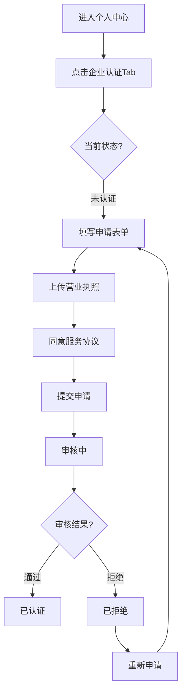

# 个人中心企业认证功能说明

## 功能概述
为用户提供企业认证申请入口和认证进度查看功能，用户可以在个人中心申请企业认证，提交营业执照等资质文件，并实时查看审核进度。

## 一、头像菜单优化

### 修改文件
- `src/views/HomePage.vue`

### 功能点
1. 在头像下拉菜单中新增"设置"菜单项
   - 点击跳转到 `/settings` 路由
   - 图标：Settings
   
2. 在头像下拉菜单中新增"个人中心"菜单项
   - 点击跳转到 `/profile` 路由
   - 图标：User

3. 菜单结构
   ```
   - 主题
   - 后台管理系统
   --------分隔线--------
   - 设置 (新增)
   - 个人中心 (新增)
   --------分隔线--------
   - 退出账号
   ```

## 二、企业认证功能

### 修改文件
- `src/views/ProfilePage.vue`

### 功能点

#### 1. 新增"企业认证"Tab
在个人中心页面的tab列表中新增"企业认证"选项，位于"基本信息"之后。

#### 2. 认证状态管理
支持四种认证状态：
- **未认证 (none)**: 初始状态，显示认证申请表单
- **审核中 (pending)**: 已提交申请，等待后台审核
- **已认证 (approved)**: 审核通过，显示企业信息
- **已拒绝 (rejected)**: 审核未通过，显示拒绝原因和重新申请按钮

#### 3. 未认证状态 (申请表单)

**企业认证权益说明**
- 企业专属标识和认证徽章
- 提升品牌可信度和专业形象
- 支持创建多个团队子账号
- 企业级技术支持服务
- 优先体验新功能和产品

**申请表单字段**
| 字段名称 | 类型 | 必填 | 说明 |
|---------|------|------|------|
| 企业名称 | 文本 | 是 | 企业全称 |
| 统一社会信用代码 | 文本 | 是 | 18位代码，仅支持数字和大写字母 |
| 法定代表人 | 文本 | 是 | 法人姓名 |
| 企业联系电话 | 电话 | 是 | 企业联系方式 |
| 企业地址 | 文本 | 否 | 企业注册地址 |
| 营业执照 | 文件 | 是 | 支持JPG、PNG、PDF格式，最大10MB |
| 服务协议 | 复选框 | 是 | 必须同意才能提交 |

**文件上传功能**
- 支持格式：JPG、PNG、PDF
- 文件大小限制：10MB
- 拖拽或点击上传
- 实时显示已选文件
- 支持删除已选文件

#### 4. 审核中状态
- 显示黄色状态徽章
- 提示"预计1-3个工作日内完成"
- 显示提交时间
- 展示已提交的申请信息（只读）

#### 5. 已认证状态
- 显示绿色状态徽章
- 祝贺信息和认证时间
- 完整展示企业信息
- 强调企业专属权益

#### 6. 已拒绝状态
- 显示红色状态徽章
- 展示拒绝原因
- 提供"重新申请认证"按钮
- 点击后恢复到未认证状态

## 三、技术实现

### 数据结构

```typescript
// 企业认证状态
const enterpriseCertification = reactive({
  status: 'none', // none, pending, approved, rejected
  companyName: '',
  creditCode: '',
  legalPerson: '',
  contactPhone: '',
  address: '',
  submittedAt: '',
  approvedAt: '',
  rejectReason: ''
})

// 企业认证申请表单
const enterpriseForm = reactive({
  companyName: '',
  creditCode: '',
  legalPerson: '',
  contactPhone: '',
  address: '',
  licenseFile: null as File | null,
  agreed: false
})
```

### 核心方法

1. **triggerFileUpload()**: 触发文件选择器
2. **handleFileChange()**: 处理文件选择，包含文件类型和大小验证
3. **submitEnterpriseApplication()**: 提交企业认证申请
4. **reapplyEnterprise()**: 重新申请认证（拒绝后）
5. **getStatusText()**: 获取状态显示文本

### 表单验证
- 必填字段验证
- 统一社会信用代码格式验证（18位，数字和大写字母）
- 文件类型验证（JPG/PNG/PDF）
- 文件大小验证（≤10MB）
- 服务协议勾选验证

## 四、UI设计特点

### 状态标识
- 未认证：灰色徽章
- 审核中：黄色徽章 + 时钟图标
- 已认证：绿色徽章 + 对勾图标
- 已拒绝：红色徽章 + 叉号图标

### 视觉层次
- 权益说明：蓝色渐变背景
- 审核中提示：黄色渐变背景
- 认证通过：绿色渐变背景
- 审核拒绝：红色渐变背景

### 交互反馈
- 文件上传区域hover效果
- 提交按钮禁用状态
- 表单验证提示
- 提交成功/失败弹窗

## 五、用户流程



## 六、后续对接

当前为前端实现，后续需要对接后台接口：
1. 提交企业认证申请接口
2. 查询认证状态接口
3. 文件上传接口
4. 获取认证信息接口

## 七、测试要点

### 功能测试
- [x] 头像菜单中显示"设置"和"个人中心"入口
- [x] 点击"设置"跳转到设置页面
- [x] 点击"个人中心"跳转到个人中心页面
- [x] 企业认证Tab正常显示
- [x] 未认证状态显示申请表单
- [x] 表单字段验证正常
- [x] 文件上传功能正常
- [x] 文件类型和大小验证
- [x] 提交后状态切换到审核中
- [x] 各状态UI展示正确

### UI测试
- [x] 状态徽章颜色正确
- [x] 图标显示正确
- [x] 表单布局合理
- [x] 文件上传区域交互友好
- [x] 移动端响应式正常

## 八、更新内容总结

1. **HomePage.vue**
   - 新增"设置"和"个人中心"菜单项
   - 添加路由跳转处理函数
   - 导入相关图标组件

2. **ProfilePage.vue**
   - 新增"企业认证"Tab
   - 实现完整的企业认证申请流程
   - 支持四种认证状态展示
   - 实现文件上传功能
   - 添加表单验证逻辑
   - 导入相关图标组件

完成时间：2025-11-19

