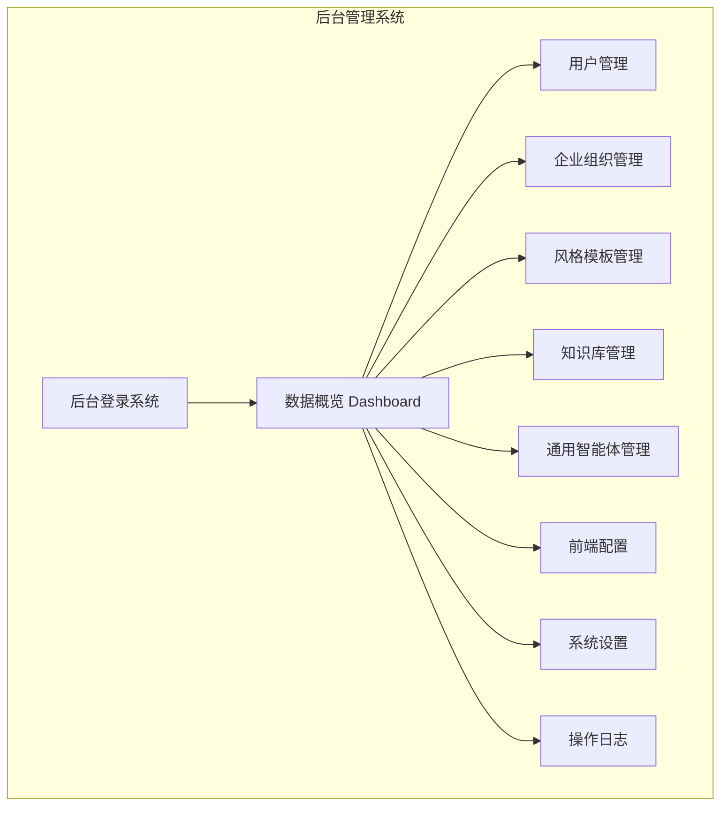
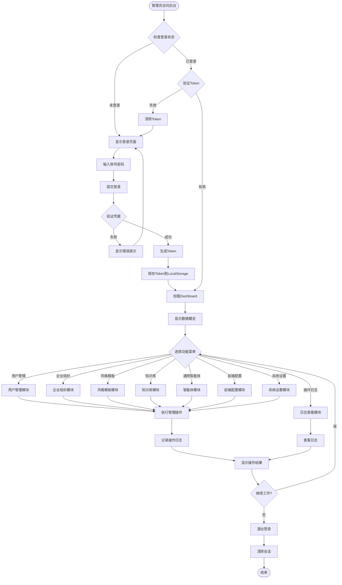
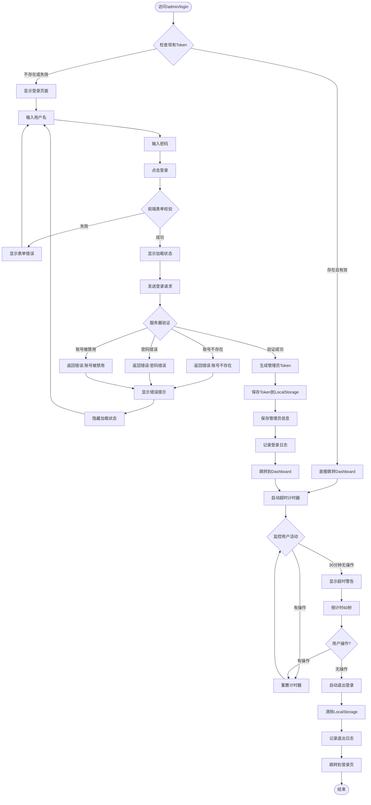
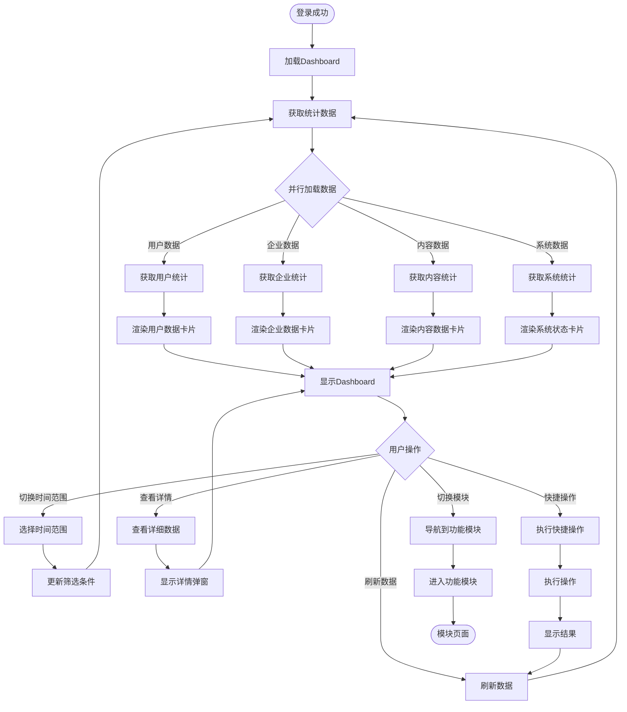
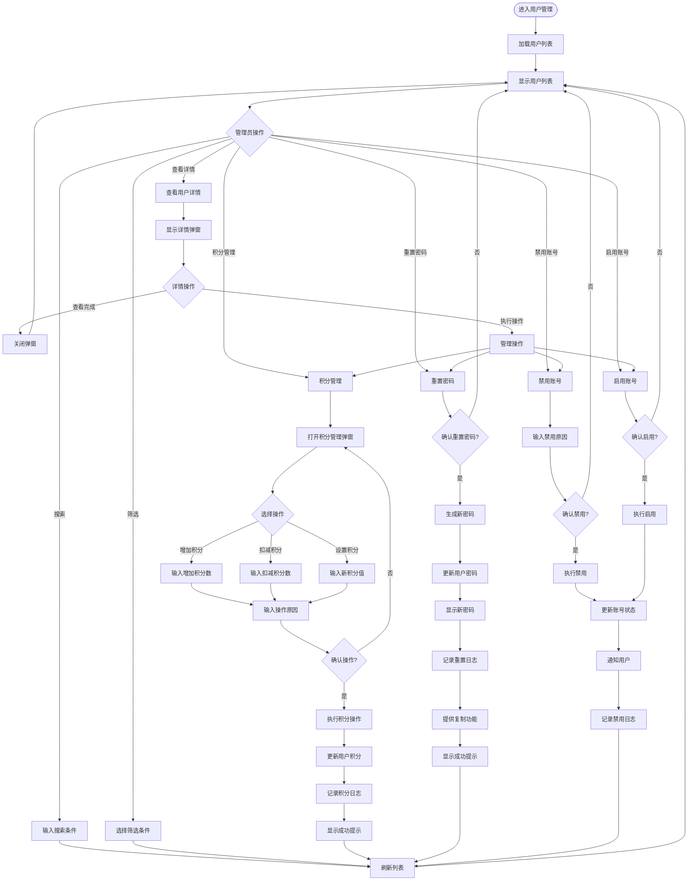
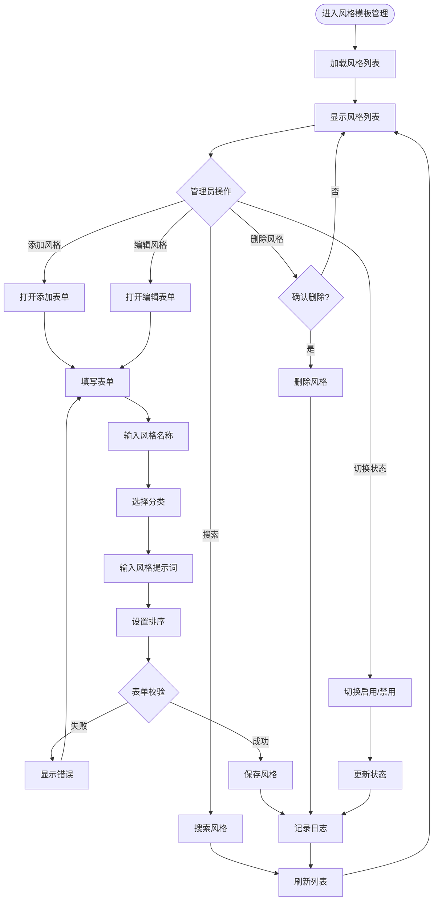
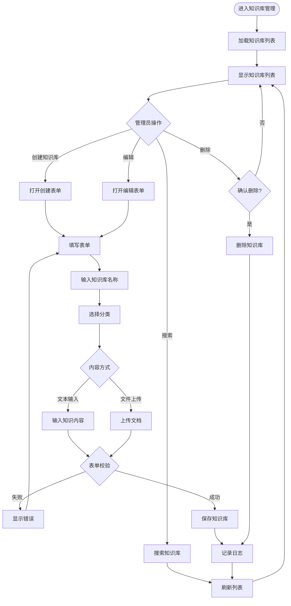
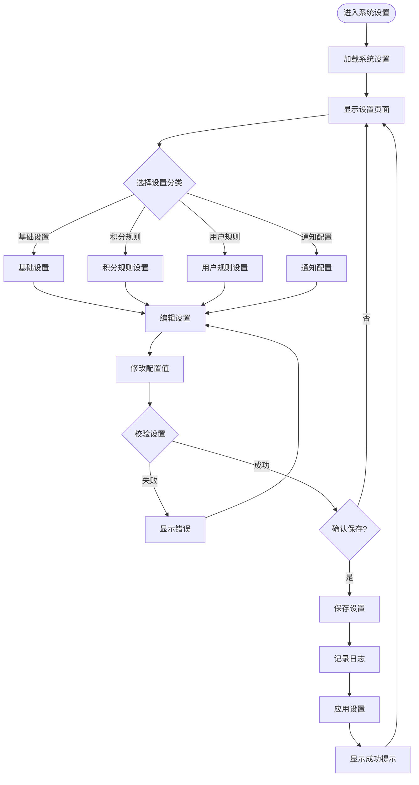

# 后台管理系统 PRD 文档

## 一、产品概述

### 1.1 产品定位

后台管理系统是视频混剪平台的核心管理工具，为系统管理员提供全方位的用户管理、企业组织管理、内容配置、数据监控等功能。通过该系统，管理员可以高效地管理C端用户、审核企业认证、配置系统资源、监控平台运营数据，实现平台的规范化运营和精细化管理。

### 1.2 目标用户

- **系统管理员**：拥有最高权限，负责系统整体管理
- **运营管理员**：负责用户管理、企业审核、内容配置
- **内容管理员**：负责风格模板、知识库等内容管理

### 1.3 核心价值

- **集中化管理**：统一管理平台所有核心资源和数据
- **权限分离**：后台与前台用户系统分离，安全性高
- **数据可视化**：提供直观的数据看板和统计分析
- **高效运营**：简化管理流程，提升运营效率
- **灵活配置**：支持动态配置前端功能和内容

### 1.4 系统架构

---

## 二、总体业务逻辑

### 2.1 业务流程

### 2.2 核心功能模块

1. **后台登录系统**：独立的管理员认证系统
2. **数据概览 (Dashboard)**：平台核心数据可视化展示
3. **用户管理**：C端用户的增删改查及权限管理
4. **企业组织管理**：企业认证审核及组织资源管理
5. **风格模板管理**：系统预设写作风格的配置管理
6. **知识库管理**：通用知识库的创建和维护
7. **通用智能体管理**：智能体的配置和管理
8. **前端配置**：前端展示内容和功能的动态配置
9. **系统设置**：系统级参数和全局配置
10. **操作日志**：管理员操作的审计追踪

---

## 三、功能模块详细设计

### 模块一：后台登录系统

#### 3.1.1 功能描述

**背景**：
后台管理系统需要独立的认证体系，与前端用户系统完全分离。管理员通过专用账号登录后台，确保系统安全性和权限隔离。

**目标用户**：
- 系统管理员
- 运营管理员
- 内容管理员

**实现目标**：
- 提供安全的管理员登录入口
- 独立的认证和授权机制
- 会话管理和超时控制
- 登录日志记录

**业务价值**：
- 保障系统安全
- 权限分离管理
- 操作可追溯
- 防止未授权访问

#### 3.1.2 业务流程

**文字描述**：
1. 管理员访问后台登录页面 `/admin/login`
2. 输入管理员账号和密码
3. 系统验证凭据合法性
4. 验证成功后生成Token并保存到LocalStorage
5. 跳转至后台Dashboard
6. 30分钟无操作自动退出

**流程图**：

#### 3.1.3 业务规则

| 规则编号 | 业务规则描述 | 规则类型 |
|---------|------------|---------|
| BR-AL-001 | 管理员账号：必填，6-20字符，仅支持字母、数字、下划线 | 强制规则 |
| BR-AL-002 | 管理员密码：必填，8-20字符，需包含字母和数字 | 强制规则 |
| BR-AL-003 | 密码错误连续3次，账号锁定10分钟 | 强制规则 |
| BR-AL-004 | 密码错误连续5次，账号锁定1小时 | 强制规则 |
| BR-AL-005 | Token有效期24小时，过期自动失效 | 强制规则 |
| BR-AL-006 | 30分钟无操作，显示超时警告 | 强制规则 |
| BR-AL-007 | 超时警告后60秒无操作，强制退出 | 强制规则 |
| BR-AL-008 | 登录成功后记录登录时间、IP地址、设备信息 | 强制规则 |
| BR-AL-009 | 支持"记住我"功能，Token有效期延长至7天 | 推荐规则 |
| BR-AL-010 | 后台登录页面与前端完全独立，路由为/admin/* | 强制规则 |
| BR-AL-011 | 未登录访问后台页面，自动跳转到/admin/login | 强制规则 |
| BR-AL-012 | 已登录前端用户可以打开后台登录页（新窗口） | 强制规则 |
| BR-AL-013 | 登录失败记录失败日志 | 强制规则 |
| BR-AL-014 | 支持通过浏览器标签页关闭时清除Token（可选） | 推荐规则 |

#### 3.1.4 页面元素

**后台登录页面**

| 元素名称 | 元素类型 | 必填 | 说明 | 交互行为 |
|---------|---------|------|------|---------|
| 页面标题 | 文本 | 是 | "后台管理系统" | 静态展示 |
| 系统Logo | 图片 | 否 | 系统标识图标 | 静态展示 |
| 副标题 | 文本 | 否 | "管理员登录" | 静态展示 |
| 用户名标签 | 文本 | 是 | "管理员账号" | 静态展示 |
| 用户名输入框 | 单行输入框 | 是 | "请输入管理员账号" | 输入文本 |
| 用户名图标 | 图标 | 否 | User图标 | 静态展示 |
| 用户名错误提示 | 错误提示 | 否 | "请输入账号"等 | 条件显示 |
| 密码标签 | 文本 | 是 | "密码" | 静态展示 |
| 密码输入框 | 密码输入框 | 是 | "请输入密码" | 输入密码 |
| 密码图标 | 图标 | 否 | Lock图标 | 静态展示 |
| 密码显示/隐藏 | 图标按钮 | 否 | Eye图标 | 切换显示 |
| 密码错误提示 | 错误提示 | 否 | "密码错误"等 | 条件显示 |
| 记住我选项 | 复选框 | 否 | "记住我（7天）" | 勾选 |
| 忘记密码链接 | 文本链接 | 否 | "忘记密码？" | 点击跳转 |
| 登录按钮 | 主按钮 | 是 | "登录" | 点击提交 |
| 加载状态 | 加载动画 | 否 | "登录中..." | 登录时显示 |
| 全局错误提示 | 警告框 | 否 | 显示登录失败原因 | 条件显示 |
| 版本号 | 文本 | 否 | "v1.0.0" | 静态展示 |

---

### 模块二：数据概览 (Dashboard)

#### 3.2.1 功能描述

**背景**：
Dashboard是管理员登录后的首页，提供平台核心数据的可视化展示，帮助管理员快速了解平台运营状况，包括用户数据、企业数据、内容数据、系统状态等关键指标。

**目标用户**：
- 系统管理员
- 运营管理员

**实现目标**：
- 展示平台核心运营数据
- 提供数据趋势分析
- 快速访问各功能模块
- 实时监控系统状态

**业务价值**：
- 数据驱动决策
- 快速发现问题
- 提升管理效率
- 全局把控运营

#### 3.2.2 业务流程

**文字描述**：
1. 管理员登录成功后进入Dashboard
2. 系统加载并展示核心数据卡片
3. 实时更新数据统计
4. 管理员可以点击快捷操作进入各功能模块
5. 支持自定义数据展示时间范围

**流程图**：

#### 3.2.3 业务规则

| 规则编号 | 业务规则描述 | 规则类型 |
|---------|------------|---------|
| BR-DB-001 | Dashboard数据每30秒自动刷新一次 | 推荐规则 |
| BR-DB-002 | 支持今天、本周、本月、自定义时间范围筛选 | 强制规则 |
| BR-DB-003 | 数据卡片显示数值、环比、同比增长率 | 强制规则 |
| BR-DB-004 | 用户总数统计包含普通用户和企业用户 | 强制规则 |
| BR-DB-005 | 今日新增用户显示当天0点至当前时间的新注册用户 | 强制规则 |
| BR-DB-006 | 企业待审核数量实时更新，显示红点提醒 | 强制规则 |
| BR-DB-007 | 系统状态包括CPU、内存、磁盘使用率 | 推荐规则 |
| BR-DB-008 | 快捷操作最多显示8个常用功能 | 推荐规则 |
| BR-DB-009 | 数据加载失败显示错误提示和重试按钮 | 强制规则 |
| BR-DB-010 | 支持导出Dashboard数据为Excel或PDF | 推荐规则 |
| BR-DB-011 | 数据趋势图支持折线图、柱状图切换 | 推荐规则 |
| BR-DB-012 | 管理员权限不同，展示的数据模块不同 | 推荐规则 |

#### 3.2.4 页面元素

**Dashboard主页**

| 元素名称 | 元素类型 | 必填 | 说明 | 交互行为 |
|---------|---------|------|------|---------|
| 顶部导航栏 | 导航条 | 是 | 系统名称、用户信息、退出 | 静态展示+交互 |
| 侧边菜单 | 菜单栏 | 是 | 各功能模块入口 | 点击导航 |
| 欢迎信息 | 文本 | 是 | "欢迎，管理员XXX" | 动态展示 |
| 时间范围选择器 | 下拉选择 | 是 | 今天/本周/本月/自定义 | 切换时间 |
| 刷新按钮 | 图标按钮 | 是 | 刷新图标 | 点击刷新 |
| 自动刷新开关 | 开关 | 否 | 开启/关闭自动刷新 | 切换状态 |

**数据概览卡片区**

| 元素名称 | 元素类型 | 必填 | 说明 | 交互行为 |
|---------|---------|------|------|---------|
| 用户总数卡片 | 数据卡片 | 是 | 显示用户总数及增长 | 点击查看详情 |
| 用户数值 | 大号数字 | 是 | 如"1,2345" | 静态展示 |
| 用户增长率 | 标签 | 是 | "+5.2%" | 绿色/红色 |
| 用户图标 | 图标 | 是 | Users图标 | 静态展示 |
| 今日新增用户卡片 | 数据卡片 | 是 | 今日新注册用户数 | 点击查看列表 |
| 企业总数卡片 | 数据卡片 | 是 | 已认证企业数量 | 点击查看详情 |
| 待审核企业卡片 | 数据卡片 | 是 | 待审核企业数+红点 | 点击进入审核 |
| 待审核数值 | 大号数字 | 是 | 如"12" | 静态展示 |
| 待审核红点 | 徽标 | 否 | 红色圆点 | 数量>0显示 |
| 风格模板数卡片 | 数据卡片 | 是 | 系统风格模板总数 | 点击查看列表 |
| 知识库数卡片 | 数据卡片 | 是 | 知识库总数 | 点击查看列表 |
| 智能体数卡片 | 数据卡片 | 是 | 通用智能体总数 | 点击查看列表 |
| 系统状态卡片 | 数据卡片 | 否 | CPU/内存/磁盘使用率 | 点击查看详情 |

**数据趋势图区**

| 元素名称 | 元素类型 | 必填 | 说明 | 交互行为 |
|---------|---------|------|------|---------|
| 趋势图标题 | 文本 | 是 | "用户增长趋势" | 静态展示 |
| 图表类型切换 | 按钮组 | 否 | 折线图/柱状图 | 切换图表 |
| 趋势图表 | 图表 | 是 | 展示数据趋势 | 可交互 |
| 图例 | 图例 | 是 | 数据系列说明 | 点击显示/隐藏 |
| 时间轴 | X轴 | 是 | 时间刻度 | 可缩放 |
| 数值轴 | Y轴 | 是 | 数值刻度 | 自动调整 |

**快捷操作区**

| 元素名称 | 元素类型 | 必填 | 说明 | 交互行为 |
|---------|---------|------|------|---------|
| 快捷操作标题 | 文本 | 是 | "快捷操作" | 静态展示 |
| 操作按钮 | 按钮网格 | 是 | 常用功能快捷入口 | 点击跳转 |
| 添加用户按钮 | 操作按钮 | 是 | "添加用户" | 打开表单 |
| 审核企业按钮 | 操作按钮 | 是 | "审核企业" | 跳转审核页 |
| 添加风格按钮 | 操作按钮 | 是 | "添加风格" | 打开表单 |
| 系统设置按钮 | 操作按钮 | 是 | "系统设置" | 跳转设置页 |
| 查看日志按钮 | 操作按钮 | 是 | "操作日志" | 跳转日志页 |

---

### 模块三：用户管理

#### 3.3.1 功能描述

**背景**：
用户管理模块专注于C端普通用户的管理，包括用户信息维护、积分管理、账号状态控制、密码重置等功能。管理员可以查看所有注册用户，对用户账号进行必要的管理操作。

**目标用户**：
- 系统管理员
- 运营管理员

**实现目标**：
- 查看和管理所有C端用户
- 管理用户积分和权益
- 重置用户密码
- 控制用户账号状态
- 查看用户操作记录

**业务价值**：
- 用户服务支持
- 账号安全管理
- 积分体系维护
- 用户行为分析

#### 3.3.2 业务流程

**文字描述**：
1. 管理员进入用户管理页面
2. 系统展示所有C端用户列表
3. 支持按条件搜索和筛选用户
4. 管理员可以查看用户详情
5. 执行积分调整、密码重置、账号禁用等操作
6. 系统记录所有管理操作日志

**流程图**：

#### 3.3.3 业务规则

| 规则编号 | 业务规则描述 | 规则类型 |
|---------|------------|---------|
| BR-UM-001 | 用户列表展示所有C端注册用户，不包括企业管理员 | 强制规则 |
| BR-UM-002 | 支持按手机号、用户名、注册时间搜索 | 强制规则 |
| BR-UM-003 | 支持按账号类型筛选：体验账号/付费账号 | 强制规则 |
| BR-UM-004 | 支持按账号状态筛选：正常/禁用 | 强制规则 |
| BR-UM-005 | 用户详情展示：基本信息、积分记录、使用记录 | 强制规则 |
| BR-UM-006 | 积分管理支持：增加、扣减、设置积分 | 强制规则 |
| BR-UM-007 | 积分操作必须填写操作原因，记录操作日志 | 强制规则 |
| BR-UM-008 | 单次积分调整范围：-10000 ~ +10000 | 强制规则 |
| BR-UM-009 | 用户积分不能为负数 | 强制规则 |
| BR-UM-010 | 重置密码生成8位随机密码（字母+数字） | 强制规则 |
| BR-UM-011 | 重置密码后显示新密码，支持一键复制 | 强制规则 |
| BR-UM-012 | 禁用账号需填写禁用原因 | 强制规则 |
| BR-UM-013 | 禁用后用户无法登录系统 | 强制规则 |
| BR-UM-014 | 启用账号立即生效 | 强制规则 |
| BR-UM-015 | 新注册用户默认获得100积分 | 强制规则 |
| BR-UM-016 | 用户列表支持导出为Excel | 推荐规则 |
| BR-UM-017 | 用户详情显示最近10条操作记录 | 推荐规则 |

#### 3.3.4 页面元素

**用户管理列表页**

| 元素名称 | 元素类型 | 必填 | 说明 | 交互行为 |
|---------|---------|------|------|---------|
| 页面标题 | 文本 | 是 | "用户管理" | 静态展示 |
| 页面描述 | 文本 | 否 | "管理所有C端注册用户" | 静态展示 |
| 搜索框 | 输入框 | 是 | "搜索手机号或用户名" | 实时搜索 |
| 搜索按钮 | 按钮 | 是 | "搜索" | 点击搜索 |
| 账号类型筛选 | 下拉选择 | 是 | 全部/体验账号/付费账号 | 筛选 |
| 账号状态筛选 | 下拉选择 | 是 | 全部/正常/禁用 | 筛选 |
| 导出按钮 | 次按钮 | 否 | "导出Excel" | 点击导出 |
| 用户统计 | 文本 | 是 | "共 X 个用户" | 动态展示 |
| 用户列表表格 | 表格 | 是 | 展示用户数据 | 可排序 |

**用户列表表格列**

| 列名 | 字段类型 | 必填 | 说明 | 交互行为 |
|------|---------|------|------|---------|
| 用户ID | 文本 | 是 | 系统生成唯一ID | 静态展示 |
| 手机号 | 文本 | 是 | 用户注册手机号 | 静态展示 |
| 用户名 | 文本 | 否 | 用户昵称 | 静态展示 |
| 账号类型 | 标签 | 是 | 体验账号/付费账号 | 静态展示 |
| 剩余积分 | 数字 | 是 | 当前可用积分 | 静态展示 |
| 账号状态 | 开关 | 是 | 正常/禁用 | 切换状态 |
| 注册时间 | 时间 | 是 | 格式化时间 | 可排序 |
| 最后登录 | 时间 | 否 | 最后登录时间 | 可排序 |
| 操作 | 按钮组 | 是 | 详情/积分/重置密码 | 点击操作 |

**用户详情弹窗**

| 元素名称 | 元素类型 | 必填 | 说明 | 交互行为 |
|---------|---------|------|------|---------|
| 弹窗标题 | 文本 | 是 | "用户详情" | 静态展示 |
| 关闭按钮 | 按钮 | 是 | "×" | 点击关闭 |
| 标签页切换 | 标签页 | 是 | 基本信息/积分记录/使用记录 | 切换显示 |

**基本信息标签页**

| 元素名称 | 元素类型 | 必填 | 说明 | 交互行为 |
|---------|---------|------|------|---------|
| 用户头像 | 图片 | 否 | 用户头像 | 静态展示 |
| 用户ID | 文本 | 是 | 系统ID | 可复制 |
| 手机号 | 文本 | 是 | 注册手机号 | 静态展示 |
| 用户名 | 文本 | 否 | 用户昵称 | 静态展示 |
| 账号类型 | 标签 | 是 | 体验账号/付费账号 | 静态展示 |
| 剩余积分 | 数字 | 是 | 当前积分 | 静态展示 |
| 累计消费积分 | 数字 | 否 | 总消费积分 | 静态展示 |
| 账号状态 | 标签 | 是 | 正常/禁用 | 静态展示 |
| 注册时间 | 时间 | 是 | 完整时间 | 静态展示 |
| 最后登录时间 | 时间 | 否 | 完整时间 | 静态展示 |
| 注册IP | 文本 | 否 | IP地址 | 静态展示 |
| 操作按钮组 | 按钮组 | 是 | 积分管理/重置密码/禁用账号 | 点击操作 |

**积分记录标签页**

| 元素名称 | 元素类型 | 必填 | 说明 | 交互行为 |
|---------|---------|------|------|---------|
| 记录列表 | 列表 | 是 | 积分变动记录 | 可滚动 |
| 时间筛选 | 日期选择器 | 否 | 筛选时间范围 | 选择日期 |
| 记录项 | 列表项 | 是 | 单条记录 | 静态展示 |
| 操作时间 | 文本 | 是 | 变动时间 | 静态展示 |
| 操作类型 | 标签 | 是 | 增加/扣减/设置 | 颜色区分 |
| 变动数量 | 数字 | 是 | 积分变化值 | +/- 显示 |
| 操作原因 | 文本 | 是 | 变动原因 | 静态展示 |
| 操作人 | 文本 | 是 | 管理员/系统 | 静态展示 |
| 变动后余额 | 数字 | 是 | 操作后积分 | 静态展示 |

**使用记录标签页**

| 元素名称 | 元素类型 | 必填 | 说明 | 交互行为 |
|---------|---------|------|------|---------|
| 记录列表 | 列表 | 是 | 功能使用记录 | 可滚动 |
| 时间筛选 | 日期选择器 | 否 | 筛选时间范围 | 选择日期 |
| 功能筛选 | 下拉选择 | 否 | 按功能类型筛选 | 筛选 |
| 记录项 | 列表项 | 是 | 单条使用记录 | 静态展示 |
| 使用时间 | 文本 | 是 | 操作时间 | 静态展示 |
| 功能名称 | 文本 | 是 | 使用的功能 | 静态展示 |
| 消耗积分 | 数字 | 是 | 本次消耗 | 静态展示 |
| 操作详情 | 文本 | 否 | 详细信息 | 可展开 |

**积分管理弹窗**

| 元素名称 | 元素类型 | 必填 | 说明 | 交互行为 |
|---------|---------|------|------|---------|
| 弹窗标题 | 文本 | 是 | "积分管理" | 静态展示 |
| 关闭按钮 | 按钮 | 是 | "×" | 点击关闭 |
| 当前积分 | 数字展示 | 是 | 显示当前积分 | 静态展示 |
| 操作类型标签 | 文本 | 是 | "操作类型" | 静态展示 |
| 操作类型选择 | 单选按钮组 | 是 | 增加/扣减/设置 | 单选 |
| 积分数量标签 | 文本 | 是 | "积分数量" | 静态展示 |
| 积分数量输入 | 数字输入框 | 是 | 输入数量 | 输入数字 |
| 数量限制提示 | 提示文本 | 是 | "-10000 ~ +10000" | 静态展示 |
| 操作原因标签 | 文本 | 是 | "操作原因" | 静态展示 |
| 操作原因输入 | 多行文本框 | 是 | 输入原因 | 输入文本 |
| 原因字数统计 | 文本 | 是 | "X/200" | 实时更新 |
| 预计余额 | 数字展示 | 是 | 操作后积分 | 动态计算 |
| 取消按钮 | 次按钮 | 是 | "取消" | 点击关闭 |
| 确认按钮 | 主按钮 | 是 | "确认" | 点击提交 |

**重置密码弹窗**

| 元素名称 | 元素类型 | 必填 | 说明 | 交互行为 |
|---------|---------|------|------|---------|
| 弹窗标题 | 文本 | 是 | "重置密码" | 静态展示 |
| 关闭按钮 | 按钮 | 是 | "×" | 点击关闭 |
| 警告提示 | 警告框 | 是 | "重置后无法恢复" | 静态展示 |
| 用户信息 | 文本 | 是 | 显示用户手机号 | 静态展示 |
| 确认文本 | 文本 | 是 | "确认为该用户重置密码？" | 静态展示 |
| 新密码展示区 | 文本区域 | 否 | 重置后显示新密码 | 重置后显示 |
| 复制密码按钮 | 按钮 | 否 | "复制密码" | 点击复制 |
| 取消按钮 | 次按钮 | 是 | "取消" | 点击关闭 |
| 确认重置按钮 | 主按钮 | 是 | "确认重置" | 点击执行 |

---

### 模块四：企业组织管理

#### 3.4.1 功能描述

**背景**：
企业组织管理模块负责企业认证审核、组织资源配置、团队管理等功能。普通用户可以申请企业认证，成为企业管理员。管理员在后台审核企业资质，配置组织的积分、有效期、子账号数量等资源。

**目标用户**：
- 系统管理员
- 运营管理员

**实现目标**：
- 审核企业认证申请
- 配置企业组织资源
- 管理企业账号状态
- 查看企业使用情况

**业务价值**：
- 企业客户管理
- 资源合理分配
- 认证流程规范化
- 企业服务支持

#### 3.4.2 业务流程

**文字描述**：
1. 管理员进入企业组织管理页面
2. 系统展示所有企业列表（待审核+已审核）
3. 支持按审核状态筛选（全部/待审核/已审核）
4. 管理员查看待审核企业详情
5. 审核企业资质材料
6. 通过审核：配置积分、有效期、子账号数量
7. 驳回审核：填写驳回原因
8. 已审核企业可以调整资源配置
9. 系统记录所有审核和配置操作

**流程图**：

```mermaid
graph TB
    Start([进入企业组织管理]) --> LoadOrgs[加载企业列表]
    LoadOrgs --> ShowList[显示企业列表]
    
    ShowList --> TabFilter{选择标签页}
    
    TabFilter -->|全部| ShowAll[显示所有企业]
    TabFilter -->|待审核| ShowPending[显示待审核企业]
    TabFilter -->|已审核| ShowApproved[显示已审核企业]
    
    ShowAll --> ListDisplay[列表展示]
    ShowPending --> ListDisplay
    ShowApproved --> ListDisplay
    
    ListDisplay --> ViewToggle{视图切换}
    
    ViewToggle -->|列表视图| ShowTable[表格视图]
    ViewToggle -->|卡片视图| ShowCards[卡片视图]
    
    ShowTable --> UserAction{管理员操作}
    ShowCards --> UserAction
    
    UserAction -->|搜索| SearchOrg[输入企业名称]
    UserAction -->|查看详情| ViewDetail[查看企业详情]
    UserAction -->|审核| ReviewOrg[审核企业]
    UserAction -->|配置资源| ConfigResource[配置资源]
    UserAction -->|禁用| DisableOrg[禁用企业]
    
    SearchOrg --> RefreshList[刷新列表]
    RefreshList --> ListDisplay
    
    ViewDetail --> ShowDetailModal[显示详情弹窗]
    ShowDetailModal --> DetailContent{查看内容}
    
    DetailContent -->|基本信息| ShowBasicInfo[展示基本信息]
    DetailContent -->|资质材料| ShowDocuments[展示资质文件]
    DetailContent -->|使用情况| ShowUsage[展示使用统计]
    
    ShowBasicInfo --> CloseDetail[关闭详情]
    ShowDocuments --> ActionFromDetail{从详情操作}
    ShowUsage --> CloseDetail
    
    ActionFromDetail -->|审核| ReviewOrg
    ActionFromDetail -->|配置| ConfigResource
    
    CloseDetail --> ListDisplay
    
    ReviewOrg --> CheckStatus{检查状态}
    
    CheckStatus -->|待审核| OpenReviewModal[打开审核弹窗]
    CheckStatus -->|已审核| ShowAlreadyReviewed[提示已审核]
    
    ShowAlreadyReviewed --> ListDisplay
    
    OpenReviewModal --> ViewMaterials[查看资质材料]
    ViewMaterials --> DownloadDocs[下载/预览文件]
    DownloadDocs --> ReviewDecision{审核决策}
    
    ReviewDecision -->|通过| ApproveFlow[审核通过流程]
    ReviewDecision -->|驳回| RejectFlow[审核驳回流程]
    ReviewDecision -->|取消| CloseReviewModal[关闭弹窗]
    
    CloseReviewModal --> ListDisplay
    
    ApproveFlow --> ConfigPoints[配置团队积分]
    ConfigPoints --> InputPoints[输入积分数量]
    InputPoints --> ValidatePoints{校验积分}
    
    ValidatePoints -->|失败| ShowPointsError[显示错误]
    ValidatePoints -->|成功| ConfigExpiry[配置有效期]
    
    ShowPointsError --> InputPoints
    
    ConfigExpiry --> SelectExpiry[选择有效期类型]
    SelectExpiry --> ExpiryType{有效期类型}
    
    ExpiryType -->|永久有效| SetPermanent[设置为永久]
    ExpiryType -->|指定时长| InputDuration[输入月数]
    ExpiryType -->|指定日期| SelectDate[选择截止日期]
    
    SetPermanent --> ConfigSubAccounts[配置子账号数]
    InputDuration --> ConfigSubAccounts
    SelectDate --> ConfigSubAccounts
    
    ConfigSubAccounts --> InputSubCount[输入子账号数]
    InputSubCount --> ValidateSubCount{校验数量}
    
    ValidateSubCount -->|失败| ShowSubError[显示错误]
    ValidateSubCount -->|成功| InputApproveRemark[输入审核备注]
    
    ShowSubError --> InputSubCount
    
    InputApproveRemark --> ConfirmApprove{确认通过?}
    
    ConfirmApprove -->|否| ConfigPoints
    ConfirmApprove -->|是| ExecuteApprove[执行审核通过]
    
    ExecuteApprove --> UpdateOrgStatus[更新企业状态为已审核]
    UpdateOrgStatus --> SaveOrgConfig[保存企业配置]
    SaveOrgConfig --> NotifyEnterprise[通知企业]
    NotifyEnterprise --> RecordApproveLog[记录审核日志]
    RecordApproveLog --> ShowApproveSuccess[显示成功提示]
    ShowApproveSuccess --> RefreshList
    
    RejectFlow --> InputRejectReason[输入驳回原因]
    InputRejectReason --> ValidateReason{校验原因}
    
    ValidateReason -->|失败| ShowReasonError[显示错误]
    ValidateReason -->|成功| ConfirmReject{确认驳回?}
    
    ShowReasonError --> InputRejectReason
    
    ConfirmReject -->|否| CloseReviewModal
    ConfirmReject -->|是| ExecuteReject[执行驳回]
    
    ExecuteReject --> UpdateRejectStatus[更新状态为已驳回]
    UpdateRejectStatus --> NotifyReject[通知企业驳回原因]
    NotifyReject --> RecordRejectLog[记录驳回日志]
    RecordRejectLog --> ShowRejectSuccess[显示成功提示]
    ShowRejectSuccess --> RefreshList
    
    ConfigResource --> OpenConfigModal[打开资源配置弹窗]
    OpenConfigModal --> ShowCurrentConfig[显示当前配置]
    ShowCurrentConfig --> ModifyConfig{修改配置}
    
    ModifyConfig -->|调整积分| AdjustPoints[调整团队积分]
    ModifyConfig -->|延长有效期| ExtendExpiry[延长有效期]
    ModifyConfig -->|修改子账号数| ModifySubCount[修改子账号数]
    
    AdjustPoints --> InputNewPoints[输入新积分值]
    InputNewPoints --> InputConfigReason[输入调整原因]
    
    ExtendExpiry --> SelectNewExpiry[选择新有效期]
    SelectNewExpiry --> InputConfigReason
    
    ModifySubCount --> InputNewSubCount[输入新数量]
    InputNewSubCount --> InputConfigReason
    
    InputConfigReason --> ConfirmConfig{确认修改?}
    
    ConfirmConfig -->|否| OpenConfigModal
    ConfirmConfig -->|是| ExecuteConfig[执行配置修改]
    
    ExecuteConfig --> UpdateOrgConfig[更新企业配置]
    UpdateOrgConfig --> RecordConfigLog[记录配置日志]
    RecordConfigLog --> ShowConfigSuccess[显示成功提示]
    ShowConfigSuccess --> RefreshList
    
    DisableOrg --> InputDisableReason[输入禁用原因]
    InputDisableReason --> ConfirmDisableOrg{确认禁用?}
    
    ConfirmDisableOrg -->|否| ListDisplay
    ConfirmDisableOrg -->|是| ExecuteDisableOrg[执行禁用]
    
    ExecuteDisableOrg --> UpdateOrgDisabled[更新企业状态]
    UpdateOrgDisabled --> NotifyOrgDisabled[通知企业]
    NotifyOrgDisabled --> RecordDisableLog[记录禁用日志]
    RecordDisableLog --> RefreshList
```

#### 3.4.3 业务规则

| 规则编号 | 业务规则描述 | 规则类型 |
|---------|------------|---------|
| BR-OM-001 | 企业列表包含待审核和已审核两种状态 | 强制规则 |
| BR-OM-002 | 支持全部、待审核、已审核三个标签页切换 | 强制规则 |
| BR-OM-003 | 支持列表视图和卡片视图切换 | 强制规则 |
| BR-OM-004 | 待审核标签页显示待审核数量 | 强制规则 |
| BR-OM-005 | 待审核企业显示：企业名称、社会信用代码、联系人、注册时间 | 强制规则 |
| BR-OM-006 | 已审核企业额外显示：团队积分、子账号数、有效期 | 强制规则 |
| BR-OM-007 | 社会信用代码作为副标题显示在企业名称下方 | 强制规则 |
| BR-OM-008 | 审核通过时必须配置：团队积分、有效期、子账号数 | 强制规则 |
| BR-OM-009 | 团队积分范围：100-1000000，默认1000 | 强制规则 |
| BR-OM-010 | 有效期类型：永久/指定时长/指定日期 | 强制规则 |
| BR-OM-011 | 指定时长范围：1-120个月 | 强制规则 |
| BR-OM-012 | 子账号数量范围：1-100，默认5 | 强制规则 |
| BR-OM-013 | 审核驳回必须填写驳回原因，10-500字符 | 强制规则 |
| BR-OM-014 | 企业认证通过后发送通知（邮件/短信/站内信） | 推荐规则 |
| BR-OM-015 | 同一企业（社会信用代码）只能认证一次 | 强制规则 |
| BR-OM-016 | 已审核企业可以调整资源配置 | 强制规则 |
| BR-OM-017 | 资源配置调整需填写调整原因 | 强制规则 |
| BR-OM-018 | 企业被禁用后，其管理员和子账号均无法登录 | 强制规则 |
| BR-OM-019 | 企业到期前7天发送提醒通知 | 推荐规则 |
| BR-OM-020 | 企业资质材料支持在线预览和下载 | 强制规则 |
| BR-OM-021 | 支持按企业名称搜索 | 强制规则 |
| BR-OM-022 | 审核状态和操作列不换行显示 | 强制规则 |

#### 3.4.4 页面元素

**企业组织管理列表页**

| 元素名称 | 元素类型 | 必填 | 说明 | 交互行为 |
|---------|---------|------|------|---------|
| 页面标题 | 文本 | 是 | "企业组织管理" | 静态展示 |
| 页面描述 | 文本 | 否 | "管理企业认证审核和组织资源" | 静态展示 |
| 标签页 | 标签页组 | 是 | 全部/待审核/已审核 | 切换标签 |
| 全部标签 | 标签 | 是 | "全部" | 点击切换 |
| 待审核标签 | 标签 | 是 | "待审核 (X)" | 点击切换，显示数量 |
| 已审核标签 | 标签 | 是 | "已审核 (X)" | 点击切换，显示数量 |
| 搜索框 | 输入框 | 是 | "搜索企业名称" | 实时搜索 |
| 视图切换 | 按钮组 | 是 | 列表/卡片 | 切换视图 |
| 列表视图按钮 | 图标按钮 | 是 | List图标 | 点击切换 |
| 卡片视图按钮 | 图标按钮 | 是 | Grid图标 | 点击切换 |
| 刷新按钮 | 图标按钮 | 是 | RefreshCw图标 | 点击刷新 |
| 企业统计 | 文本 | 是 | "共 X 家企业" | 动态展示 |

**列表视图 - 企业表格**

| 列名 | 字段类型 | 必填 | 说明 | 交互行为 |
|------|---------|------|------|---------|
| 企业名称 | 文本 | 是 | 企业全称+信用代码（副标题） | 点击查看详情 |
| 联系人 | 文本 | 是 | 联系人姓名+手机号 | 静态展示 |
| 团队积分 | 数字 | 否 | 仅已审核显示 | 静态展示 |
| 子账号数 | 文本 | 否 | "X/Y"格式，仅已审核显示 | 静态展示 |
| 有效期 | 文本/时间 | 否 | 永久/截止日期，仅已审核显示 | 静态展示 |
| 注册时间 | 时间 | 是 | 格式化时间 | 可排序 |
| 审核状态 | 标签 | 是 | 待审核/已通过/已驳回 | 颜色区分，不换行 |
| 操作 | 按钮组 | 是 | 详情/审核/配置 | 不换行，根据状态显示 |

**卡片视图 - 企业卡片**

| 元素名称 | 元素类型 | 必填 | 说明 | 交互行为 |
|---------|---------|------|------|---------|
| 企业卡片 | 卡片容器 | 是 | 单个企业卡片 | 鼠标悬停高亮 |
| 审核状态标签 | 角标标签 | 是 | 右上角状态标识 | 静态展示 |
| 企业图标 | 图标 | 是 | Building图标 | 静态展示 |
| 企业名称 | 标题文本 | 是 | 企业全称 | 静态展示 |
| 社会信用代码 | 小号文本 | 是 | 灰色副标题 | 静态展示 |
| 联系人标签 | 文本标签 | 是 | "联系人" | 静态展示 |
| 联系人信息 | 文本 | 是 | 姓名+手机号 | 静态展示 |
| 注册时间标签 | 文本标签 | 是 | "注册时间" | 静态展示 |
| 注册时间 | 文本 | 是 | 格式化时间 | 静态展示 |
| 团队积分行 | 信息行 | 否 | 仅已审核显示 | 静态展示 |
| 子账号数行 | 信息行 | 否 | 仅已审核显示 | 静态展示 |
| 有效期行 | 信息行 | 否 | 仅已审核显示 | 静态展示 |
| 操作按钮区 | 按钮组 | 是 | 底部操作按钮 | 根据状态显示 |
| 查看详情按钮 | 次按钮 | 是 | "查看详情" | 点击打开详情 |
| 审核按钮 | 主按钮 | 否 | "立即审核"，待审核时显示 | 点击审核 |
| 配置资源按钮 | 次按钮 | 否 | "配置资源"，已审核时显示 | 点击配置 |

**企业详情弹窗**

| 元素名称 | 元素类型 | 必填 | 说明 | 交互行为 |
|---------|---------|------|------|---------|
| 弹窗标题 | 文本 | 是 | "企业详情" | 静态展示 |
| 关闭按钮 | 按钮 | 是 | "×" | 点击关闭 |
| 标签页 | 标签页组 | 是 | 基本信息/资质材料/使用情况 | 切换标签 |

**基本信息标签页**

| 元素名称 | 元素类型 | 必填 | 说明 | 交互行为 |
|---------|---------|------|------|---------|
| 企业名称标签 | 文本 | 是 | "企业名称" | 静态展示 |
| 企业名称 | 文本 | 是 | 企业全称 | 静态展示 |
| 统一社会信用代码标签 | 文本 | 是 | "统一社会信用代码" | 静态展示 |
| 信用代码 | 文本 | 是 | 18位代码 | 可复制 |
| 联系人标签 | 文本 | 是 | "联系人" | 静态展示 |
| 联系人姓名 | 文本 | 是 | 姓名 | 静态展示 |
| 联系电话标签 | 文本 | 是 | "联系电话" | 静态展示 |
| 联系电话 | 文本 | 是 | 手机号 | 静态展示 |
| 企业地址标签 | 文本 | 否 | "企业地址" | 静态展示 |
| 企业地址 | 文本 | 否 | 详细地址 | 静态展示 |
| 申请时间标签 | 文本 | 是 | "申请时间" | 静态展示 |
| 申请时间 | 文本 | 是 | 完整时间 | 静态展示 |
| 审核状态标签 | 文本 | 是 | "审核状态" | 静态展示 |
| 审核状态 | 标签 | 是 | 待审核/已通过/已驳回 | 颜色区分 |
| 审核时间标签 | 文本 | 否 | "审核时间"，已审核显示 | 静态展示 |
| 审核时间 | 文本 | 否 | 完整时间 | 静态展示 |
| 审核人标签 | 文本 | 否 | "审核人"，已审核显示 | 静态展示 |
| 审核人 | 文本 | 否 | 管理员名称 | 静态展示 |
| 驳回原因标签 | 文本 | 否 | "驳回原因"，已驳回显示 | 静态展示 |
| 驳回原因 | 文本 | 否 | 原因内容 | 静态展示 |

**资质材料标签页**

| 元素名称 | 元素类型 | 必填 | 说明 | 交互行为 |
|---------|---------|------|------|---------|
| 材料说明 | 提示文本 | 否 | "企业提交的认证材料" | 静态展示 |
| 材料列表 | 列表 | 是 | 文件列表 | 可滚动 |
| 材料项 | 列表项 | 是 | 单个文件 | 静态展示 |
| 文件图标 | 图标 | 是 | FileText图标 | 静态展示 |
| 文件名称 | 文本 | 是 | 文件名 | 静态展示 |
| 文件大小 | 文本 | 是 | 格式化大小 | 静态展示 |
| 上传时间 | 文本 | 是 | 上传时间 | 静态展示 |
| 预览按钮 | 文本按钮 | 是 | "预览" | 点击预览 |
| 下载按钮 | 文本按钮 | 是 | "下载" | 点击下载 |
| 无材料提示 | 提示文本 | 否 | "暂无上传材料" | 条件显示 |

**使用情况标签页**

| 元素名称 | 元素类型 | 必填 | 说明 | 交互行为 |
|---------|---------|------|------|---------|
| 使用统计标题 | 文本 | 是 | "使用统计" | 静态展示 |
| 积分使用情况 | 统计卡片 | 是 | 团队积分使用统计 | 静态展示 |
| 总积分 | 数字 | 是 | 分配的总积分 | 静态展示 |
| 已使用积分 | 数字 | 是 | 消耗的积分 | 静态展示 |
| 剩余积分 | 数字 | 是 | 可用积分 | 静态展示 |
| 使用率进度条 | 进度条 | 是 | 可视化使用率 | 静态展示 |
| 子账号使用情况 | 统计卡片 | 是 | 子账号统计 | 静态展示 |
| 已创建子账号 | 数字 | 是 | 已创建数量 | 静态展示 |
| 子账号上限 | 数字 | 是 | 允许的最大数量 | 静态展示 |
| 活跃子账号 | 数字 | 否 | 最近7天活跃数 | 静态展示 |
| 有效期信息 | 统计卡片 | 是 | 有效期状态 | 静态展示 |
| 账号类型 | 标签 | 是 | 永久/限时 | 静态展示 |
| 到期时间 | 文本 | 否 | 截止日期（限时账号） | 静态展示 |
| 剩余天数 | 文本 | 否 | 计算剩余天数 | 动态计算 |

**审核企业弹窗**

| 元素名称 | 元素类型 | 必填 | 说明 | 交互行为 |
|---------|---------|------|------|---------|
| 弹窗标题 | 文本 | 是 | "审核企业认证" | 静态展示 |
| 关闭按钮 | 按钮 | 是 | "×" | 点击关闭 |
| 企业信息区 | 信息区域 | 是 | 展示企业基本信息 | 静态展示 |
| 企业名称 | 文本 | 是 | 企业全称 | 静态展示 |
| 社会信用代码 | 文本 | 是 | 18位代码 | 静态展示 |
| 联系人信息 | 文本 | 是 | 姓名+手机号 | 静态展示 |
| 资质材料区 | 材料展示区 | 是 | 展示上传的文件 | 静态展示 |
| 材料列表 | 列表 | 是 | 文件列表 | 可滚动 |
| 预览/下载按钮 | 按钮 | 是 | 查看材料 | 点击操作 |
| 审核操作标签页 | 标签页组 | 是 | 审核通过/审核驳回 | 切换操作 |

**审核通过标签页**

| 元素名称 | 元素类型 | 必填 | 说明 | 交互行为 |
|---------|---------|------|------|---------|
| 配置说明 | 提示框 | 是 | "审核通过后需配置企业资源" | 静态展示 |
| 团队积分标签 | 文本 | 是 | "团队积分" | 静态展示 |
| 团队积分输入 | 数字输入框 | 是 | 输入积分数量 | 输入数字 |
| 积分范围提示 | 提示文本 | 是 | "100-1000000" | 静态展示 |
| 积分单位 | 文本 | 是 | "分" | 静态展示 |
| 有效期类型标签 | 文本 | 是 | "有效期类型" | 静态展示 |
| 有效期类型选择 | 单选按钮组 | 是 | 永久/指定时长/指定日期 | 单选 |
| 指定时长输入 | 数字输入框 | 否 | 月数（1-120） | 条件显示 |
| 指定日期选择 | 日期选择器 | 否 | 选择截止日期 | 条件显示 |
| 子账号数标签 | 文本 | 是 | "子账号数量" | 静态展示 |
| 子账号数输入 | 数字输入框 | 是 | 输入数量（1-100） | 输入数字 |
| 子账号说明 | 提示文本 | 否 | "可创建的子账号数量" | 静态展示 |
| 审核备注标签 | 文本 | 否 | "审核备注" | 静态展示 |
| 审核备注输入 | 多行文本框 | 否 | 输入备注 | 输入文本 |
| 备注字数 | 文本 | 否 | "X/500" | 实时更新 |
| 取消按钮 | 次按钮 | 是 | "取消" | 点击关闭 |
| 确认通过按钮 | 主按钮 | 是 | "确认通过" | 点击提交 |

**审核驳回标签页**

| 元素名称 | 元素类型 | 必填 | 说明 | 交互行为 |
|---------|---------|------|------|---------|
| 驳回说明 | 警告框 | 是 | "驳回后企业需重新提交申请" | 静态展示 |
| 驳回原因标签 | 文本 | 是 | "驳回原因" | 静态展示 |
| 驳回原因输入 | 多行文本框 | 是 | 输入驳回原因 | 输入文本 |
| 原因字数 | 文本 | 是 | "X/500" | 实时更新 |
| 原因模板 | 下拉选择 | 否 | 常用驳回原因模板 | 选择填充 |
| 取消按钮 | 次按钮 | 是 | "取消" | 点击关闭 |
| 确认驳回按钮 | 危险按钮 | 是 | "确认驳回" | 点击提交 |

**配置资源弹窗**

| 元素名称 | 元素类型 | 必填 | 说明 | 交互行为 |
|---------|---------|------|------|---------|
| 弹窗标题 | 文本 | 是 | "配置企业资源" | 静态展示 |
| 关闭按钮 | 按钮 | 是 | "×" | 点击关闭 |
| 企业名称 | 文本 | 是 | 显示企业名称 | 静态展示 |
| 当前配置标题 | 文本 | 是 | "当前配置" | 静态展示 |
| 当前积分 | 数字展示 | 是 | 当前团队积分 | 静态展示 |
| 当前有效期 | 文本展示 | 是 | 当前有效期 | 静态展示 |
| 当前子账号数 | 文本展示 | 是 | 当前子账号配置 | 静态展示 |
| 分隔线 | 分隔线 | 是 | 区分当前和新配置 | 静态展示 |
| 新配置标题 | 文本 | 是 | "调整配置" | 静态展示 |
| 团队积分标签 | 文本 | 是 | "团队积分" | 静态展示 |
| 积分输入框 | 数字输入框 | 是 | 输入新积分值 | 输入数字 |
| 有效期标签 | 文本 | 是 | "有效期" | 静态展示 |
| 有效期类型选择 | 单选按钮组 | 是 | 永久/指定时长/指定日期 | 单选 |
| 有效期输入 | 数字/日期输入 | 否 | 根据类型显示 | 条件显示 |
| 子账号数标签 | 文本 | 是 | "子账号数量" | 静态展示 |
| 子账号数输入 | 数字输入框 | 是 | 输入新数量 | 输入数字 |
| 调整原因标签 | 文本 | 是 | "调整原因" | 静态展示 |
| 调整原因输入 | 多行文本框 | 是 | 输入调整原因 | 输入文本 |
| 原因字数 | 文本 | 是 | "X/500" | 实时更新 |
| 取消按钮 | 次按钮 | 是 | "取消" | 点击关闭 |
| 确认调整按钮 | 主按钮 | 是 | "确认调整" | 点击提交 |

---

### 模块五:风格模板管理

#### 3.5.1 功能描述

**背景**:
系统需要预设多种写作风格模板(如"雷军风格"、"品牌营销风格"等),供用户在创作时选择。管理员可以在后台配置和管理这些风格模板。

**目标用户**:
- 系统管理员
- 内容管理员

**实现目标**:
- 创建、编辑、删除风格模板
- 配置风格的提示词和参数
- 启用/禁用风格模板
- 管理风格分类

**业务价值**:
- 丰富用户创作选择
- 标准化风格输出
- 提升内容质量

#### 3.5.2 业务流程

**文字描述**:
1. 管理员进入风格模板管理页面
2. 查看所有风格模板列表
3. 可以添加新风格、编辑现有风格、删除风格
4. 配置风格提示词(长文本)、分类、排序等
5. 设置风格启用/禁用状态
6. 保存后前端立即生效

**流程图**:

#### 3.5.3 业务规则

| 规则编号 | 业务规则描述 | 规则类型 |
|---------|------------|---------|
| BR-ST-001 | 风格名称:必填,2-50字符,不允许重复 | 强制规则 |
| BR-ST-002 | 风格描述:必填,10-200字符 | 强制规则 |
| BR-ST-003 | 风格分类:如企业家、品牌营销、技术领袖等 | 推荐规则 |
| BR-ST-004 | 风格提示词:必填,50-10000字符,支持长文本 | 强制规则 |
| BR-ST-005 | 风格提示词支持富文本编辑 | 推荐规则 |
| BR-ST-006 | 风格模板支持启用/禁用,禁用后前端不可见 | 强制规则 |
| BR-ST-007 | 系统预置风格不允许删除,但可编辑 | 强制规则 |
| BR-ST-008 | 自定义风格可以删除 | 强制规则 |
| BR-ST-009 | 风格支持排序,控制前端显示顺序 | 推荐规则 |
| BR-ST-010 | 支持按名称搜索风格 | 强制规则 |

#### 3.5.4 页面元素

**风格模板列表页**

| 元素名称 | 元素类型 | 必填 | 说明 | 交互行为 |
|---------|---------|------|------|---------|
| 页面标题 | 文本 | 是 | "风格模板管理" | 静态展示 |
| 搜索框 | 输入框 | 是 | "搜索风格名称" | 实时搜索 |
| 添加按钮 | 主按钮 | 是 | "+ 添加风格" | 打开表单 |
| 风格统计 | 文本 | 是 | "共 X 个风格" | 动态展示 |
| 风格表格 | 表格 | 是 | 展示所有风格 | 可排序 |

**风格列表表格列**

| 列名 | 字段类型 | 必填 | 说明 | 交互行为 |
|------|---------|------|------|---------|
| 风格名称 | 文本 | 是 | 如"雷军风格" | 点击查看详情 |
| 分类 | 标签 | 否 | 风格分类 | 静态展示 |
| 描述 | 文本 | 是 | 简短描述(最多50字) | 静态展示 |
| 状态 | 开关 | 是 | 启用/禁用 | 点击切换 |
| 系统预置 | 标签 | 否 | "系统"标识 | 条件显示 |
| 排序 | 数字 | 否 | 排序值 | 可编辑 |
| 创建时间 | 时间 | 是 | 格式化时间 | 可排序 |
| 操作 | 按钮组 | 是 | 编辑/删除 | 点击操作 |

**添加/编辑风格表单**

| 元素名称 | 元素类型 | 必填 | 说明 | 交互行为 |
|---------|---------|------|------|---------|
| 表单标题 | 文本 | 是 | "添加/编辑风格" | 静态展示 |
| 风格名称输入 | 单行输入框 | 是 | "请输入风格名称" | 输入文本 |
| 名称字数统计 | 文本 | 是 | "X/50" | 实时更新 |
| 分类选择 | 下拉选择 | 否 | 选择分类 | 单选 |
| 描述输入 | 多行文本框 | 是 | "请输入风格描述" | 输入文本 |
| 描述字数统计 | 文本 | 是 | "X/200" | 实时更新 |
| 提示词标签 | 文本 | 是 | "风格提示词(核心)" | 静态展示 |
| 提示词编辑器 | 长文本编辑器 | 是 | 输入提示词 | 输入文本 |
| 提示词字数 | 文本 | 是 | "X/10000" | 实时更新 |
| 排序输入 | 数字输入框 | 否 | 排序值(1-999) | 输入数字 |
| 启用状态 | 开关 | 是 | 默认启用 | 切换 |
| 取消按钮 | 次按钮 | 是 | "取消" | 关闭表单 |
| 保存按钮 | 主按钮 | 是 | "保存" | 提交保存 |

---

### 模块六:知识库管理

#### 3.6.1 功能描述

**背景**:
知识库用于存储和管理各类通用知识内容,供智能体调用和学习。管理员可以创建、编辑、分类管理知识库。

**目标用户**:
- 系统管理员
- 内容管理员

**实现目标**:
- 创建和管理知识库
- 上传和组织知识内容
- 分类管理知识库
- 关联知识库到智能体

**业务价值**:
- 知识沉淀和复用
- 提升智能体能力
- 统一知识管理

#### 3.6.2 业务流程

**文字描述**:
1. 管理员进入知识库管理页面
2. 查看所有知识库列表
3. 可以创建新知识库、编辑、删除
4. 上传知识文档或输入知识内容
5. 设置知识库分类和权限
6. 关联到相应的智能体

**流程图**:

#### 3.6.3 业务规则

| 规则编号 | 业务规则描述 | 规则类型 |
|---------|------------|---------|
| BR-KB-001 | 知识库名称:必填,2-100字符,不允许重复 | 强制规则 |
| BR-KB-002 | 知识库描述:必填,10-500字符 | 强制规则 |
| BR-KB-003 | 知识内容支持:文本输入、文件上传(txt、pdf、doc) | 强制规则 |
| BR-KB-004 | 单个知识库内容不超过100MB | 强制规则 |
| BR-KB-005 | 支持知识库分类管理 | 推荐规则 |
| BR-KB-006 | 知识库可以关联多个智能体 | 推荐规则 |
| BR-KB-007 | 支持按名称、分类搜索 | 强制规则 |
| BR-KB-008 | 删除知识库前检查关联关系 | 推荐规则 |

#### 3.6.4 页面元素

**知识库列表页**

| 元素名称 | 元素类型 | 必填 | 说明 | 交互行为 |
|---------|---------|------|------|---------|
| 页面标题 | 文本 | 是 | "知识库管理" | 静态展示 |
| 搜索框 | 输入框 | 是 | "搜索知识库名称" | 实时搜索 |
| 分类筛选 | 下拉选择 | 否 | 按分类筛选 | 筛选 |
| 创建按钮 | 主按钮 | 是 | "+ 创建知识库" | 打开表单 |
| 知识库统计 | 文本 | 是 | "共 X 个知识库" | 动态展示 |
| 知识库表格 | 表格 | 是 | 展示所有知识库 | 可排序 |

**知识库列表表格列**

| 列名 | 字段类型 | 必填 | 说明 | 交互行为 |
|------|---------|------|------|---------|
| 知识库名称 | 文本 | 是 | 知识库名称 | 点击查看详情 |
| 分类 | 标签 | 否 | 知识库分类 | 静态展示 |
| 描述 | 文本 | 是 | 简短描述 | 静态展示 |
| 内容类型 | 标签 | 是 | 文本/文档 | 静态展示 |
| 大小 | 文本 | 否 | 内容大小 | 静态展示 |
| 关联智能体 | 数字 | 否 | 关联数量 | 点击查看 |
| 创建时间 | 时间 | 是 | 格式化时间 | 可排序 |
| 操作 | 按钮组 | 是 | 编辑/删除 | 点击操作 |

**创建/编辑知识库表单**

| 元素名称 | 元素类型 | 必填 | 说明 | 交互行为 |
|---------|---------|------|------|---------|
| 表单标题 | 文本 | 是 | "创建/编辑知识库" | 静态展示 |
| 名称输入 | 单行输入框 | 是 | "请输入知识库名称" | 输入文本 |
| 分类选择 | 下拉选择 | 否 | 选择分类 | 单选 |
| 描述输入 | 多行文本框 | 是 | "请输入描述" | 输入文本 |
| 内容方式选择 | 单选按钮组 | 是 | 文本输入/文件上传 | 单选 |
| 文本编辑器 | 长文本编辑器 | 否 | 输入知识内容 | 条件显示 |
| 文件上传区 | 文件上传 | 否 | 拖拽或选择文件 | 条件显示 |
| 文件列表 | 列表 | 否 | 已上传文件 | 可删除 |
| 取消按钮 | 次按钮 | 是 | "取消" | 关闭表单 |
| 保存按钮 | 主按钮 | 是 | "保存" | 提交保存 |

---

### 模块七:系统设置

#### 3.7.1 功能描述

**背景**:
系统设置模块提供全局参数配置功能,包括系统基础配置、积分规则、用户注册规则等核心参数的管理。

**目标用户**:
- 系统管理员

**实现目标**:
- 配置系统基础参数
- 设置积分规则
- 管理用户注册规则
- 配置系统通知

**业务价值**:
- 灵活的系统配置
- 规则统一管理
- 降低开发成本

#### 3.7.2 业务流程

**文字描述**:
1. 管理员进入系统设置页面
2. 选择要配置的设置分类(基础设置/积分规则/用户规则等)
3. 修改相应的配置参数
4. 保存配置
5. 配置立即生效或需要重启

**流程图**:

#### 3.7.3 业务规则

| 规则编号 | 业务规则描述 | 规则类型 |
|---------|------------|---------|
| BR-SYS-001 | 新用户注册默认积分:100分,可配置(0-10000) | 强制规则 |
| BR-SYS-002 | 生成内容消耗积分:5分/次,可配置(1-100) | 强制规则 |
| BR-SYS-003 | 系统名称:可配置,2-50字符 | 推荐规则 |
| BR-SYS-004 | 体验账号默认有效期:永久,可配置 | 推荐规则 |
| BR-SYS-005 | 管理员超时时间:30分钟,可配置(10-120分钟) | 推荐规则 |
| BR-SYS-006 | 系统设置修改需记录操作日志 | 强制规则 |
| BR-SYS-007 | 关键配置修改需二次确认 | 推荐规则 |
| BR-SYS-008 | 支持配置导出/导入(备份) | 推荐规则 |

#### 3.7.4 页面元素

**系统设置页面**

| 元素名称 | 元素类型 | 必填 | 说明 | 交互行为 |
|---------|---------|------|------|---------|
| 页面标题 | 文本 | 是 | "系统设置" | 静态展示 |
| 设置分类导航 | 标签页 | 是 | 基础设置/积分规则/用户规则/通知配置 | 切换分类 |

**基础设置标签页**

| 元素名称 | 元素类型 | 必填 | 说明 | 交互行为 |
|---------|---------|------|------|---------|
| 系统名称标签 | 文本 | 是 | "系统名称" | 静态展示 |
| 系统名称输入 | 单行输入框 | 是 | 当前系统名称 | 输入文本 |
| 系统Logo标签 | 文本 | 否 | "系统Logo" | 静态展示 |
| Logo上传 | 图片上传 | 否 | 上传Logo图片 | 上传图片 |
| 超时时间标签 | 文本 | 是 | "管理员超时时间(分钟)" | 静态展示 |
| 超时时间输入 | 数字输入框 | 是 | 10-120 | 输入数字 |
| 保存按钮 | 主按钮 | 是 | "保存设置" | 提交保存 |

**积分规则标签页**

| 元素名称 | 元素类型 | 必填 | 说明 | 交互行为 |
|---------|---------|------|------|---------|
| 注册赠送积分标签 | 文本 | 是 | "新用户注册赠送积分" | 静态展示 |
| 注册积分输入 | 数字输入框 | 是 | 0-10000 | 输入数字 |
| 生成消耗积分标签 | 文本 | 是 | "生成内容消耗积分" | 静态展示 |
| 消耗积分输入 | 数字输入框 | 是 | 1-100 | 输入数字 |
| 规则说明 | 提示文本 | 否 | "修改后立即生效" | 静态展示 |
| 保存按钮 | 主按钮 | 是 | "保存设置" | 提交保存 |

**用户规则标签页**

| 元素名称 | 元素类型 | 必填 | 说明 | 交互行为 |
|---------|---------|------|------|---------|
| 体验账号有效期标签 | 文本 | 是 | "体验账号默认有效期" | 静态展示 |
| 有效期选择 | 单选按钮组 | 是 | 永久/限时 | 单选 |
| 限时天数输入 | 数字输入框 | 否 | 天数(1-365) | 条件显示 |
| 注册审核标签 | 文本 | 否 | "是否需要注册审核" | 静态展示 |
| 注册审核开关 | 开关 | 否 | 开启/关闭 | 切换 |
| 保存按钮 | 主按钮 | 是 | "保存设置" | 提交保存 |

**通知配置标签页**

| 元素名称 | 元素类型 | 必填 | 说明 | 交互行为 |
|---------|---------|------|------|---------|
| 邮件通知标签 | 文本 | 是 | "邮件通知" | 静态展示 |
| 邮件通知开关 | 开关 | 是 | 开启/关闭 | 切换 |
| 短信通知标签 | 文本 | 是 | "短信通知" | 静态展示 |
| 短信通知开关 | 开关 | 是 | 开启/关闭 | 切换 |
| 站内信通知标签 | 文本 | 是 | "站内信通知" | 静态展示 |
| 站内信开关 | 开关 | 是 | 开启/关闭 | 切换 |
| 保存按钮 | 主按钮 | 是 | "保存设置" | 提交保存 |

---

## 四、文档总结

本PRD文档详细描述了后台管理系统的7个核心模块:

### 已完成模块

1. **后台登录系统** - 独立的管理员认证体系,包含完整的登录流程、会话管理、超时控制
2. **数据概览(Dashboard)** - 平台核心数据可视化展示,提供数据卡片、趋势图、快捷操作
3. **用户管理** - C端用户的全面管理,包括积分管理、密码重置、账号状态控制
4. **企业组织管理** - 企业认证审核及资源配置,支持列表/卡片视图切换,标签页筛选
5. **风格模板管理** - 系统预设写作风格的配置管理,支持长文本提示词编辑
6. **知识库管理** - 通用知识库的创建和维护,支持文本输入和文件上传
7. **系统设置** - 系统级参数和全局配置,包括积分规则、用户规则等

### 文档特点

- **结构清晰**: 每个模块包含功能描述、业务流程、业务规则、页面元素四大部分
- **流程完整**: 提供Mermaid流程图,直观展示业务逻辑
- **规则详细**: 明确强制规则和推荐规则,规范系统行为
- **元素明确**: 详细的页面元素表格,指导UI设计和开发

### 技术要点

- **前后台分离**: 独立的管理员认证系统,路由为/admin/*
- **权限控制**: 基于Token的会话管理,30分钟超时机制
- **数据可视化**: Dashboard提供核心数据展示和趋势分析
- **灵活配置**: 系统设置模块支持动态配置各项规则参数
- **操作日志**: 所有关键操作均记录日志,支持审计追溯

---

**文档版本**: v1.0
**创建日期**: 2025-11-05
**最后更新**: 2025-11-05
