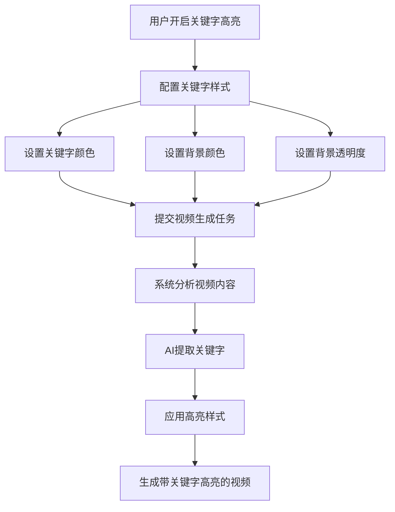

# 字幕配置折叠面板优化说明

## 优化概览

对字幕配置进行了全面重构，使用折叠面板（Accordion）组织配置项，并新增关键字高亮功能，使界面更加清晰、易用。

---

## 一、新增功能：关键字高亮

### 1.1 功能描述
- **开关控制**：支持开启/关闭关键字高亮功能
- **自动提取**：在视频生成阶段，系统自动提取关键字
- **突出显示**：关键字使用特殊颜色和背景进行高亮显示
- **默认状态**：默认关闭

### 1.2 配置参数

| 参数名称 | 类型 | 默认值 | 说明 |
|---------|------|--------|------|
| `enableKeywordHighlight` | boolean | false | 是否启用关键字高亮 |
| `keywordColor` | string | '#FFD700' | 关键字文字颜色（金色） |
| `keywordBackgroundColor` | string | '#FF4500' | 关键字背景颜色（橙红色） |
| `keywordBackgroundOpacity` | number | 30 | 关键字背景透明度（0-100） |

### 1.3 UI 设计
- **橙色主题**：使用橙色竖条和橙色高亮框
- **Sparkles 图标**：闪光图标表示关键字特效
- **开关组件**：橙色开关（激活）/ 灰色开关（未激活）
- **说明文字**：提示用户功能作用

---

## 二、折叠面板设计

### 2.1 四个分类

#### 1️⃣ 基础配置（绿色竖条）
- **默认状态**：折叠
- **包含内容**：
  - 字幕颜色
  - 字幕位置
  - 字体大小
  - 字体选择
  - 字体描边颜色
  - 字体描边宽度
  - 字幕阴影深度
  - 字幕背景颜色
  - 字幕背景透明度

#### 2️⃣ 花字（黄色竖条）
- **默认状态**：折叠
- **包含内容**：
  - 打开花字字体库按钮
  - 功能说明文字

#### 3️⃣ 贴纸（蓝色竖条）
- **默认状态**：折叠
- **包含内容**：
  - 打开贴纸库按钮
  - 功能说明文字

#### 4️⃣ 关键字（橙色竖条）**[新增]**
- **默认状态**：折叠
- **包含内容**：
  - 启用关键字高亮开关
  - 关键字颜色设置
  - 关键字背景颜色设置
  - 关键字背景透明度设置
  - 功能说明文字

### 2.2 折叠面板结构

```
┌──────────────────────────────────────┐
│ │ 基础配置                    ∨ │ ▲  │  ← 标题栏（可点击）
├──────────────────────────────────────┤
│ [配置内容区域]                       │  ← 内容区（可展开/折叠）
│ • 字幕颜色                           │
│ • 字幕位置                           │
│ • ...                                │
└──────────────────────────────────────┘

小竖条颜色标识：
│ ← 绿色（基础配置）
│ ← 黄色（花字）
│ ← 蓝色（贴纸）
│ ← 橙色（关键字）
```

---

## 三、UI 交互

### 3.1 折叠/展开行为
- **点击标题栏**：切换展开/折叠状态
- **图标变化**：ChevronDown（折叠） ⇄ ChevronUp（展开）
- **动画过渡**：使用 `v-show` 实现平滑过渡
- **独立控制**：每个面板独立控制，互不影响

### 3.2 视觉反馈
- **标题栏悬停**：背景色从 `bg-gray-800` 变为 `hover:bg-gray-750`
- **颜色标识**：左侧竖条（1px宽 × 16px高）区分不同分类
- **背景对比**：
  - 标题栏：`bg-gray-800`
  - 内容区：`bg-gray-800/50`（半透明）

### 3.3 关键字高亮特殊处理
- **橙色高亮框**：启用开关区域使用橙色背景和边框
- **条件显示**：只有开启开关后才显示配置项
- **说明文字**：灰色小字提示功能作用

---

## 四、数据模型

### 4.1 新增状态管理

```typescript
// 字幕配置折叠状态
const subtitleSections = reactive({
  basic: false,      // 基础配置默认折叠
  fancy: false,      // 花字默认折叠
  sticker: false,    // 贴纸默认折叠
  keyword: false     // 关键字默认折叠
})
```

### 4.2 新增 config 字段

```typescript
const config = reactive({
  // ... 原有字段
  
  // 关键字配置（新增）
  enableKeywordHighlight: false,            // 启用关键字高亮
  keywordColor: '#FFD700',                  // 关键字颜色（金色）
  keywordBackgroundColor: '#FF4500',        // 关键字背景色（橙红色）
  keywordBackgroundOpacity: 30              // 关键字背景透明度
})
```

---

## 五、技术实现

### 5.1 新增图标导入
```typescript
import {
  ChevronDown,    // 折叠图标
  ChevronUp,      // 展开图标
  Sparkles        // 关键字闪光图标
} from 'lucide-vue-next'
```

### 5.2 折叠面板模板结构
```vue
<div class="border border-gray-700 rounded-lg overflow-hidden">
  <!-- 标题栏 -->
  <button @click="subtitleSections.basic = !subtitleSections.basic">
    <div class="w-1 h-4 bg-green-500 rounded"></div>
    <span>基础配置</span>
    <component :is="subtitleSections.basic ? ChevronUp : ChevronDown" />
  </button>
  
  <!-- 内容区 -->
  <div v-show="subtitleSections.basic">
    <!-- 配置项 -->
  </div>
</div>
```

### 5.3 动态组件渲染
使用 `<component :is="">` 动态切换上下箭头图标

---

## 六、颜色规范

### 6.1 竖条颜色标识
| 分类 | 颜色 | Tailwind类 | 说明 |
|-----|------|-----------|------|
| 基础配置 | 绿色 | `bg-green-500` | 与顶部标题呼应 |
| 花字 | 黄色 | `bg-yellow-500` | 突出装饰性质 |
| 贴纸 | 蓝色 | `bg-blue-500` | 区分装饰类型 |
| 关键字 | 橙色 | `bg-orange-500` | 强调高亮功能 |

### 6.2 关键字主题色
- **开关激活**：`bg-orange-600`
- **高亮框背景**：`bg-orange-500/10`
- **高亮框边框**：`border-orange-500/30`
- **图标颜色**：`text-orange-400`

---

## 七、优化对比

### 7.1 优化前
```
字幕样式设置（标题）
┌─────────────────┐
│ 字幕颜色        │
│ 字幕位置        │
│ 字体大小        │
│ 字体            │
│ 字体描边颜色    │
│ 字体描边宽度    │
│ 字幕阴影深度    │
│ 字幕背景颜色    │
│ 字幕背景透明度  │
│ [花字字体库]    │
│ [贴纸选择]      │
└─────────────────┘
问题：
❌ 所有参数平铺，页面很长
❌ 无法快速定位想要的功能
❌ 视觉层次不清晰
```

### 7.2 优化后
```
字幕样式设置（标题）

│ 基础配置        ∨     ← 默认折叠
│ 花字            ∨     ← 默认折叠
│ 贴纸            ∨     ← 默认折叠
│ 关键字          ∨     ← 默认折叠（新增）

优势：
✅ 分类清晰，层次分明
✅ 默认折叠，页面简洁
✅ 按需展开，快速定位
✅ 颜色标识，一目了然
✅ 新增关键字功能
```

---

## 八、使用场景

### 8.1 场景一：快速配置基础字幕
1. 展开"基础配置"
2. 设置颜色、位置、字体
3. 其他面板保持折叠
4. 界面简洁，不受干扰

### 8.2 场景二：添加花字装饰
1. 展开"花字"面板
2. 点击"打开花字字体库"
3. 选择花字样式
4. 其他面板保持折叠

### 8.3 场景三：启用关键字高亮
1. 展开"关键字"面板
2. 开启"启用关键字高亮"开关
3. 配置关键字颜色和背景
4. 系统自动提取并高亮关键字

### 8.4 场景四：全面配置
1. 按需展开各个面板
2. 逐项配置参数
3. 配置完成后折叠
4. 保持界面整洁

---

## 九、关键字高亮工作流程



---

## 十、测试要点

### 10.1 折叠面板测试
- [ ] 点击标题栏正常展开/折叠
- [ ] 图标正确切换（上下箭头）
- [ ] 多个面板独立控制，互不影响
- [ ] 默认状态均为折叠
- [ ] 展开动画流畅

### 10.2 关键字功能测试
- [ ] 开关正常切换
- [ ] 开关关闭时不显示配置项
- [ ] 开关开启时显示所有配置项
- [ ] 颜色选择器正常工作
- [ ] 透明度数值范围限制有效（0-100）

### 10.3 视觉测试
- [ ] 竖条颜色正确（绿/黄/蓝/橙）
- [ ] 标题栏悬停效果正常
- [ ] 橙色高亮框正确显示
- [ ] 说明文字正确显示
- [ ] 整体布局协调美观

### 10.4 数据测试
- [ ] 折叠状态正确保存到 subtitleSections
- [ ] 关键字配置正确保存到 config
- [ ] 模板保存包含新增字段
- [ ] 模板加载正确恢复状态

---

## 十一、用户体验提升

### 11.1 信息密度优化
- **优化前**：所有配置平铺，需要滚动查看
- **优化后**：默认折叠，只显示分类标题，页面简洁

### 11.2 认知负担降低
- **优化前**：10+ 个配置项同时呈现，难以聚焦
- **优化后**：按需展开，每次只关注 1 个分类

### 11.3 操作效率提升
- **优化前**：查找特定功能需要逐项浏览
- **优化后**：通过颜色和标题快速定位

### 11.4 视觉层次清晰
- **优化前**：平铺结构，层次不明显
- **优化后**：折叠面板 + 颜色标识，层次分明

---

## 十二、后续优化建议

### 12.1 功能增强
1. 关键字手动编辑功能
2. 关键字提取预览
3. 关键字出现频率控制
4. 多种关键字高亮样式预设

### 12.2 交互优化
1. "全部展开/折叠"快捷按钮
2. 记住用户的折叠偏好
3. 面板拖拽排序
4. 关键字高亮效果实时预览

### 12.3 性能优化
1. 大量配置项的虚拟滚动
2. 折叠动画性能优化
3. 配置变更防抖

---

## 十三、完整代码示例

### 13.1 折叠状态管理
```typescript
const subtitleSections = reactive({
  basic: false,
  fancy: false,
  sticker: false,
  keyword: false
})
```

### 13.2 关键字配置
```typescript
{
  enableKeywordHighlight: false,
  keywordColor: '#FFD700',
  keywordBackgroundColor: '#FF4500',
  keywordBackgroundOpacity: 30
}
```

### 13.3 折叠面板模板
```vue
<div class="border border-gray-700 rounded-lg overflow-hidden">
  <button @click="subtitleSections.keyword = !subtitleSections.keyword">
    <div class="w-1 h-4 bg-orange-500 rounded"></div>
    <span>关键字</span>
    <ChevronDown v-if="!subtitleSections.keyword" />
    <ChevronUp v-else />
  </button>
  <div v-show="subtitleSections.keyword">
    <!-- 内容 -->
  </div>
</div>
```

---

**优化完成日期**: 2024-11-18  
**修改文件**: `src/views/WorkspacePage/agents/VideoAgent/VideoConfig.vue`  
**新增功能**: 关键字高亮  
**新增UI**: 折叠面板结构  
**版本**: v2.2.0

